# Perfil de Usuário

## Introdução

&emsp;&emsp;Para compreender melhor as necessidades e identificar os usuários do site de análise do projeto, foi elaborado um perfil genérico denominado "perfil de usuário". Essa abordagem envolveu a definição das características dos usuários, cujos objetivos deveriam ser atendidos pelo sistema em análise. Para isso, foi disponibilizado um questionário elaborado pelo grupo para coletar os dados necessários<a href="#1">1</a>. 

## Metodologia

&emsp;&emsp;Para se chegar ao perfil de usuário foi utilizado o método de questionário. Foi elaborado um formulário on-line que foi divulgado em grupos e sites para que os usuários do aplicativo CAESB Autoatendimento pudessem responder. A escolha desse método se deu principalmente por permitir que um grande número de pessoas respondesse e que ele fosse respondido do conforto do lar ou local de trabalho. O questionário teve foco em questões fechadas para privilegiar o preenchimento rápido dos participantes e, posteriormente, uma análise mais rápida das respostas.

## Vantagens
- Padronização: Permite coletar informações de forma uniforme entre os participantes.
- Cobertura ampla: Atinge um grande número de pessoas em pouco tempo.
- Facilidade de analisar os dados
- Escalabilidade: Adequado tanto para pequenos grupos quanto para grandes audiências.
- Quando o público alvo se encontra disperso geograficamente
- Quando se tem amostras o suficiente, existe como ter uma ideia de como é a opinião de uma população

## Desvantagens
- Baixa taxa de respostas implica em um resultado menos preciso
- Maior gasto de tempo caso as respostas possam ser respondidas de múltiplas maneiras
- Uma falha no questionário pode levar a uma falha na pesquisa

## Perguntas do Questionário

Tabela 01: Perguntas realizadas no questionário

| **Pergunta**                                                                 |
|------------------------------------------------------------------------------|
| 1. Qual o seu nome?                                                          |
| 2. Qual o seu sexo?                                                          |
| 3. Qual a sua idade?                                                         |
| 4. Qual o seu nível de escolaridade?                                         |
| 5. Qual a região onde você mora?                                             |
| 6. Qual a sua profissão?                                                     |
| 7. Qual plataforma você usa pra acessar o aplicativo?                        |
| 8. Existe algum erro que você comete frequentemente ao usar esse aplicativo? Se sim, qual? |
| 9. Existe alguma função que você acha necessário maior apoio em sua execução? Se sim, qual? |
| 10. Qual sua experiência com aplicativos Mobile?                             |
| 11. Você costuma consultar a segunda via da conta em seu nome utilizando esse aplicativo? |
| 12. Você costuma consultar seu histórico de consumo utilizando esse aplicativo? |
| 13. Você costuma buscar informações sobre a falta de água utilizando esse aplicativo? |
| 14. Você costuma solicitar serviços relacionados à água e saneamento utilizando esse aplicativo? |
| 15. Você costuma realizar a simulação de tarifa utilizando esse aplicativo?  |
| 16. Você costuma solicitar desobstrução do esgoto utilizando esse aplicativo? |
| 17. Quão fácil é para você corrigir um erro que você mesmo cometeu ao usar o aplicativo Caesb Autoatendimento? |
| 18. O quão fácil é para você encontrar as informações no aplicativo CAESB Autoatendimento? |

<h6 align = "center"> Autor(a): <a href="https://github.com/Ninja-Haiyai">Matheus Barros</a></h6>

## Respostas

Imagem 01: Gráfico da pergunta "Qual seu sexo"

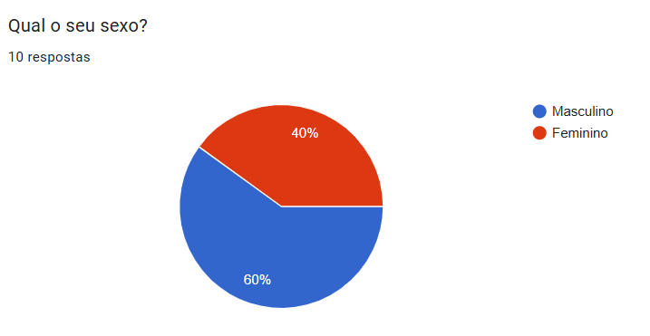 

<h6 align = "center"> Autor(a): <a href="https://github.com/Ninja-Haiyai">Matheus Barros</a></h6>

Imagem 02: Gráfico da pergunta "Qual sua idade"

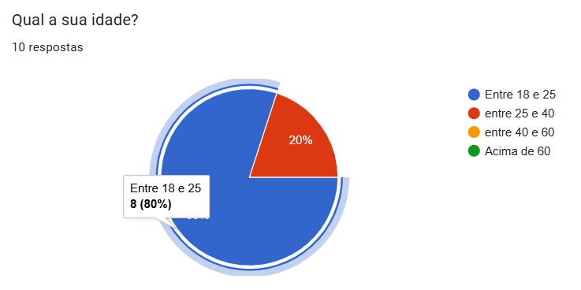 

<h6 align = "center"> Autor(a): <a href="https://github.com/Ninja-Haiyai">Matheus Barros</a></h6>

Imagem 03: Gráfico da pergunta "Nível de escolaridade"

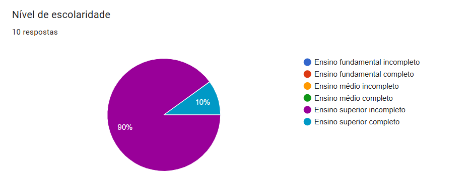 

<h6 align = "center"> Autor(a): <a href="https://github.com/Ninja-Haiyai">Matheus Barros</a></h6>

Imagem 04: Gráfico da pergunta "Nível de escolaridade"

 

<h6 align = "center"> Autor(a): <a href="https://github.com/Ninja-Haiyai">Matheus Barros</a></h6>

Imagem 05: Gráfico da pergunta "Região em qual moram"

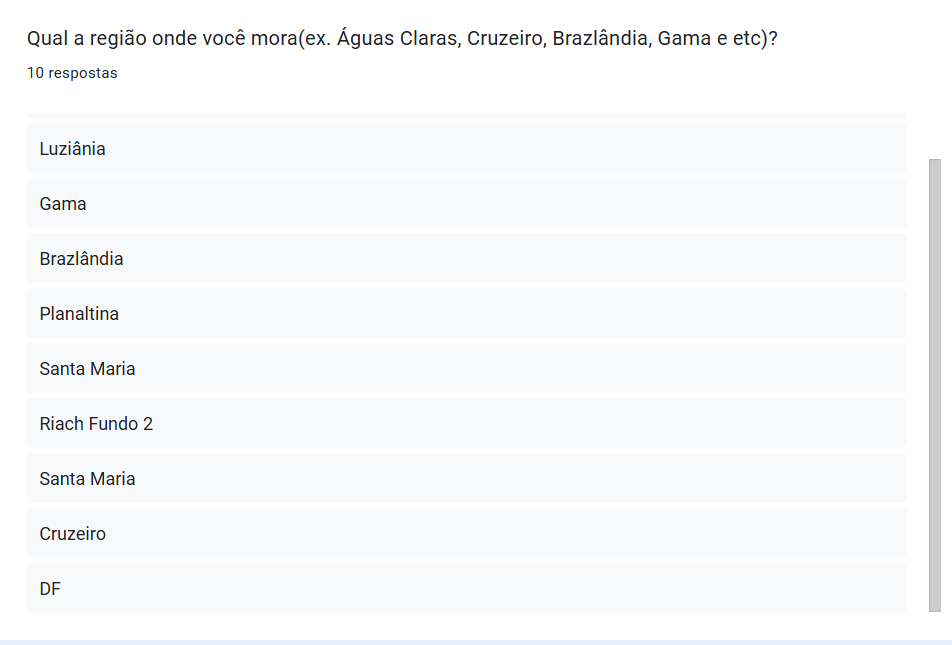 

<h6 align = "center"> Autor(a): <a href="https://github.com/Ninja-Haiyai">Matheus Barros</a></h6>

Imagem 06: Gráfico da pergunta "Nível de escolaridade"

 

<h6 align = "center"> Autor(a): <a href="https://github.com/Ninja-Haiyai">Matheus Barros</a></h6>

Imagem 07: Gráfico da pergunta "Qual sua profissão"

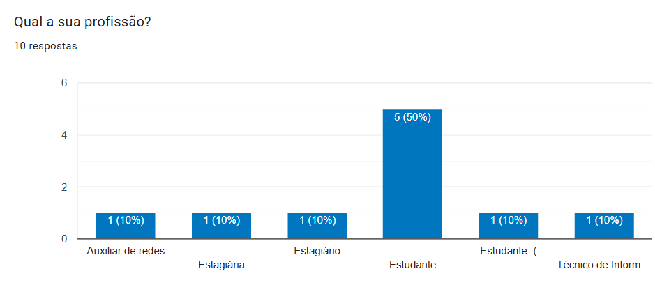 

<h6 align = "center"> Autor(a): <a href="https://github.com/Ninja-Haiyai">Matheus Barros</a></h6>

Imagem 08: Gráfico da pergunta "Qual plataforma  você utiliza para acessar o aplicativo"

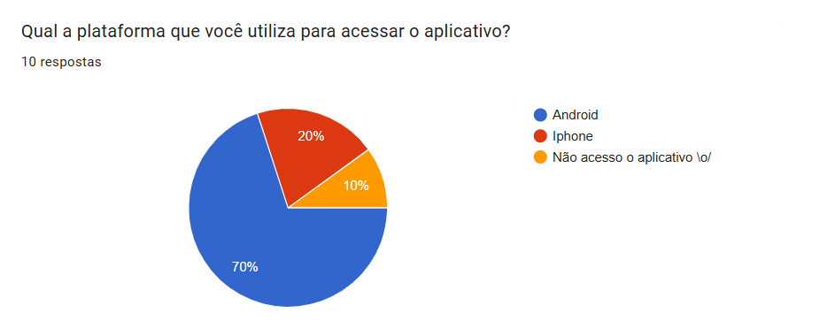 

<h6 align = "center"> Autor(a): <a href="https://github.com/Ninja-Haiyai">Matheus Barros</a></h6>

Imagem 09: Gráfico da pergunta "Erros cometidos frequentemente na plataforma"

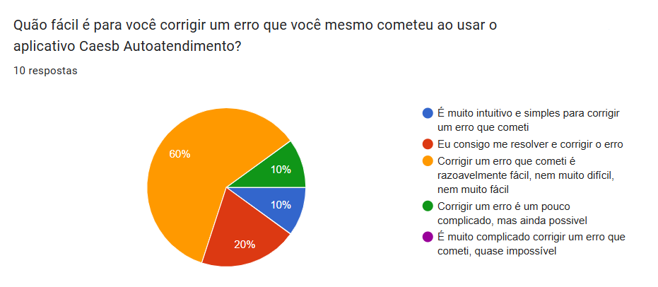 

<h6 align = "center"> Autor(a): <a href="https://github.com/Ninja-Haiyai">Matheus Barros</a></h6>

Imagem 10: Gráfico da pergunta "Função que necessita maior apoio na execução"

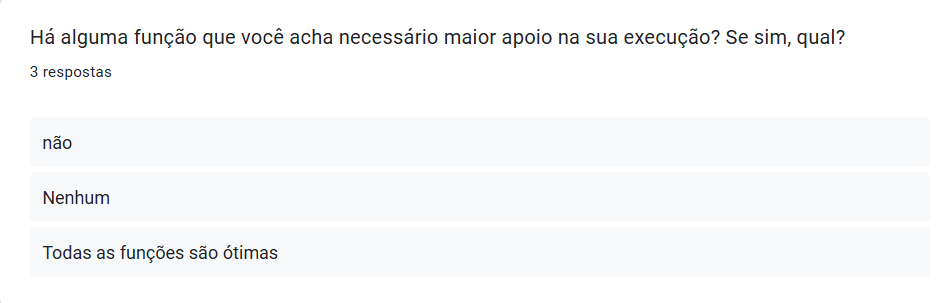 

<h6 align = "center"> Autor(a): <a href="https://github.com/Ninja-Haiyai">Matheus Barros</a></h6>

Imagem 11: Gráfico da pergunta "Experiência com aplicativos mobile"

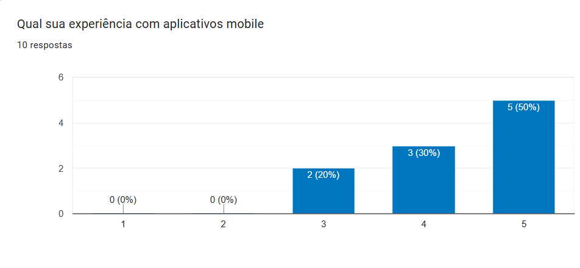 

<h6 align = "center"> Autor(a): <a href="https://github.com/Ninja-Haiyai">Matheus Barros</a></h6>

Imagem 12: Gráfico da pergunta "Consulta da segunda via"

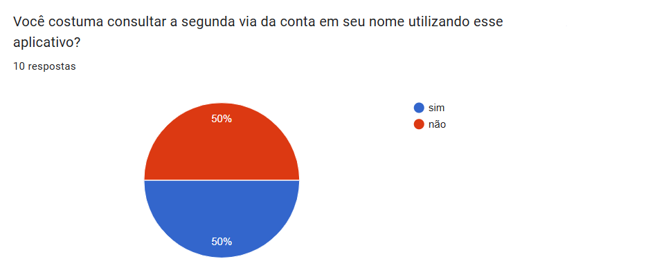 

<h6 align = "center"> Autor(a): <a href="https://github.com/Ninja-Haiyai">Matheus Barros</a></h6>

Imagem 13: Gráfico da pergunta "Consulta de histórico de consumo"

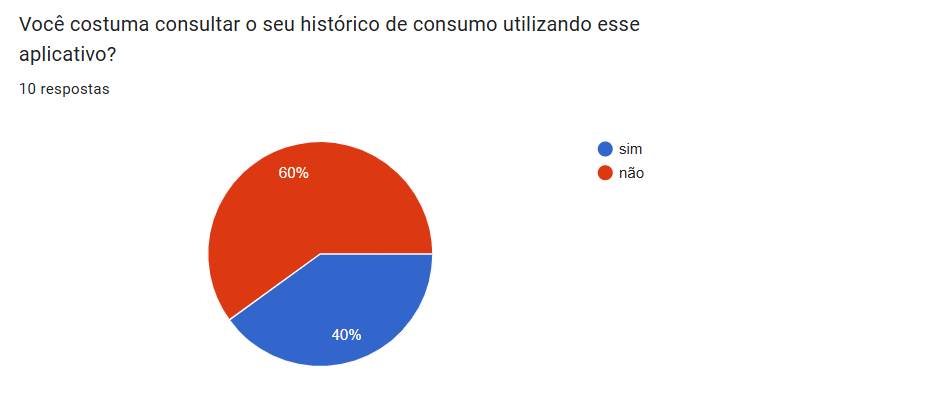 

<h6 align = "center"> Autor(a): <a href="https://github.com/Ninja-Haiyai">Matheus Barros</a></h6>

Imagem 14: Gráfico da pergunta "Informações sobre falta de água"

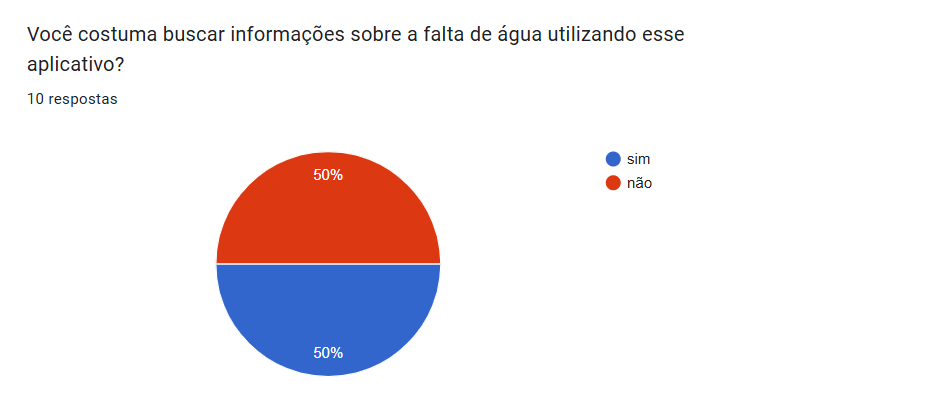 

<h6 align = "center"> Autor(a): <a href="https://github.com/Ninja-Haiyai">Matheus Barros</a></h6>

Imagem 15: Gráfico da pergunta "Serviços de saneamento"

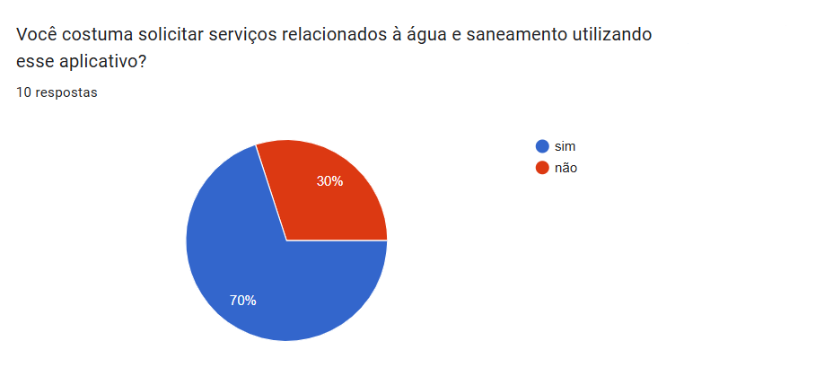 

<h6 align = "center"> Autor(a): <a href="https://github.com/Ninja-Haiyai">Matheus Barros</a></h6>

Imagem 16: Gráfico da pergunta "Simulação de tarifa"

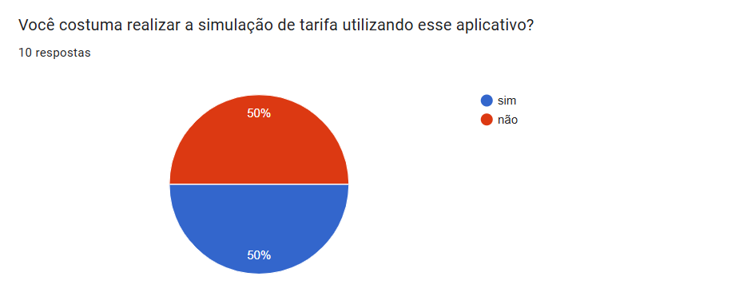 

<h6 align = "center"> Autor(a): <a href="https://github.com/Ninja-Haiyai">Matheus Barros</a></h6>

Imagem 17: Gráfico da pergunta "Desobstrução de esgoto"

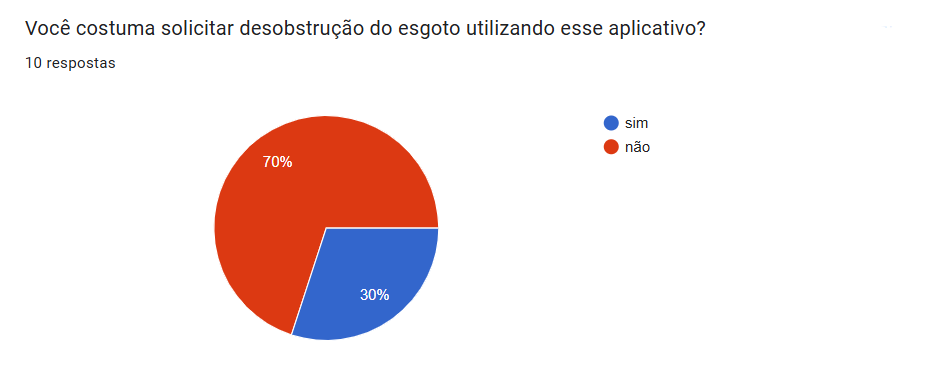 

<h6 align = "center"> Autor(a): <a href="https://github.com/Ninja-Haiyai">Matheus Barros</a></h6>

Imagem 18: Gráfico da pergunta "Auto correção de erros"

 

<h6 align = "center"> Autor(a): <a href="https://github.com/Ninja-Haiyai">Matheus Barros</a></h6>

Imagem 19: Gráfico da pergunta "Facilidade de encontrar informações"

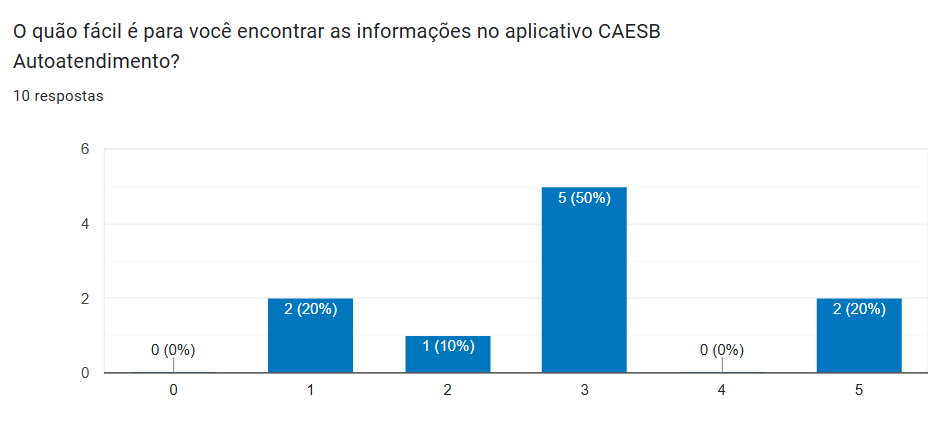 

<h6 align = "center"> Autor(a): <a href="https://github.com/Ninja-Haiyai">Matheus Barros</a></h6>

## Referências

> 
1. Barbosa, S. D. J.; Silva, B. S. da; Silveira, M. S.; Gasparini, I.; Darin, T.; Barbosa, G. D. J. (2021)
Interação Humano-Computador e Experiência do usuário. Autopublicação. ISBN: 978-65-00-19677-1.

 

## Histórico de versão

| Versão |    Data    |      Descrição       |       Autor(es)       |     Revisor(es)     |
| :-----: | :--------: | :------------------: | :-------------------: | :-----------------: |
|  1.0   | 20/11/2024 | Adicionando introdução e metodologia | [Leandro de Almeida](https://github.com/leomitx10)|[Letícia Resende](https://github.com/LeticiaResende23)  |
|  1.1   | 20/11/2024 | Adicionando vantagens, desvantagens, perguntas e respostas  | [Matheus Barros](https://github.com/Ninja-Haiyai)|[Leandro de Almeida](https://github.com/leomitx10) |

