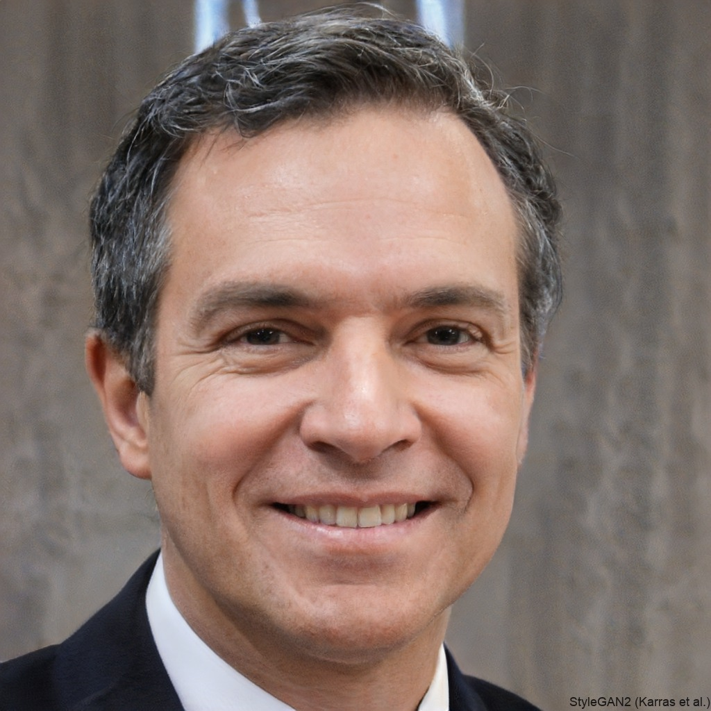
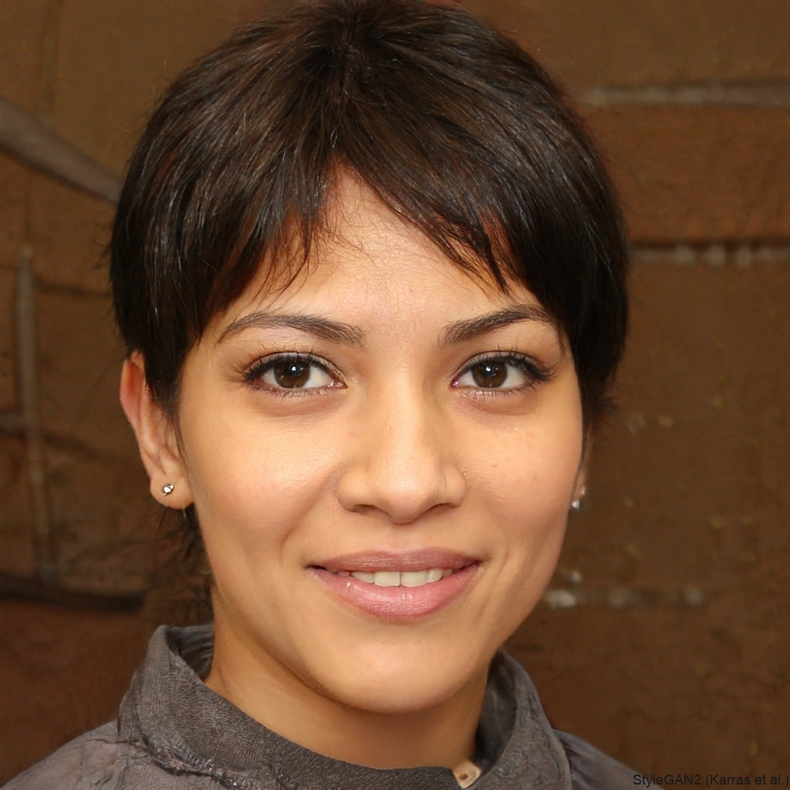
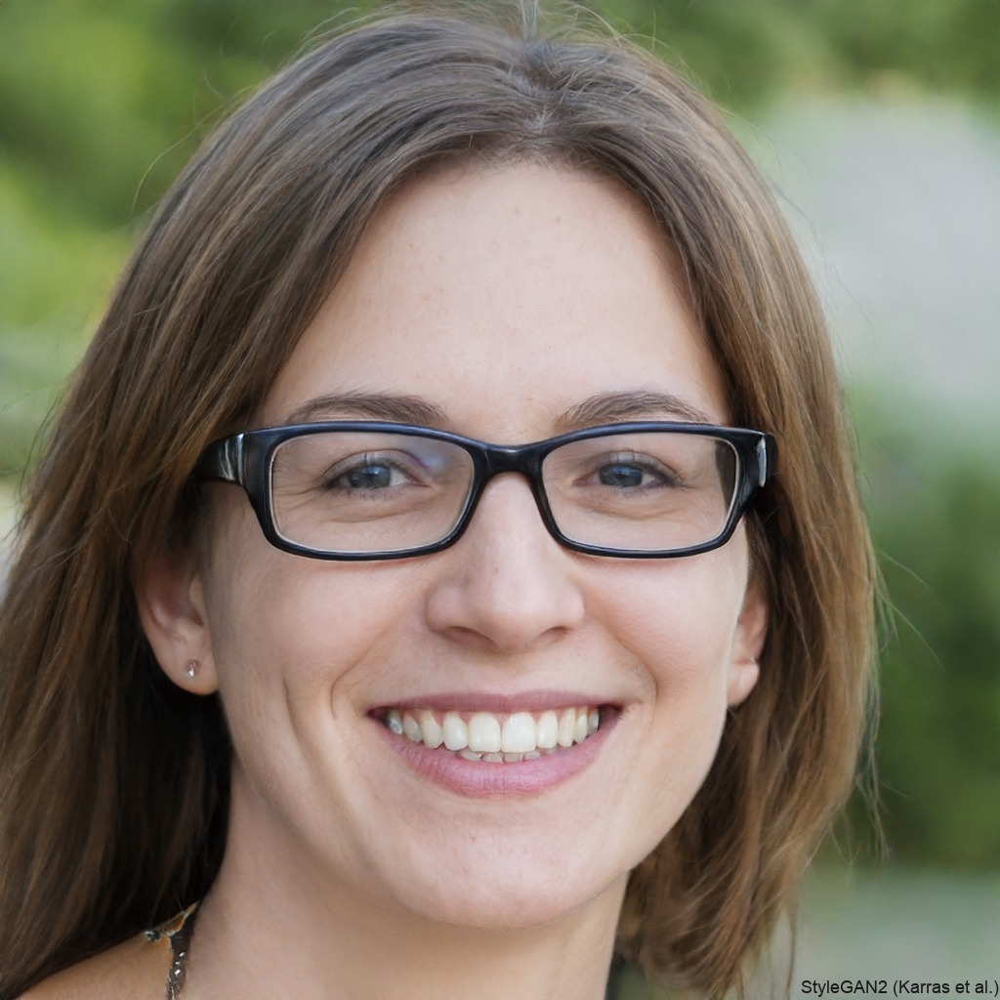

# Personas

## Introdução

&emsp;&emsp;Uma persona é um personagem fictício que representa um tipo de usuário real. Ela é usada em discussões de design para manter o foco no público-alvo. As personas são definidas pelos seus objetivos, identificados através de pesquisas e ajustes. O processo começa com uma ideia geral e vai sendo refinado até criar uma representação realista do usuário típico<a href="#1">1</a>.

## Metodologia

&emsp;&emsp;Para a criação das personas, foram utilizados principalmente os dados obtidos por meio do perfil de usuário. As informações coletadas nas respostas referentes ao Brainstorm permitiram a elaboração de perfis que representam os usuários "típicos" do aplicativo CAESB Autoatendimento.

&emsp;&emsp;Serão utilizadas quatro personas, escolha orientada pelo intervalo recomendado por Courage e Baxter (2005), de 3 a 12 personas<a href="#1">2</a>. Dentre elas, serão definidas duas personas primárias, uma persona secundária e, por fim, uma antipersona. As personas primárias e a secundária representam usuários que têm contato direto com o sistema e abrangem os dados coletados e estimados para refletir o papel de usuários do site. Por outro lado, a antipersona descreve um perfil de usuário que não se encaixa nos dados levantados.

As tabelas de 1 a 4 apresentam o elenco de personas:

Tabela 01: Persona 01

|
<figure markdown>                           |
| -------------------------------------------------------------------------------------------------------------------------------------------------------------------------------------------------------------------------------------------------------------------------------------------------------------------------------------------------------------------------------------------------------------------- |
| **Status**: Persona Primária |
| **Nome**: Lucas Henrique Costa |   
| **Descrição**: 45 anos, reside em Taguatinga, é contador e trabalha de forma autônoma. Buscando sempre otimizar o tempo e melhorar sua produtividade. Homem. Casado.|                 
| **Relacionamento**: Lucas é muito próximo de sua esposa e filhos. Gosta de interagir com outros profissionais da área, sendo ativo em fóruns e eventos de contabilidade.|
| **Habilidades**: É muito habilidoso com números e possui uma boa familiaridade com ferramentas tecnológicas, principalmente softwares de contabilidade. Precisa de ajuda para questões tecnológicas mais complexas, geralmente recorre a tutoriais ou colegas mais experientes.|
| **Tarefas**: Trabalha em seu escritório em casa pela manhã, atendendo a clientes e realizando cálculos. À tarde, se dedica a tarefas administrativas, reuniões e atualização de sistemas de contabilidade.|
| **Objetivo**: Aumentar sua clientela e manter-se atualizado sobre as mudanças fiscais e contábeis.|
| **Expectativa**: Acesso rápido às contas de consumo, com uma interface intuitiva e possibilidade de realizar simulações de contas facilmente.|
| **Requisitos**: Consultar débitos, emitir segunda via de contas e simular valores com base em diferentes cenários de consumo.|

 Autor(a): <a href="https://github.com/leomitx10" target = "_blank">Leandro de Almeida</a>

Tabela 02: Persona 02

|
<figure markdown>                           |
| -------------------------------------------------------------------------------------------------------------------------------------------------------------------------------------------------------------------------------------------------------------------------------------------------------------------------------------------------------------------------------------------------------------------- |
| **Status**: Persona Primária |
| **Nome**: Mariana da Silva Oliveira |
| **Descrição**: 36 anos, residente em Ceilândia, trabalha como chef de cozinha em um restaurante popular. Mulher. Divorciada, mãe de dois filhos. |
| **Relacionamento**: Mariana tem uma rede de apoio sólida entre colegas de trabalho e familiares. Gosta de passar tempo com seus filhos e está constantemente em contato com fornecedores e clientes. |
| **Habilidades**: Tem excelente conhecimento culinário e habilidades de gestão de equipe, mas seu conhecimento de tecnologia é limitado. Normalmente, pede ajuda a amigos ou familiares quando precisa de suporte tecnológico. |
| **Tarefas**: Acorda cedo para comprar ingredientes e preparar o almoço no restaurante, trabalha até a noite para garantir o bom funcionamento da cozinha e atender aos clientes. |
| **Objetivo**: Expandir seu restaurante e aumentar a clientela, mantendo a qualidade e a relação com os fornecedores. |
| **Expectativa**: Consultar e pagar suas contas rapidamente, sem complicações, e também registrar problemas como falhas no fornecimento de água. |
| **Requisitos**: Consultar e pagar contas de água, verificar status de falhas no fornecimento e reportar problemas como falta de água ou vazamentos. |

 Autor(a): <a href="https://github.com/leomitx10" target = "_blank">Leandro de Almeida</a>

Tabela 03: Persona 03

|
<figure markdown>                           |
| -------------------------------------------------------------------------------------------------------------------------------------------------------------------------------------------------------------------------------------------------------------------------------------------------------------------------------------------------------------------------------------------------------------------- |
| **Status**: Antipersona |
| **Nome**: Roberto Alves Martins |
| **Descrição**: 24 anos, reside em Brasília, recém-formado em Design Gráfico, trabalha como freelancer. Homem. Namorando. |
| **Relacionamento**: Roberto tem um círculo social pequeno, mas é bem próximo dos amigos com quem compartilha interesses profissionais e hobbies. Sua namorada, também freelancer, é sua principal companheira. |
| **Habilidades**: Ele tem muita experiência em design, edição de imagem e trabalho com várias plataformas digitais, mas não se interessa por questões relacionadas ao gerenciamento de contas ou serviços públicos. |
| **Tarefas**: Passa a maior parte do tempo criando conteúdo digital para seus clientes, respondendo e-mails e realizando projetos criativos. Nos fins de semana, prefere sair com a namorada ou socializar com amigos. |
| **Objetivo**: Crescer como freelancer, expandindo sua rede de clientes e desenvolvendo novos projetos. |
| **Expectativa**: Não tem interesse em interações relacionadas ao fornecimento de água ou serviços públicos. Seus pais lidam com esses assuntos em sua casa. |
| **Requisitos**: Não tem requisitos identificados, pois não se envolve com questões relacionadas ao fornecimento de água. |

 Autor(a): <a href="https://github.com/leomitx10" target = "_blank">Leandro de Almeida</a>

Tabela 04: Persona 04

|
<figure markdown>                           |
| -------------------------------------------------------------------------------------------------------------------------------------------------------------------------------------------------------------------------------------------------------------------------------------------------------------------------------------------------------------------------------------------------------------------- |
| **Status**: Persona Secundária |
| **Nome**: Beatriz Costa Lima |
| **Descrição**: 29 anos, residente em Brasília, trabalha como gerente de marketing em uma grande empresa. Mulher. Casada. |
| **Relacionamento**: Beatriz tem uma forte rede de contatos profissionais dentro da empresa e é muito próxima de sua família e amigos íntimos. |
| **Habilidades**: Possui grande habilidade de liderança e comunicação. Seu conhecimento tecnológico é intermediário, e quando precisa de ajuda, recorre ao time de TI da empresa ou a colegas mais experientes. |
| **Tarefas**: Beatriz começa seu expediente pela manhã, lidando com reuniões e projetos de marketing até o final da tarde. À noite, após o trabalho, costuma relaxar em casa ou se reunir com amigos. |
| **Objetivo**: Evoluir na carreira profissional e assumir um cargo de liderança mais alto na área de marketing. |
| **Expectativa**: Consultar rapidamente informações sobre o status de serviços, como interrupções no fornecimento de água, e obter previsão clara de quando o problema será resolvido. |
| **Requisitos**: Consultar rapidamente o status de ocorrências de falta de água e acompanhar a previsão de resolução dos problemas. |

 Autor(a): <a href="https://github.com/leomitx10" target = "_blank">Leandro de Almeida</a>

## Referências

> 
1. Barbosa, S. D. J.; Silva, B. S. da; Silveira, M. S.; Gasparini, I.; Darin, T.; Barbosa, G. D. J. (2021)
Interação Humano-Computador e Experiência do usuário. Autopublicação. ISBN: 978-65-00-19677-1.

 

## Histórico de versão

| Versão |    Data    |      Descrição       |       Autor(es)       |     Revisor(es)     |
| :-----: | :--------: | :------------------: | :-------------------: | :-----------------: |
|  1.0   | 20/11/2024 | Criação das personas | [Leandro de Almeida](https://github.com/leomitx10)| [Letícia Resende](https://github.com/LeticiaResende23) |

