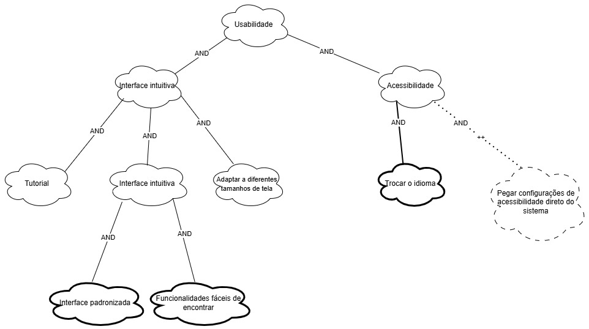
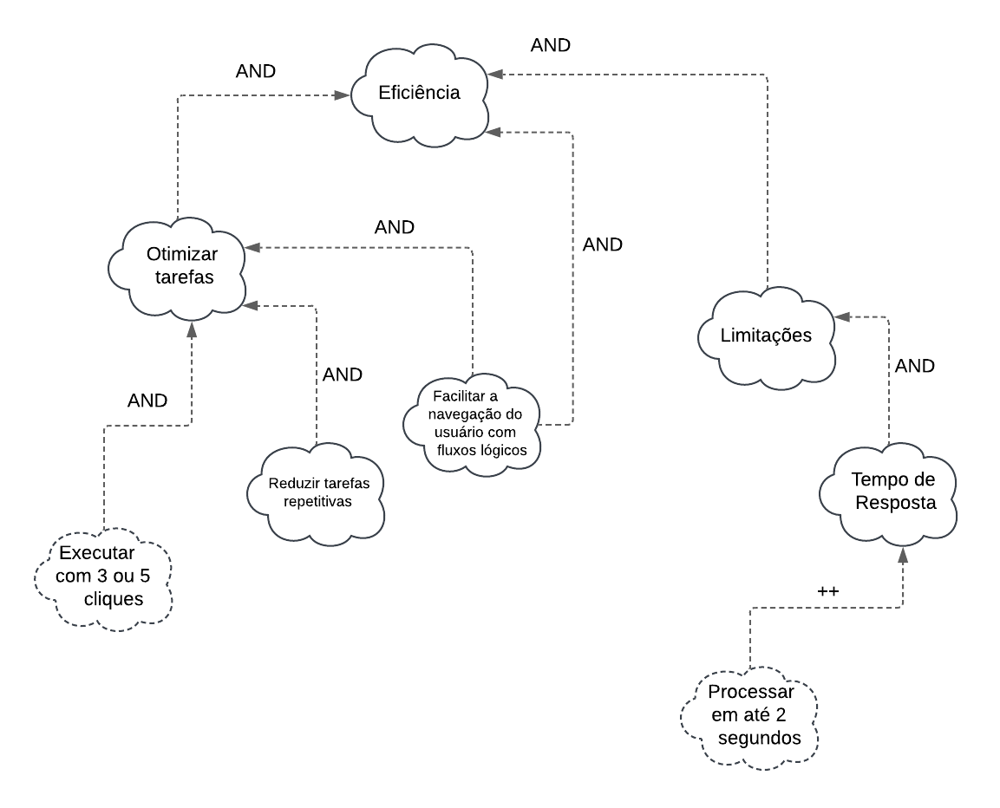
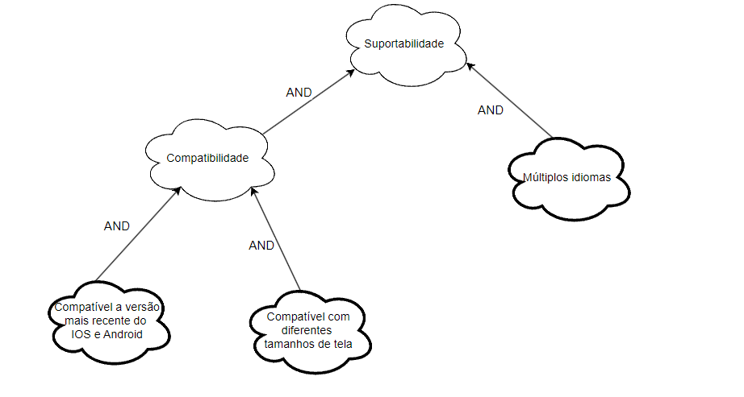
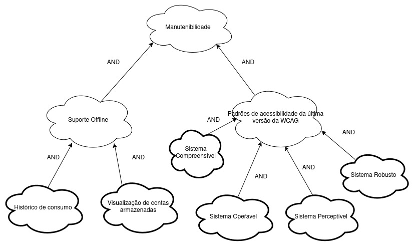

# NFR Framework

## Introdução

&emsp;&emsp;O Framework de Requisitos Não Funcionais (NFR) é um método estruturado para lidar com requisitos não funcionais no desenvolvimento de software. Foi criado com o objetivo de auxiliar engenheiros e analistas de sistemas na identificação, representação, análise e monitoramento da satisfação de requisitos não funcionais (como desempenho, segurança, confiabilidade, manutenibilidade, entre outros) ao longo da vida útil do software.

## Metodologia  

&emsp;&emsp;Para que este documento possa ser produzido, foram utilizados os requisitos não funcionais presentes no nosso projeto e elicitados no artefato de <a href="https://requisitos-de-software.github.io/2024.2-CAESB-Autoatendimento/elicitacao/requisitos_elicitados/">de requisitos elicitados</a>, que trata dos requisitos elicitados em relação ao  aplicativo <a href="https://play.google.com/store/apps/details?id=br.gov.df.caesb.mobile&hl=pt_BR">Caesb Autoatendimento</a>.

&emsp;&emsp;Para a verificação foi feita uma reunião com o PO para validação dos NFR, os participantes estão contidos na tabela 1

Tabela 1: Participantes entrevista 1

| Participante   | Função          | Local         | Data       |
|----------------|-----------------|---------------|------------|
| Natan Almeida  | Desenvolvedor   |   Gama - DF   | 17/12/2024 |
| Matheus Barros | Desenvolvedor   |   Gama - DF   | 17/12/2024 |
| João Paulo     | Product Owner   |   Gama - DF   | 17/12/2024 |

Autor(a): <a href="https://github.com/natanalmeida03" target = "_blank">Natan Almeida</a>

    
Vídeo 01: Entrevista com o PO

    <iframe width="760" height="515" src="https://www.youtube.com/embed/pLyS8JTte6Q?si=XORINlf23HvaU--f" title="YouTube video player" frameborder="0" allow="accelerometer; autoplay; clipboard-write; encrypted-media; gyroscope; picture-in-picture; web-share" referrerpolicy="strict-origin-when-cross-origin" allowfullscreen></iframe>
    Autor(a): <a href="https://github.com/natanalmeida03" target = "_blank">Natan Almeida</a> e <a href="https://github.com/Ninja-Haiyai" target = "_blank">Matheus Barros</a></h6>

&emsp;&emsp;Esse framework leva em consideração o conceito de "softgoal", eles se referem a um objeto desprovido de definição clara e critérios de satisfação sólidos, esses softgoals são utilizados para representar Requisitos não-funcionais e podem estar conectados entre si, refletindo as influências que eles exercem entre si.

&emsp;&emsp; Existem três categorias de softgoals, abaixo segue (Tabela 2)  uma explicação sobre cada tipo:

Tabela 2: Tipos de Softgoals

| **Tipo de Softgoal**         | **Descrição**                                                                                                                                 |
|------------------------------|---------------------------------------------------------------------------------------------------------------------------------------------|
| **Softgoals NFR**            | Representam os requisitos não funcionais e podem ser organizados hierarquicamente no desenvolvimento do projeto.                           |
| **Softgoals de Operacionalização** | Representam as soluções de implementação para atender aos softgoals NFR ou outros softgoals de operacionalização. Incluem operações, processos, estruturas de dados e restrições no sistema para cumprir as necessidades indicadas. |
| **Softgoals de Afirmação ( CLAIM )**   | Consideram as características do domínio, como prioridades e carga de trabalho, no processo de tomada de decisão. Servem como justificativa para apoiar ou negar a priorização e seleção de componentes, facilitando a revisão, justificativa, melhoria do sistema e rastreamento das decisões de desenvolvimento. |

Autor(a): <a href="https://github.com/Ninja-Haiyai" target = "_blank">Matheus Barros</a>

 

 Figura 1: Tipos de Softgoals

 Autor: (CHUNG et al., 2000). 

 

&emsp;&emsp;Após determinarmos o tipo de softgoal, devemos fazer uma avaliação, esse processo de avaliação determina o quanto os requisitos não funcionais são satisfatórios por meio de um conjunto de decisões. Para tal atribuimos os rótulos de "satisfeito", "parcialmente satisfeito", "não atendido", "parcialmente não atendido", "conflitante" e "indeterminado"

 

 Figura 2: Rótulos de propagação de impacto

 Autor: (CHUNG et al., 2000). 

&emsp;&emsp; Depois de fazermos a identificação deles e relacionarmos devemos atribuir a eles as contribuições e decomposições, que serão explicadas na Tabela 3: 

 Tabela 3: Tipos de contribuições e decomposições

| **Tipo de Contribuição**           | **Descrição**                                                                                          |
|------------------------------------|------------------------------------------------------------------------------------------------------|
| **Contribuições Positivas (`+`)**  | Indicadores de que uma decisão ou elemento contribui para a satisfação de um softgoal.               |
| **`++` (Forte Positiva)**          | Uma contribuição muito significativa e positiva.                                                    |
| **`+` (Fraca Positiva)**           | Uma contribuição positiva moderada.                                                                 |
| **Contribuições Negativas (`-`)**  | Indicadores de que uma decisão ou elemento dificulta a satisfação de um softgoal.                   |
| **`--` (Forte Negativa)**          | Um impacto muito significativo e prejudicial.                                                      |
| **`-` (Fraca Negativa)**           | Um impacto negativo moderado.                                                                       |
| **Decomposição AND**               | Todos os sub-softgoals precisam ser atendidos para que o softgoal pai seja satisfeito.              |
| **Decomposição OR**                | Apenas um ou mais sub-softgoals precisam ser atendidos para que o softgoal pai seja satisfeito.     |

Autor(a): <a href="https://github.com/Ninja-Haiyai" target = "_blank">Matheus Barros</a>

 

## Requisitos Não-Funcionais:

<figcaption>Tabela 04 - Requisitos Não Funcionais (RNF) utilizados para elabaoração do documento, retirado do artefato <a href="https://requisitos-de-software.github.io/2024.2-CAESB-Autoatendimento/elicitacao/requisitos_elicitados.md/">de requisitos elicitados</a> :</figcaption>

|  ID  |                      DESCRIÇÃO                       |                 RASTREABILIDADE                  | IMPLEMENTADO |
| :--: | :--------------------------------------------------: | :----------------------------------------------: | :----------: |
| **RQ31** | O aplicativo deve incluir um tutorial inicial para ajudar novos usuários a se familiarizarem.| <a href="https://requisitos-de-software.github.io/2024.2-CAESB-Autoatendimento/elicitacao/tecnicas/analise_documento/">ADD10</a> | Não |
| **RQ32** | O aplicativo deve oferecer suporte a múltiplos idiomas para atender usuários diversificados. | <a href="https://requisitos-de-software.github.io/2024.2-CAESB-Autoatendimento/elicitacao/tecnicas/analise_documento/">ADD04</a>, <a href="https://requisitos-de-software.github.io/2024.2-CAESB-Autoatendimento/elicitacao/tecnicas/introspeccao/">INT25</a> | Não |
| **RQ33** | O aplicativo deve ser compatível com as versões mais recentes do Android e iOS. | <a href="https://requisitos-de-software.github.io/2024.2-CAESB-Autoatendimento/elicitacao/tecnicas/introspeccao/">INT07</a>, <a href="https://requisitos-de-software.github.io/2024.2-CAESB-Autoatendimento/elicitacao/tecnicas/observacao/">OBS16</a> | Sim |
| **RQ34** | O aplicativo deve garantir segurança com os dados dos usuários. | <a href="https://requisitos-de-software.github.io/2024.2-CAESB-Autoatendimento/elicitacao/tecnicas/analise_documento/">ADD06</a>, <a href="https://requisitos-de-software.github.io/2024.2-CAESB-Autoatendimento/elicitacao/tecnicas/analise_documento/">ADD07</a> | Sim |
| **RQ35** | O aplicativo deve estar em conformidade com os padrões de acessibilidade da última versão da WCAG. | <a href="https://requisitos-de-software.github.io/2024.2-CAESB-Autoatendimento/elicitacao/tecnicas/analise_documento/">ADD13</a>, <a href="https://requisitos-de-software.github.io/2024.2-CAESB-Autoatendimento/elicitacao/tecnicas/introspeccao/">INT26</a>, <a href="https://requisitos-de-software.github.io/2024.2-CAESB-Autoatendimento/elicitacao/tecnicas/observacao/">OBS18</a> | Não |
| **RQ36** | O aplicativo deve ter uma interface intuitiva, organizada e fácil de usar. | <a href="https://requisitos-de-software.github.io/2024.2-CAESB-Autoatendimento/elicitacao/tecnicas/introspeccao/">INT08</a>, <a href="https://requisitos-de-software.github.io/2024.2-CAESB-Autoatendimento/elicitacao/tecnicas/entrevista/">ENT02</a>, <a href="https://requisitos-de-software.github.io/2024.2-CAESB-Autoatendimento/elicitacao/tecnicas/Brainstorm/">B15</a>, <a href="https://requisitos-de-software.github.io/2024.2-CAESB-Autoatendimento/elicitacao/tecnicas/Brainstorm/">B13</a>, <a href="https://requisitos-de-software.github.io/2024.2-CAESB-Autoatendimento/elicitacao/tecnicas/entrevista/">ENT10</a> | Sim |
| **RQ37** | O número de cliques necessários para realizar uma ação deve ser de 3 a 5. | <a href="https://requisitos-de-software.github.io/2024.2-CAESB-Autoatendimento/elicitacao/tecnicas/Brainstorm/">B14</a>, <a href="https://requisitos-de-software.github.io/2024.2-CAESB-Autoatendimento/elicitacao/tecnicas/observacao/">OBS19</a> | Sim |
| **RQ38** | O aplicativo deve se adaptar a diferentes tamanhos de tela. | <a href="https://requisitos-de-software.github.io/2024.2-CAESB-Autoatendimento/elicitacao/tecnicas/observacao/">OBS17</a>, <a href="https://requisitos-de-software.github.io/2024.2-CAESB-Autoatendimento/elicitacao/tecnicas/introspeccao/">INT10</a> | Não |
| **RQ39** | O aplicativo deve permitir suporte offline para funcionalidades básicas, como visualização de contas armazenadas. | <a href="https://requisitos-de-software.github.io/2024.2-CAESB-Autoatendimento/elicitacao/tecnicas/analise_documento/">ADD14</a> | Não | NAO |
| **RQ40** | O aplicativo deve ter tempos de resposta inferiores a 2 segundos para a maioria das funcionalidades. | <a href="https://requisitos-de-software.github.io/2024.2-CAESB-Autoatendimento/elicitacao/tecnicas/introspeccao/">INT22</a> | Não |

Autor(a): <a href="https://github.com/Ninja-Haiyai" target = "_blank">Matheus Barros</a>

## NFR Framework - NFR01: Usabilidade

&emsp;&emsp; De acordo com Jakob Nielsen usabilidade é um atributo de qualidade que avalia a facilidade de uso das interfaces de usuário. Nielsen define usabilidade como um conjunto de componentes que determinam o quão eficaz, eficiente e satisfatória é a interação do usuário com um sistema. Os requisitos utilizados para esse NFR foram: 

- RQ31: O aplicativo deve incluir um tutorial inicial para ajudar novos usuários a se familiarizarem.
- RQ32: O aplicativo deve oferecer suporte a múltiplos idiomas para atender usuários diversificados.
- RQ36: O aplicativo deve ter uma interface intuitiva, organizada e fácil de usar.
- RQ38: O aplicativo deve se adaptar a diferentes tamanhos de tela.

Com isso em mente, segue a Figura número 3 com o NFR relativo a usabilidade:

 FIgura 3: SIG usabilidade

Autor(a): <a href="https://github.com/Ninja-Haiyai" target = "_blank">Matheus Barros</a>

### Propagação de impactos - NFR01

 Tabela 05: Propagação de impactos NF01

|          NFR                          |         Impacto           |              Avaliador               |
| :-----------------------------------: | :-----------------------: | :----------------------------------: |
| Usabilidade                          | ✓ (satisfeito)           | <a href="https://github.com/Ninja-Haiyai" target="_blank">Matheus Barros</a> |
| Interface intuitiva                 | ✓ (satisfeito)           | <a href="https://github.com/Ninja-Haiyai" target="_blank">Matheus Barros</a> |
| Tutorial                             | 𝒲+ (fracamente satisfeito) | <a href="https://github.com/Ninja-Haiyai" target="_blank">Matheus Barros</a> |
| Adaptar a diferentes tamanhos de tela| ✓ (satisfeito)           | <a href="https://github.com/Ninja-Haiyai" target="_blank">Matheus Barros</a> |
| Interface padronizada                | ✓ (satisfeito)           | <a href="https://github.com/Ninja-Haiyai" target="_blank">Matheus Barros</a> |
| Funcionalidades fáceis de encontrar   | 𝒲+ (fracamente satisfeito) | <a href="https://github.com/Ninja-Haiyai" target="_blank">Matheus Barros</a> |

Autor(a): <a href="https://github.com/Ninja-Haiyai" target = "_blank">Matheus Barros</a>

## NFR Framework - NFR02: Eficiência

&emsp;&emsp; Eficiência é um atributo de qualidade de um sistema que se refere à sua capacidade de executar as funções especificadas de maneira otimizada, utilizando o mínimo de recursos necessários. Esse atributo é fundamental para garantir que o sistema ofereça respostas rápidas e mantenha um desempenho estável, mesmo sob condições de carga elevada. É um dos requisitos não funcionais (NFRs) mais relevantes em sistemas computacionais modernos, especialmente em aplicações onde o desempenho é importante. 

- RQ37: O número de cliques necessários para realizar uma ação deve ser de 3 a 5.
- RQ40: O aplicativo deve ter tempos de resposta inferiores a 2 segundos para a maioria das funcionalidades.

Com isso em mente, segue a Figura número 4 com o NFR relativo a eficiência:

 Figura 4: SIG eficiência

Autor(a): <a href="https://github.com/leomitx10" target = "_blank">Leandro de Almeida</a>

### Propagação de impactos - NFR02

 Tabela 06: Propagação de impactos NRF02

|          NFR                          |         Impacto           |              Avaliador               |
| :-----------------------------------: | :-----------------------: | :----------------------------------: |
| Eficiência                            |  ✓ (satisfeito)     | <a href="https://github.com/leomitx10" target="_blank">Leandro de Almeida</a> |
| Otimizar tarefas                      |  𝒲+ (fracamente satisfeito)  | <a href="https://github.com/leomitx10" target="_blank">Leandro de Almeida</a> |
| Reduzir tarefas repetitivas           |   𝒲+ (fracamente satisfeito)| <a href="https://github.com/leomitx10" target="_blank">Leandro de Almeida</a> |
| Facilitar a navegação do usuário com fluxos lógicos |  ✓ (satisfeito)  | <a href="https://github.com/leomitx10" target="_blank">Leandro de Almeida</a> |
| Executar com 3 ou 5 cliques           |   ✓ (satisfeito) | <a href="https://github.com/leomitx10" target="_blank">Leandro de Almeida</a> |
| Limitações                            |    𝒲+ (fracamente satisfeito)   | <a href="https://github.com/leomitx10" target="_blank">Leandro de Almeida</a> |
| Tempo de resposta                     |   ✓ (satisfeito) | <a href="https://github.com/leomitx10" target="_blank">Leandro de Almeida</a> |
| Processar em até 2 segundos           |   ✓ (satisfeito)| <a href="https://github.com/leomitx10" target="_blank">Leandro de Almeida</a> |
| Organização intuitiva do menu         |   ✓ (satisfeito)| <a href="https://github.com/leomitx10" target="_blank">Leandro de Almeida</a> |

Autor(a): <a href="https://github.com/leomitx10" target = "_blank">Leandro de Almeida</a>

 

## NFR Framework - NFR03: Confiabilidade

&emsp;&emsp; Confiabilidade é um atributo de qualidade de um sistema que se refere à sua capacidade de executar as funções especificadas de maneira consistente, correta e sem falhas em um determinado período de tempo ou sob condições específicas. É um dos requisitos não funcionais (NFRs) mais importantes em sistemas computacionais, pois está diretamente relacionado à confiança que os usuários depositam no sistema. Os requisitos utilizados para esse NFR foram: 

- RQ34 - O aplicativo deve garantir segurança com os dados dos usuários.

Com isso em mente, segue a Figura número 5 com o NFR relativo a confiabilidade:

 Figura 5: SIG Confiabilidade

Autor(a): <a href="https://github.com/LeticiaResende23" target = "_blank">Letícia Resende</a>

### Propagação de impactos - NFR03

 Tabela 07: Propagação de impactos NRF03

|        NFR                     |    Impacto                   |  Avaliador           |
|--------------------------------|------------------------------|-------------------------|
| Confiabilidade                 | ✓ (satisfeito)              | <a href="https://github.com/LeticiaResende23" target="_blank">Letícia Resende</a>    |
| Segurança                      | ✓ (satisfeito)              | <a href="https://github.com/LeticiaResende23" target="_blank">Letícia Resende</a>       |
| Solicitar autenticação         | ++ (fortemente satisfeito)  | <a href="https://github.com/LeticiaResende23" target="_blank">Letícia Resende</a>       |
| Notificar novos logins         | 𝒲+ (fracamente satisfeito)  |<a href="https://github.com/LeticiaResende23" target="_blank">Letícia Resende</a>      |
| Implementar criptografia       | ++ (fortemente satisfeito)  | <a href="https://github.com/LeticiaResende23" target="_blank">Letícia Resende</a>      |
| Transparência                  | ✓ (satisfeito)              | <a href="https://github.com/LeticiaResende23" target="_blank">Letícia Resende</a>       |
| Política de Privacidade        | + (satisfeito)              | <a href="https://github.com/LeticiaResende23" target="_blank">Letícia Resende</a>      |
| Termos de Uso                  | + (satisfeito)              | <a href="https://github.com/LeticiaResende23" target="_blank">Letícia Resende</a>       |
| Suporte ao Usuário             | ✓ (satisfeito)              | <a href="https://github.com/LeticiaResende23" target="_blank">Letícia Resende</a>         |
| FAQs sobre segurança           | 𝒲+ (fracamente satisfeito)  | <a href="https://github.com/LeticiaResende23" target="_blank">Letícia Resende</a>        |
| Suporte dedicado ao usuário    | + (satisfeito)              | <a href="https://github.com/LeticiaResende23" target="_blank">Letícia Resende</a>        |

Autor(a): <a href="https://github.com/LeticiaResende23" target = "_blank">Letícia Resende</a>

## NFR Framework - NFR04: Suportabilidade

&emsp;&emsp; Suportabilidade é um atributo de qualidade de um sistema que se refere à sua capacidade de ser mantido, adaptado ou expandido com facilidade ao longo de seu ciclo de vida. Esse atributo é fundamental para garantir que o sistema possa evoluir diante de mudanças nos requisitos, corrigir problemas rapidamente e incorporar novas funcionalidades sem comprometer sua estabilidade ou desempenho. É um dos requisitos não funcionais (NFRs) mais relevantes em sistemas modernos, especialmente em contextos onde a manutenção contínua e a escalabilidade são cruciais para atender às demandas do negócio. 

- RQ32: O aplicativo deve oferecer suporte a múltiplos idiomas para atender usuários diversificados.
- RQ33: O aplicativo deve ser compatível com as versões mais recentes do Android e iOS.
- RQ38: O aplicativo deve se adaptar a diferentes tamanhos de tela.

Com isso em mente, segue a Figura número 5 com o NFR relativo a suportabilidade:

 Figura 5: SIG suportabilidade

Autor(a): <a href="https://github.com/natanalmeida03" target = "_blank">Natan Almeida</a>

### Propagação de impactos - NFR04

 Tabela 08: Propagação de impactos NRF04

|          NFR                          |         Impacto           |              Avaliador               |
| :-----------------------------------: | :-----------------------: | :----------------------------------: |
| Suportabilidade                       |  ✓ (satisfeito)     | <a href="https://github.com/natanalmeida03" target="_blank">Natan Almeida</a> |
| Estabilidade                          |  ✓ (satisfeito)  | <a href="https://github.com/natanalmeida03" target="_blank">Natan Almeida</a> |
| Múltiplos idiomas                     |   𝒲+ (fracamente satisfeito)| <a href="https://github.com/natanalmeida03" target="_blank">Natan Almeida</a> |
| Adaptar a diferentes tamanhos de tela |  ✓ (satisfeito)  | <a href="https://github.com/natanalmeida03" target="_blank">Natan Almeida</a> |
| Compatibilidade Multi-plataforma      |   ✓ (satisfeito) | <a href="https://github.com/natanalmeida03" target="_blank">Natan Almeida</a> |

Autor(a): <a href="https://github.com/natanalmeida03" target = "_blank">Natan Almeida</a>

 

## NFR Framework - NFR05: Manutenibilidade

&emsp;&emsp; A manutenibilidade de um sistema se refere à facilidade com que um sistema pode ser mantido, ajustado ou melhorado ao longo de seu ciclo de vida. Em outras palavras, é a capacidade do sistema de ser modificado para corrigir defeitos, melhorar o desempenho ou adaptar-se a novos requisitos, sem causar grandes interrupções ou custos excessivos. 

- RQ35: O aplicativo deve estar em conformidade com os padrões de acessibilidade da última versão da WCAG.
- RQ39: O aplicativo deve permitir suporte offline para funcionalidades básicas, como visualização de contas armazenadas.

Com isso em mente, segue a Figura número 6 com o NFR relativo a manutenibilidade:

 Figura 6: SIG manutenibilidade

Autor(a): <a href="https://github.com/jmarquees" target = "_blank">Joao Victor Marques</a>

### Propagação de impactos - NFR05

 Tabela 09: Propagação de impactos NRF05

|          NFR                          |         Impacto           |              Avaliador               |
| :-----------------------------------: | :-----------------------: | :----------------------------------: |
| Conformidade com os padrões de acessibilidade da última versão da WCAG                      |  𝒲+ (fracamente satisfeito)     | <a href="https://github.com/jmarquees" target="_blank">Joao Victor Marques</a> |
| Suporte offline para funcionalidades básicas                          |  𝒲+ (fracamente satisfeito)  | <a href="https://github.com/jmarquees" target="_blank">Joao Victor Marques</a> |

Autor(a): <a href="https://github.com/jmarquees" target = "_blank">Joao Victor Marques</a>

 

## Referências Bibliográficas

> 
[1] Chung, Lawrence; A. Nixon, Brian; Mylopoulos, John. Non-Functional Requirements in Software Engineering. Acesso em 13 de Dezembro de 2024.

> 
[2] SILVA, R. NFR4ES: Um Catálogo de Requisitos Não-Funcionais para Sistemas Embarcados. Tese (Mestrado em Engenharia de Software) - Centro de Informática, Universidade Federal de Pernambuco. Recife, p. 155. 2019. Acesso em: 13 de Dezembro de 2022
> 
 [3]NIELSEN, Jakob. Usability Engineering. San Francisco: Morgan Kaufmann, 1994.
> 
[4] Sommerville, I. (2011). Engenharia de Software (9ª Edição). Acesso em 14 de Dezembro de 2024.

 

## Histórico de versão

| Versão |    Data    |      Descrição       |       Autor(es)       |     Revisor(es)     |
| :-----: | :--------: | :------------------: | :-------------------: | :-----------------: |
|  1.0   | 13/12/2024 | Criação da introdução, metodologia e NFR de usabilidade| [Matheus Barros](https://github.com/Ninja-Haiyai) |[Natan Almeida](https://github.com/natanalmeida03) |
|  1.1   | 14/12/2024 | Adicionando NFR de confiabilidade e impactos|  [Letícia Resende](https://github.com/LeticiaResende23) |[Matheus Barros](https://github.com/Ninja-Haiyai) |
|  1.2   | 14/12/2024 | Adiciona NFR02: Eficiência| [Leandro de Almeida](https://github.com/leomitx10) |[Natan Almeida](https://github.com/natanalmeida03) |
|  1.3   | 15/12/2024 | Adiciona NFR04: suportabilidade| [Natan Almeida](https://github.com/natanalmeida03) | [Matheus Barros](https://github.com/Ninja-Haiyai) |
|  1.4   | 17/12/2024 | Adiciona NFR05: manutenibilidade| [Joao Victor Marques](https://github.com/jmarquees) | [Matheus Barros](https://github.com/Ninja-Haiyai) |
|  1.5   | 17/12/2024 | Adiciona vídeo 01 | [Natan Almeida](https://github.com/natanalmeida03) | [Matheus Barros](https://github.com/Ninja-Haiyai) |
