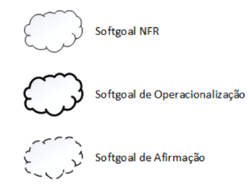

# NFR Framework

## Introdução

&emsp;&emsp;O Framework de Requisitos Não Funcionais (NFR) é um método estruturado para lidar com requisitos não funcionais no desenvolvimento de software. Foi criado com o objetivo de auxiliar engenheiros e analistas de sistemas na identificação, representação, análise e monitoramento da satisfação de requisitos não funcionais (como desempenho, segurança, confiabilidade, manutenibilidade, entre outros) ao longo da vida útil do software.

## Metodologia  

&emsp;&emsp;Para que este documento possa ser produzido, foram utilizados os requisitos não funcionais presentes no nosso projeto e elicitados no artefato de <a href="https://requisitos-de-software.github.io/2024.2-CAESB-Autoatendimento/modelagem_agil/nfr.md/">de requisitos elicitados</a>, que trata dos requisitos elicitados em relação ao  aplicativo <a href="https://play.google.com/store/apps/details?id=br.gov.df.caesb.mobile&hl=pt_BR">Caesb Autoatendimento</a>.

&emsp;&emsp;Esse framework leva em consideração o conceito de "softgoal", eles se referem a um objeto desprovido de definição clara e critérios de satisfação sólidos, esses softgoals são utilizados para representar Requisitos não-funcionais e podem estar conectados entre si, refletindo as influências que eles exercem entre si.

&emsp;&emsp; Existem três categorias de softgoals, abaixo segue na Tabela 1 tem uma explicação sobre cada tipo:

Tabela 1: Tipos de Softgoals

| **Tipo de Softgoal**         | **Descrição**                                                                                                                                 |
|------------------------------|---------------------------------------------------------------------------------------------------------------------------------------------|
| **Softgoals NFR**            | Representam os requisitos não funcionais e podem ser organizados hierarquicamente no desenvolvimento do projeto.                           |
| **Softgoals de Operacionalização** | Representam as soluções de implementação para atender aos softgoals NFR ou outros softgoals de operacionalização. Incluem operações, processos, estruturas de dados e restrições no sistema para cumprir as necessidades indicadas. |
| **Softgoals de Afirmação ( CLAIM )**   | Consideram as características do domínio, como prioridades e carga de trabalho, no processo de tomada de decisão. Servem como justificativa para apoiar ou negar a priorização e seleção de componentes, facilitando a revisão, justificativa, melhoria do sistema e rastreamento das decisões de desenvolvimento. |

Autor(a): <a href="https://github.com/Ninja-Haiyai" target = "_blank">Matheus Barros</a>

 

 Figura 1: Tipos de Softgoals

 Autor: (CHUNG et al., 2000). 

 

&emsp;&emsp;Após determinarmos o tipo de softgoal, devemos fazer uma avaliação, esse processo de avaliação determina o quanto os requisitos não funcionais são satisfatórios por meio de um conjunto de decisões. Para tal atribuimos os rótulos de "satisfeito", "parcialmente satisfeito", "não atendido", "parcialmente não atendido", "conflitante" e "indeterminado"

## Histórico de versão

| Versão |    Data    |      Descrição       |       Autor(es)       |     Revisor(es)     |
| :-----: | :--------: | :------------------: | :-------------------: | :-----------------: |
|  1.0   | 13/12/2024 | Criação da introdução, metodologia e NFR de usabilidade| [Matheus Barros](https://github.com/Ninja-Haiyai) |[Natan Almeida](https://github.com/natanalmeida03) |