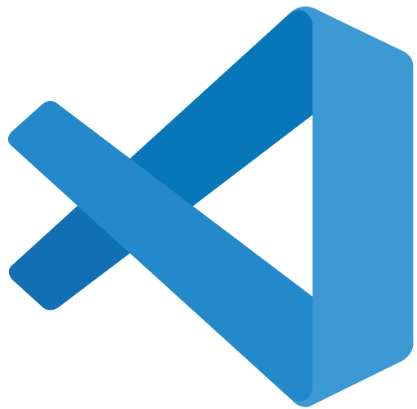
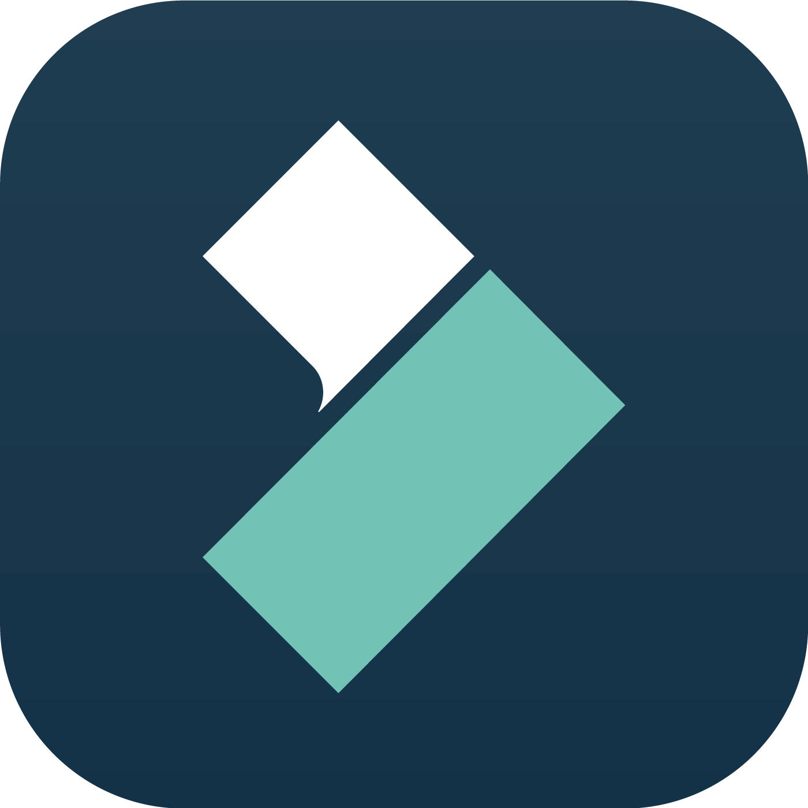

# Ferramentas

## Introdução

No desenvolvimento de um projeto, diversas ferramentas são utilizadas para facilitar o fluxo de trabalho e garantir a qualidade do produto final. As ferramentas selecionadas para a realização do projeto estão apresentadas na Tabela 1.

## Ferramentas Utilizadas

<b>Tabela 1</b> - Ferramentas Utilizadas no Projeto

| |Ferramenta| Finalidade| 
| :--: | :--: | :--: |
|{: style="height:64px;width:64px"}|<a id="a" href="#aa">Github</a>| Organizar, versionar o projeto. <a id="anchor_1" href="#FRM1">^1^</a> |
|{: style="height:64px;width:64px"} | <a id="b" href="#bb">Whatsapp</a> | Comunicação entre os participantes do grupo |
|{: style="height:64px"} | <a id="c" href="#cc">Youtube</a> | Hospedagem dos vídeos produzidos |
|{: style="height:64px;width:64px"} | <a id="d" href="#dd">VScode</a> | Edição de arquivos |
|{: style="height:64px;width:64px"}|<a id="e" href="#ee">Teams</a>|Realizações de reuniões e gravações de apresentações.|
|{: style="height:64px;width:64px"}|<a id="f" href="#ff">Filmora</a>|Edição de vídeo|
|{: style="height:64px"} | <a id="g" href="#gg">Mkdocs</a> | Criação do gitPage |
|{: style="height:64px"} | <a id="g" href="#gg">Draw.io</a> | Utilizado para fazer o Rich Picture |

Fonte: Autores.

## Bibliografia

<a id="aa" href="#a">[1]</a> GITHUB. Disponível em: [GitHub](https://github.com). Acesso em: 22 de Outubro de 2024.

<a id="bb" href="#b">[2]</a> WHATSAPP. Disponível em: [Whatsapp](https://whatsapp.com/). Acesso em: 22 de Outubro de 2024.

<a id="cc" href="#c">[3]</a> YOUTUBE. Disponível em: [YouTube](https://youtube.com). Acesso em: 22 de Outubro de 2024.

<a id="dd" href="#d">[4]</a> VSCODE. Disponível em: [VScode](https://code.visualstudio.com/). Acesso em: 22 de Outubro de 2024.

<a id="ee" href="#e">[5]</a> TEAMS. Disponível em: [Teams](https://www.microsoft.com/pt-br/microsoft-teams/log-in). Acesso em: 22 de Outubro de 2024.

<a id="ff" href="#f">[6]</a> Filmora. Disponível em: [Filmora](https://filmora.wondershare.com.br/). Acesso em: 22 de Outubro de 2024.

<a id="gg" href="#g">[7]</a> Mkdocs. Disponível em: [MkDocs](https://www.mkdocs.org/). Acesso em: 22 de Outubro de 2024.

## Histórico de Versão

| Versão |    Data    |      Descrição       |       Autor(es)       |     Revisor(es)     |
| :-----: | :--------: | :------------------: | :-------------------: | :-----------------: |
|  1.0   | 22/10/2024 | Adição das ferramentas do projeto |Natan Almeida | Leandro de Almeida  |
|  1.1   | 26/10/2024 |Adição da ferramenta utilizada no rich picture  | Letícia Resende | Natan Almeida  |