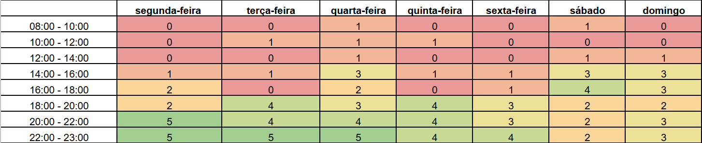

# Heatmap

## Introdução

&emsp;&emsp;Estudamos os horários dos integrantes da equipe através de um mapa de calor, para termos uma noção de como organizariamos as atividades do grupo, e qual seria os melhores horários para as reuniões.

    Imagem 1: Heatmap do grupo

Autor(a): <a href="https://github.com/leomitx10" target = "_blank">Leandro de Almeida</a>

 

&emsp;&emsp;Logo, através do estudo deste mapa, a equipe então definiu que os melhores horários para reunião seriam entre as 20h até as 23h de segunda a sexta e durante os finais de semana 16h até as 18h, optando para sempre que possível realizá-las através do  Microsoft Teams<a href="#1">1</a>.

 

## Referências Bibliográficas

> 
 1. Teams. Disponível em: <https://www.microsoft.com/pt-br/microsoft-teams/group-chat-software>. Acesso em: 26 out. 2024.

 

## Histórico de versão

| Versão |    Data    |      Descrição       |       Autor(es)       |     Revisor(es)     |
| :-----: | :--------: | :------------------: | :-------------------: | :-----------------: |
|  1.0   | 26/10/2024 | Colocando o heatmap  | [Leandro de Almeida](https://github.com/leomitx10)| [Matheus Barros](https://github.com/Ninja-Haiyai) |
|  1.1   | 26/10/2024 | Ajuste e revisão do heatmap | [Matheus Barros](https://github.com/Ninja-Haiyai) | [Leandro de Almeida](https://github.com/leomitx10) |
|  1.2   | 05/11/2024 | Correção no texto do heatmap | [Matheus Barros](https://github.com/Ninja-Haiyai) | [Leandro de Almeida](https://github.com/leomitx10) |
|  1.3   | 16/11/2024 | Correção pós apresentação | [Leandro de Almeida](https://github.com/leomitx10) | [Matheus Barros](https://github.com/Ninja-Haiyai)  |

