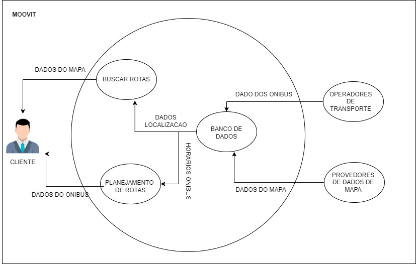
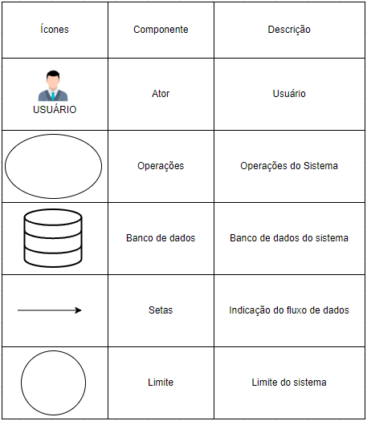
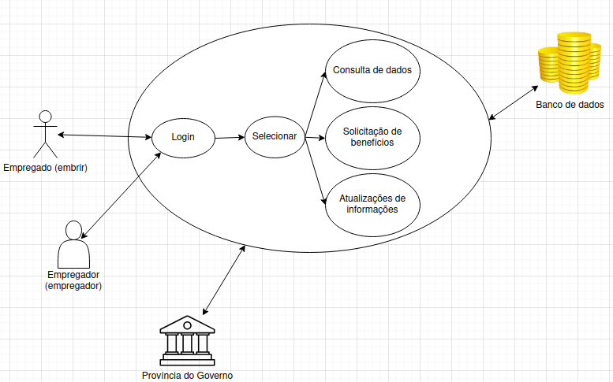

# Rich Pictures

## Introdução

&emsp;&emsp; O Rich Picture representa as interações dos usuários com o sistema, destacando também elementos externos que influenciam o funcionamento do aplicativo, como o armazenamento de dados. Ele oferece uma visão detalhada.

## BRB Mobilidade

&emsp;&emsp;O BRB Mobilidade é um aplicativo que permite aos usuários acessar diversas funcionalidades relacionadas ao transporte público, como consultar saldo e itinerários de ônibus.

<figcaption>Imagem 1: Rich Picture - BRB Mobilidade</figcaption>

 Autor(a): <a href="https://github.com/LeticiaResende23" target = "_blank">Letícia Resende</a></h6>

 

<figcaption>Imagem 2 : Legenda do Rich Picture - BRB Mobilidade</figcaption>

 
 Autor(a): <a href="https://github.com/LeticiaResende23" target = "_blank">Letícia Resende</a></h6>
    

 

## Caesb Autoatendimento

&emsp;&emsp;A Caesb é o site da Companhia de Saneamento Ambiental do Distrito Federal, uma empresa responsável pela gestão e fornecimento de serviços de abastecimento de água e esgotamento sanitário no Distrito Federal. No site da Caesb, os usuários encontram informações sobre tarifas, serviços, contas, qualidade da água, planejamento ambiental e projetos de sustentabilidade, além de poderem acessar serviços online, como consulta e pagamento de contas, solicitação de segunda via e atendimento ao cliente.

    <figcaption>Imagem 3: Rich Picture - Caesb Autoatendimento</figcaption>
    
     Autor(a): <a href="https://github.com/leomitx10" target = "_blank">Leandro de Almeida</a></h6>

 

    <figcaption>Imagem 4: Legenda do Rich Picture - Caesb Autoatendimento</figcaption>
    </img>

Autor(a): <a href="https://github.com/leomitx10" target = "_blank">Leandro de Almeida</a></h6>

## Google Classroom

&emsp;&emsp;O Google Classroom é uma aplicação de educação remota que permite a comunicação entre educadores e alunos. A plataforma oferece aos professores a capacidade de criar, editar e gerenciar atividades e trabalhos educacionais, promovendo um ambiente de aprendizado colaborativo e organizado.&emsp;&emsp;

    
    <figcaption>Imagem 5: Rich Picture - Google Classroom (Fonte: BARROS, Matheus. 2024)</figcaption>
     

<figcaption>Imagem 6 : Legenda do Rich Picture - Google Classroom (Fonte: BARROS, Matheus. 2024)</figcaption>

## Moovit

&emsp;&emsp;O Moovit é um aplicativo de mobilidade urbana que ajuda as pessoas a se locomoverem utilizando transporte público, como ônibus e metrô. Ele fornece informações em tempo real sobre rotas, horários, e condições do transporte, facilitando o planejamento e a navegação nas cidades.

    <figcaption>Imagem 7: Rich Picture - Moovit</figcaption>
    
    Autor(a): <a href="https://github.com/natanalmeida03" target = "_blank">Natan Almeida</a>

    <figcaption>Imagem 8: Legenda do Rich Picture - Moovit</figcaption>
    
    Autor(a): <a href="https://github.com/natanalmeida03" target = "_blank">Natan Almeida</a>

## Carteira de Trabalho Digital

&emsp;&emsp;A Carteira de Trabalho Digital é um aplicativo desenvolvido pelo governo brasileiro para facilitar o acesso e a gestão das informações trabalhistas dos cidadãos. O app moderniza e simplifica o acesso a informações trabalhistas, promovendo maior transparência e eficiência na gestão dos dados do trabalhador brasileiro.

    <figcaption>Imagem 9: Rich Picture (Fonte: MARQUES Joao. 2024)</figcaption>
    
    Autor(a): <a href="https://github.com/jmarquees" target = "_blank">Joao Victor Marques</a></h6>

    <figcaption>Imagem 10: Legenda do Rich Picture (Fonte: MARQUES, Joao. 2024)</figcaption>
    .png)
    Autor(a): <a href="https://github.com/jmarquees" target = "_blank">Joao Victor Marques</a></h6>

## Referências

> 
1. SALES, André Barros. Introducing Rich Pictures. Disponível em:  
[https://aprender3.unb.br/pluginfile.php/2523045/mod_resource/content/2/1_5145791542719414573.pdf](https://aprender3.unb.br/pluginfile.php/2523045/mod_resource/content/2/1_5145791542719414573.pdf){:target="_blank"}. 
Acesso em: 25 de Outubro de 2024;

> 
2. Software Development Project. Disponível em: 
[https://aprender3.unb.br/pluginfile.php/2972420/mod_resource/content/2/1_5145791542719414573.pdf](https://aprender3.unb.br/pluginfile.php/2972420/mod_resource/content/2/1_5145791542719414573.pdf){:target="_blank"}. 
Acesso em: 25 de Outubro de 2024;

## Histórico de versão

| Versão |    Data    |      Descrição       |       Autor(es)       |     Revisor(es)     |
| :-----: | :--------: | :------------------: | :-------------------: | :-----------------: |
|  1.0   | 26/10/2024 | Criação do Rich Picture | [Letícia Resende](https://github.com/LeticiaResende23)  | [Leandro de Almeida](https://github.com/leomitx10)  |
|  1.1   | 26/10/2024 | Adicionando o Rich Picture da Caesb | [Leandro de Almeida](https://github.com/leomitx10) |[Letícia Resende](https://github.com/LeticiaResende23)  |
|  1.2   | 26/10/2024 | Criação do Rich Picture |[Matheus Barros](https://github.com/Ninja-Haiyai) | [Leandro de Almeida](https://github.com/leomitx10) |
|  1.3   | 27/10/2024 | Adicionando o Rich Picture do Moovit  | [Natan Almeida](https://github.com/natanalmeida03) | [Leandro de Almeida](https://github.com/leomitx10)  |
|  1.4   | 28/10/2024 | Adicionando o Rich Picture da Carteira de Trabalho Digital  | [Joao Victor Marques](https://github.com/jmarquees) | [Leandro de Almeida](https://github.com/leomitx10) |
|  1.5   | 13/11/2024 | Correção pós apresentação  | [Letícia Resende](https://github.com/LeticiaResende23) | [Leandro de Almeida](https://github.com/leomitx10)  |
|  1.6   | 17/11/2024 | Correção pós apresentação  | [Natan Almeida](https://github.com/natanalmeida03) | [Leandro de Almeida](https://github.com/leomitx10)  |
|  1.7   | 22/11/2024 | Correção pós apresentação  | [Joao Victor Marques](https://github.com/jmarquees) | [Leandro de Almeida](https://github.com/leomitx10)  |

