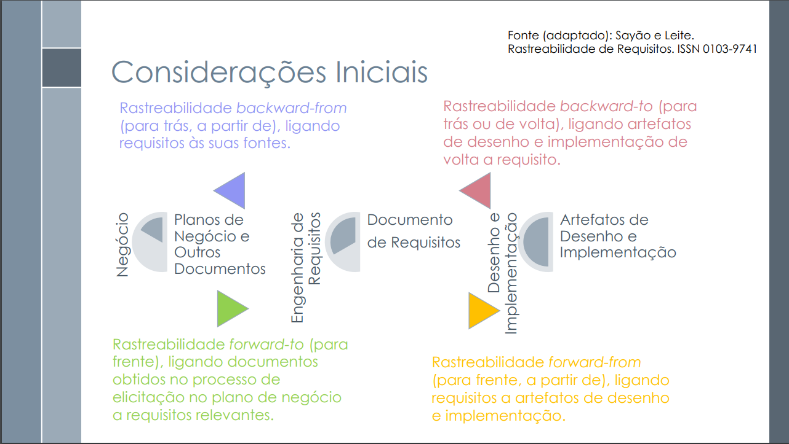

# Verificação Backward-from

## Introdução

&emsp;&emsp;Este documento inclui as verificações utilizada para inspecionar o artefato Backward-from. Ao final, são apresentados em detalhes os resultados alcançados por meio dessa inspeção.

## Objetivo

&emsp;&emsp; O objetivo da verificação é garantir que todos os critérios de avaliação foram plenamente atendidos. Para isso, é feita uma análise do conteúdo e da estrutura do artefato, com o intuito de melhorar sua qualidade.

## Metodologia

&emsp;&emsp; A verificação foi realizada utilizando uma lista de critérios de avaliação, elaborada com base no plano de ensino da disciplina. Com essa lista, foi feito uma verificação para confirmar se cada critério de avaliação havia sido atendido ou não, contando ainda com uma coluna para observações, permitindo o registro de detalhes adicionais ou outras considerações.

Neste documento, realizou-se a avaliação do artefato do <a href="https://requisitos-de-software.github.io/2024.2-CAESB-Autoatendimento/pos_rastreabilidade/backwardfrom/">Backward-from</a>, que trata das atividades realizadas no desenvolvimento do aplicativo <a href="https://github.com/Requisitos-de-Software/2024.2-CAESB-Autoatendimento">Caesb Autoatendimento</a>.

## Verificação do Backward-from

&emsp;&emsp;A tabela 01 apresenta a lista de Verificação do Backward-from que foram elaboradas com base no plano de ensino da disciplina e 02 apresenta a verificação.

Tabela 02: Verificação do Backward-from

| **ID** | **Descrição**                                              | **Avaliação** | **Autor**    | **Observações**   |
| ------ | ---------------------------------------------------------- | ------------- | ------------ | ----------------- |
|   01   | Cada requisito está claramente ligado à sua fonte de origem? |           | Leandro de Almeida |  |  
|   02   | As fontes dos requisitos estão disponíveis e bem documentadas?|           | Leandro de Almeida | |  
|   03   | As mudanças nos requisitos são justificadas com base em suas fontes?|           | Leandro de Almeida | |  
|   04   | Há uma justificativa clara para incluir cada requisito no projeto? |           | Leandro de Almeida | |  
|   05   | Os elos de rastreabilidade backward-from incluem as dependências entre os requisitos e suas fontes? |           | Leandro de Almeida |  |  

Autor(a): <a href="https://github.com/leomitx10" target = "_blank">Leandro de Almeida</a>

 

Tabela 02: Verificação do Backward-from

| **ID** | **Descrição**                                              | **Avaliação** | **Autor**    | **Observações**   |
| ------ | ---------------------------------------------------------- | ------------- | ------------ | ----------------- |
|   01   | Cada requisito está claramente ligado à sua fonte de origem? |   Sim  | Leandro de Almeida | versão 1.4 17/01 |  
|   02   | As fontes dos requisitos estão disponíveis e bem documentadas?|   Sim  | Leandro de Almeida | versão 1.4 17/01 |  
|   03   | As mudanças nos requisitos são justificadas com base em suas fontes?|  Não  | Leandro de Almeida | versão 1.4 17/01 |  
|   04   | Há uma justificativa clara para incluir cada requisito no projeto? | Sim | Leandro de Almeida | versão 1.4 17/01 |  
|   05   | Os elos de rastreabilidade backward-from incluem as dependências entre os requisitos e suas fontes? | Não | Leandro de Almeida | versão 1.4 17/01  |  

Autor(a): <a href="https://github.com/leomitx10" target = "_blank">Leandro de Almeida</a>

## Link da gravação

Pode ser vista no [YouTube]().

    
Vídeo 01: Verificação do Backward-from

    <iframe width="760" height="515" src="https://www.youtube.com/embed/HHLXh5oTa48?si=NKd95gvlB7myOdOW" title="YouTube video player" frameborder="0" allow="accelerometer; autoplay; clipboard-write; encrypted-media; gyroscope; picture-in-picture; web-share" referrerpolicy="strict-origin-when-cross-origin" allowfullscreen></iframe>

Autor(a): <a href="https://github.com/leomitx10" target = "_blank">Leandro de Almeida</a>

## Problemas encontrados

&emsp;&emsp;3. O artefato não menciona se houveram mudanças nos requisitos.

&emsp;&emsp;5. O artefato não possui as dependências entre os requisitos.

## Sugestões

&emsp;&emsp;3. Incluir no artefato as mudanças realizadas nos requisitos e a justificativa para essas mudanças.

&emsp;&emsp;3. Incluir no artefato as dependências entre os requisitos.

 

## Referências

>
[1] SERRANO, Milene. Slides da aula 26. Aula 26 da disciplina Requisitos de Software. Universidade de Brasília, Brasília. Acesso em 17 de janeiro de 2025.

<figcaption>Imagem 1: Foto da Referência 1</figcaption>

 

 

Autor(a): <a href="https://github.com/leomitx10" target = "_blank">Leandro de Almeida</a>

 
 

## Histórico de Versão

| Versão |    Data    |                  Descrição                  |                       Autor                        |                        Revisor                         |
| :----: | :--------: | :-----------------------------------------: | :------------------------------------------------: | :----------------------------------------------------: |
|  1.0   | 17/01/2025 | Criação do Documento e Lista de Verificação | [Leandro de Almeida](https://github.com/leomitx10) |    [Matheus Barros](https://github.com/Ninja-Haiyai)   |
|  1.1   | 18/01/2025 | Adiciona resultado da verificação | [Leandro de Almeida](https://github.com/leomitx10) |    [Matheus Barros](https://github.com/Ninja-Haiyai)   |
