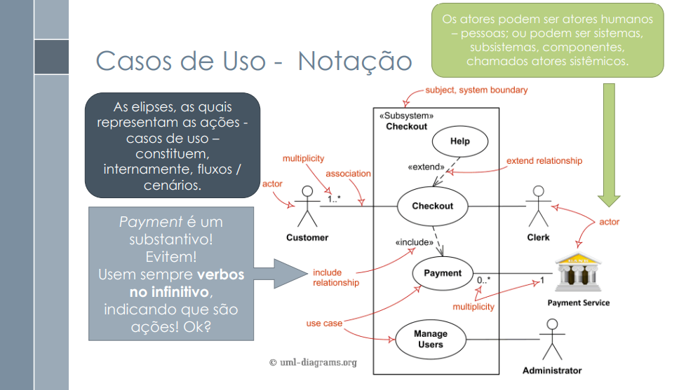
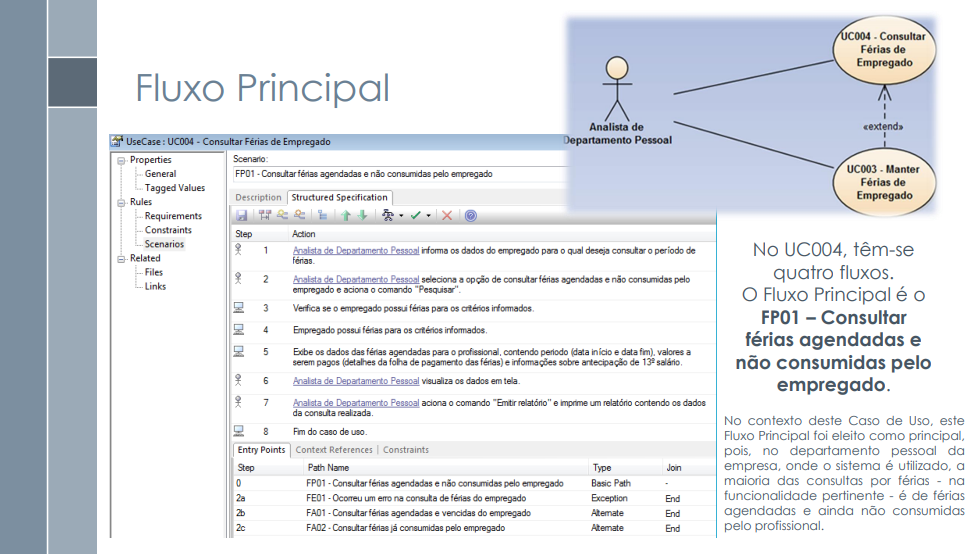
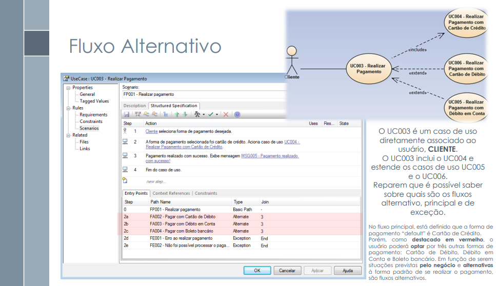
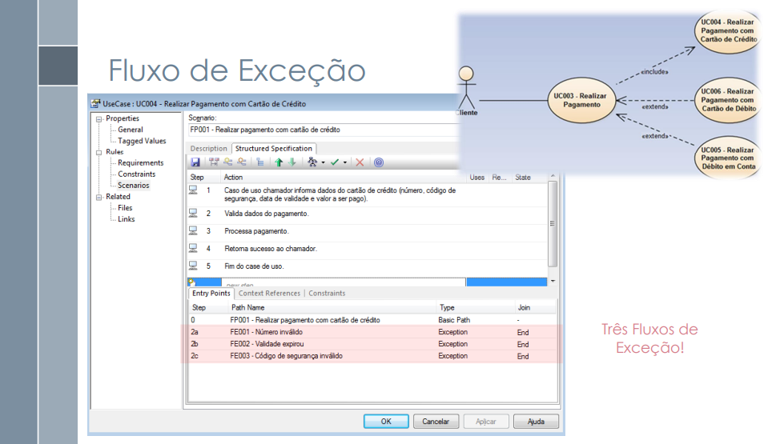

#  Verificação dos Casos de Uso

## Introdução

&emsp;&emsp;Este documento inclui as verificações utilizada para inspecionar o artefato dos casos de uso. Ao final, são apresentados em detalhes os resultados alcançados por meio dessa inspeção.

## Objetivo

&emsp;&emsp; O objetivo da verificação é garantir que todos os critérios de avaliação foram plenamente atendidos. Para isso, é feita uma análise do conteúdo e da estrutura do artefato, com o intuito de melhorar sua qualidade.

## Metodologia

&emsp;&emsp; A verificação foi realizada utilizando uma lista de critérios de avaliação, elaborada com base no plano de ensino da disciplina. Com essa lista, foi feito uma verificação para confirmar se cada critério de avaliação havia sido atendido ou não, contando ainda com uma coluna para observações, permitindo o registro de detalhes adicionais ou outras considerações.

Neste documento, realizou-se a avaliação do artefato <a href="http://127.0.0.1:8000/modelagem/caso_uso/">dos Casos de uso</a>, que trata das atividades realizadas no desenvolvimento do aplicativo <a href="https://play.google.com/store/apps/details?id=br.gov.df.caesb.mobile&hl=pt_BR">Caesb Autoatendimento</a>.

## Verificação dos Casos de Uso

&emsp;&emsp;A tabela 01 apresenta a Lista de Verificação dos casos de uso que foi elaborada com base no plano de ensino da disciplina

Tabela 01: Verificação dos Casos de uso

| **ID** | **Descrição**                                                                                                                                             | **Avaliação** | **Autor**      | **Observações**              |
|--------|-----------------------------------------------------------------------------------------------------------------------------------------------------------|---------------|----------------|------------------------------|
| 01     | 
A especificação do caso de uso?
                                                                                                | Sim           | André Barros   | Versão 1.0  06/12.          |
| 02     | 
Os atores principais e atores secundários no diagrama de caso de uso? Adicionar referência bibliográfica da fonte e foto do texto da referência explicando os atores principais e atores secundários.
 | Sim           | André Barros   | Versão 1.0  06/12.          |
| 03     | 
O ator principal está do lado esquerdo do sistema no diagrama de caso de uso? Adicionar referência bibliográfica da fonte e foto do texto da referência explicando esse item de avaliação.
 | Sim           | André Barros   | Versão 1.0  06/12.          |
| 04     | 
Os atores estão fora da caixa de limite do sistema no diagrama de caso de uso? Adicionar referência bibliográfica da fonte e foto do texto da referência explicando esse item de avaliação.
 | Sim           | André Barros   | Versão 1.0  06/12.          |
| 05     | 
A especificação do diagrama de caso de uso (com Nome, Descrição, Atores, Pré-Condição, Pós-Condição, Fluxo Principal, Fluxo Alternativo e Fluxo de Exceção etc.)? Adicionar referência bibliográfica da fonte e foto do texto da referência explicando a estrutura da especificação.
 | Sim           | André Barros   | Versão 1.0  06/12.          |
| 06     | 
No diagrama de Caso de Uso há ao menos um caso de uso com pontos de extensão? Adicionar referência bibliográfica da fonte e foto do texto da referência explicando o ponto de extensão.
 | Sim           | André Barros   | Versão 1.0  06/12.          |
| 07     | 
A participação do cliente e/ou persona na validação do Diagrama de Caso de Uso?
                                             | Sim           | André Barros   | Versão 1.0  06/12.          |

 Autor(a): <a href="https://github.com/Ninja-Haiyai" target = "_blank">Matheus Barros</a></h6>

## Link da gravação
Pode ser vista no [YouTube](https://youtu.be/4_Yi73A5_lQ).

    
Vídeo 01: Verificação dos Casos de uso

    <iframe width="760" height="515" src="https://www.youtube.com/embed/4_Yi73A5_lQ?si=O1CfKv8fB5p30qoo" title="YouTube video player" frameborder="0" allow="accelerometer; autoplay; clipboard-write; encrypted-media; gyroscope; picture-in-picture; web-share" referrerpolicy="strict-origin-when-cross-origin" allowfullscreen></iframe>
    Autor(a): <a href="https://github.com/Ninja-Haiyai" target = "_blank">Matheus Barros</a></h6>

## Problemas encontrados

&emsp;&emsp;Para este artefato não foram encontrados problemas.

## Sugestões

&emsp;&emsp;Como o artefato está de acordo com o esperado não há sugestões.

 

## Referências

> 
1. SERRANO, Milene. Requisitos – Aula 13. 2017. Apresentação de slides. Disponível em: https://aprender3.unb.br/pluginfile.php/2972480/mod_resource/content/1/Requisitos%20-%20Aula%20013a.pdf. Acesso em: 03/12/2024.

<figcaption>Imagem 1: Foto da Referência 1</figcaption> 

 

<figcaption>Imagem 1: Foto da Referência 2</figcaption> 

 

<figcaption>Imagem 1: Foto da Referência 3</figcaption> 

 

<figcaption>Imagem 1: Foto da Referência 4</figcaption> 

 

## Histórico de Versão

| Versão |    Data    |      Descrição       |  Autor  | Revisor |
| :----: | :--------: | :------------------: | :-----: | :-----: |
|  1.0   | 06/12/2024 | Criação do Documento e Lista de Verificação | [Matheus Barros](https://github.com/Ninja-Haiyai) | [Leandro de Almeida](https://github.com/leomitx10) |

