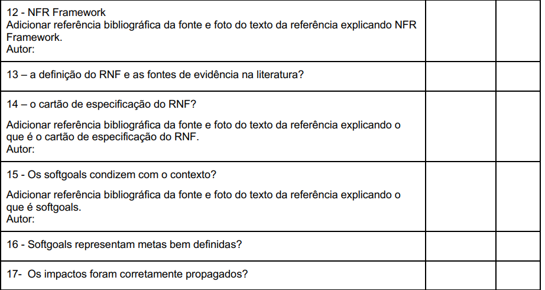

# Verificação NFR Framework

## Introdução

&emsp;&emsp;Este documento inclui as verificações utilizada para inspecionar o artefato do NFR Framework. Ao final, são apresentados em detalhes os resultados alcançados por meio dessa inspeção.

## Objetivo

&emsp;&emsp; O objetivo da verificação é garantir que todos os critérios de avaliação foram plenamente atendidos. Para isso, é feita uma análise do conteúdo e da estrutura do artefato, com o intuito de melhorar sua qualidade.

## Metodologia

&emsp;&emsp; A verificação foi realizada utilizando uma lista de critérios de avaliação, elaborada com base no plano de ensino da disciplina. Com essa lista, foi feito uma verificação para confirmar se cada critério de avaliação havia sido atendido ou não, contando ainda com uma coluna para observações, permitindo o registro de detalhes adicionais ou outras considerações.

Neste documento, realizou-se a avaliação do artefato do <a href="https://requisitos-de-software.github.io/2024.2-CAESB-Autoatendimento/modelagem_agil/nfr/">NFR Framework</a>, que trata das atividades realizdas no desenvolvimento do aplicativo <a href="https://github.com/Requisitos-de-Software/2024.2-CAESB-Autoatendimento">Caesb Autoatendimento</a>.

## Verificação da Elicitação

&emsp;&emsp;A tabela 01 apresenta a Lista de Verificação do NFR Framework que foi elaborada com base no plano de ensino da disciplina

Tabela 01: Verificação das Técnicas de Elicitação

| **ID** | **Descrição**                                              | **Avaliação** | **Autor**    | **Observações**   |
| ------ | ---------------------------------------------------------- | ------------- | ------------ | ----------------- |
| 01     | A definição do RNF e as fontes de evidência na literatura? | Sim           | André Barros | Versão 1.5 17/12. |
| 02     | O artefato possui cartão de especificação do RNF?          | Incompleto  | André Barros | Versão 1.5 17/12. |
| 03     | Os softgoals condizem com o contexto?                      | Sim           | André Barros | Versão 1.5 17/12. |
| 04     | Softgoals representam metas bem definidas?                 | Sim           | André Barros | Versão 1.5 17/12. |
| 05     | Os impactos foram corretamente propagados?                 | Sim           | André Barros | Versão 1.5 17/12. |
| 06     | O artefato possui rastreabilidade para os requisitos não funcionais utilizados?                 | Sim           | Autor(a): <a href="https://github.com/LeticiaResende23" target = "_blank">Letícia Resende</a>, <a href="https://github.com/natanalmeida03" target = "_blank">Natan Almeida</a>, <a href="https://github.com/leomitx10" target = "_blank">Leandro de Almeida</a>   | Versão 1.5 17/12. |
| 07     | Os requisitos não-funcionais são verificáveis?             |     Sim     | Autor(a): <a href="https://github.com/LeticiaResende23" target = "_blank">Letícia Resende</a>, <a href="https://github.com/natanalmeida03" target = "_blank">Natan Almeida</a>, <a href="https://github.com/leomitx10" target = "_blank">Leandro de Almeida</a>   | Versão 1.5 17/12. |

Autor(a): <a href="https://github.com/LeticiaResende23" target = "_blank">Letícia Resende</a>, <a href="https://github.com/natanalmeida03" target = "_blank">Natan Almeida</a>, <a href="https://github.com/leomitx10" target = "_blank">Leandro de Almeida</a>,

## Link da gravação

Pode ser vista no [YouTube]().

    
Vídeo 01: Verificação NFR Framework

    <iframe width="760" height="515" src="https://youtube.com" title="YouTube video player" frameborder="0" allow="accelerometer; autoplay; clipboard-write; encrypted-media; gyroscope; picture-in-picture; web-share" referrerpolicy="strict-origin-when-cross-origin" allowfullscreen></iframe>

Autor(a): <a href="https://github.com/LeticiaResende23" target = "_blank">Letícia Resende</a>, <a href="https://github.com/natanalmeida03" target = "_blank">Natan Almeida</a>, <a href="https://github.com/leomitx10" target = "_blank">Leandro de Almeida</a>,

## Problemas encontrados

&emsp;&emsp;Embora os requisitos não funcionais tenham sido detalhados na história de usuário, o artefato não possui o cartão de especificação.

## Sugestões

&emsp;&emsp;Como o artefato está de acordo com o esperado não há sugestões.

 

## Referências

> 
1. CARDOSO, Renato. Engenharia dos requisitos de software. Disponível em: https://www.cin.ufpe.br/~joa/menu_options/school/cursos/engsoft/aulas/requisitos-conceitos.pdf .Acesso em: 17 de Dez. de 2024.

<figcaption>Imagem 1: Foto da Referência 1</figcaption>

 

 

Autor(a): <a href="https://github.com/LeticiaResende23" target = "_blank">Letícia Resende</a>, <a href="https://github.com/natanalmeida03" target = "_blank">Natan Almeida</a>, <a href="https://github.com/leomitx10" target = "_blank">Leandro de Almeida</a>,

 

> 
2. SALES, André Barros de. Plano de Ensino - Requisitos de Software. Disponível em: https://aprender3.unb.br/mod/resource/view.php?id=1305187. Acesso em: 17 de Dez. de 2024.

 

 

<figcaption>Imagem 2: Foto da Referência 2</figcaption>

 

Autor(a): <a href="https://github.com/LeticiaResende23" target = "_blank">Letícia Resende</a>, <a href="https://github.com/natanalmeida03" target = "_blank">Natan Almeida</a>, <a href="https://github.com/leomitx10" target = "_blank">Leandro de Almeida</a>,

> 
3. SERRANO, Milene. Requisitos – Aula 17. Disponível em: https://aprender3.unb.br/pluginfile.php/2972516/mod_resource/content/1/Requisitos%20-%20Aula%20019a.pdf. Acesso em: 17 de Dez. 2024

## Histórico de Versão

| Versão |    Data    |                  Descrição                  |                       Autor                        |                        Revisor                         |
| :----: | :--------: | :-----------------------------------------: | :------------------------------------------------: | :----------------------------------------------------: |
|  1.0   | 17/12/2024 | Criação do Documento e Lista de Verificação | [Letícia Resende](https://github.com/LeticiaResende23)  [Leandro de Almeida](https://github.com/leomitx10)  [Natan Almeida](https://github.com/natanalmeida03)| [Matheus Barros](https://github.com/Ninja-Haiyai)   [Joao Victor](https://github.com/jmarquees) |
