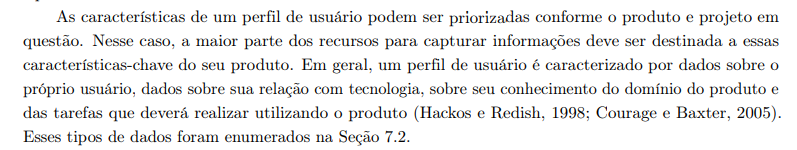

#  Verificação das Técnicas de Priorização

## Introdução

&emsp;&emsp;Este documento inclui as verificações utilizada para inspecionar o artefato das Técnicas de Priorização. Ao final, são apresentados em detalhes os resultados alcançados por meio dessa inspeção.

## Objetivo

&emsp;&emsp; O objetivo da verificação é garantir que todos os critérios de avaliação foram plenamente atendidos. Para isso, é feita uma análise do conteúdo e da estrutura do artefato, com o intuito de melhorar sua qualidade.

## Metodologia

&emsp;&emsp; A verificação foi realizada utilizando uma lista de critérios de avaliação, elaborada com base no plano de ensino da disciplina. Com essa lista, foi feito uma verificação para confirmar se cada critério de avaliação havia sido atendido ou não, contando ainda com uma coluna para observações, permitindo o registro de detalhes adicionais ou outras considerações.

Neste documento, realizou-se a avaliação do artefato <a href="http://127.0.0.1:8000/priorizacao/introducao/">das Técnicas de Priorização</a>, que trata das atividades realizadas no desenvolvimento do aplicativo <a href="https://github.com/Requisitos-de-Software/2024.2-CAESB-Autoatendimento">Caesb Autoatendimento</a>.

## Verificação da Introspecção

&emsp;&emsp;A tabela 01 apresenta a Lista de Verificação das Técnicas de Elicitação que foi elaborada com base no plano de ensino da disciplina

Tabela 01: Verificação das Técnicas de Priorização

| **Id** | **Descrição**                                                                                       | **Avaliação** | **Observações**                                |
|--------|-----------------------------------------------------------------------------------------------------|---------------|-----------------------------------------------|
| 01      | Um cronograma (data e horário) e local para realização da priorização dos requisitos com o cliente e/ou persona do projeto. | Sim     | Definir data, horário e local.                |
| 02      | No mínimo duas técnicas de priorização (quanto mais melhor).                                        | Sim     | Escolher técnicas; considerar referências.    |
| 03     | A participação do cliente e/ou persona no processo de priorização.                                  | Sim     | Verificar disponibilidade e engajamento.      |
| 04     | A gravação e o(s) registro(s) da atividade de priorização dos requisitos.                           | Sim    | Planejar recursos e meios para registros.     |

 Autor(a): <a href="https://github.com/Ninja-Haiyai" target = "_blank">Matheus Barros</a></h6>

## Link da gravação
Pode ser vista no [YouTube](https://youtu.be/6z7i3oNtn6E).

    
Vídeo 01: Verificação das Técnicas de Priorização

    <iframe width="760" height="515" src="https://www.youtube.com/embed/6z7i3oNtn6E?si=rEQAZt6_zhwkaspI" title="YouTube video player" frameborder="0" allow="accelerometer; autoplay; clipboard-write; encrypted-media; gyroscope; picture-in-picture; web-share" referrerpolicy="strict-origin-when-cross-origin" allowfullscreen></iframe>
    Autor(a): <a href="https://github.com/Ninja-Haiyai" target = "_blank">Matheus Barros</a></h6>

## Problemas encontrados

&emsp;&emsp;Para este artefato não foram encontrados problemas.

## Sugestões

&emsp;&emsp;Como o artefato está de acordo com o esperado não há sugestões.

 

## Referências

> 
1. Barbosa, S. D. J.; Silva, B. S. da; Silveira, M. S.; Gasparini, I Darin, T.; Barbosa, G. D. J. (2021)Interação Humano-Computador e Experiência do usuário. Autopublicação. ISBN: 978-65-00-19677-1. p. 166
   Acesso em: 23 nov. 2024.

 

<figcaption>Imagem 1: Foto da Referência 1</figcaption> 

## Histórico de Versão

| Versão |    Data    |      Descrição       |  Autor  | Revisor |
| :----: | :--------: | :------------------: | :-----: | :-----: |
|  1.0   | 23/11/2024 | Criação do Documento e Lista de Verificação | [Matheus Barros](https://github.com/Ninja-Haiyai) | [Leandro de Almeida](https://github.com/leomitx10) |

