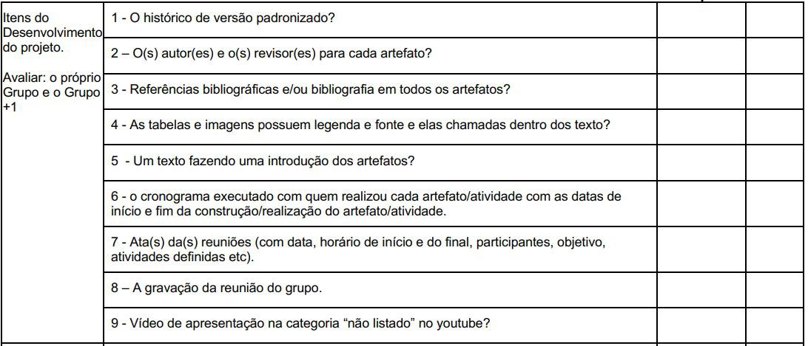

# Itens de desenvolvimento do projeto

## Introdução

&emsp;&emsp;Este documento inclui as verificações utilizadas para inspecionar os Itens de desenvolvimento do projeto do <a href="https://requisitos-de-software.github.io/2024.2-MeuSUSDigital/">Grupo 4(Meu SUS Digital)</a>. Ao final, são apresentados em detalhes os resultados alcançados por meio dessa inspeção.

## Objetivo

&emsp;&emsp; O objetivo da verificação é garantir que todos os critérios de avaliação foram plenamente atendidos. Para isso, é feita uma análise do conteúdo e da estrutura dos artefatos, com o intuito de melhorar sua qualidade.

## Metodologia

&emsp;&emsp; A verificação foi realizada utilizando uma lista de critérios de avaliação, elaborada com base no plano de ensino da disciplina. Com essa lista, foi feito um checklist para confirmar se cada critério de avaliação havia sido atendido ou não, contando ainda com uma coluna para observações, permitindo o registro de detalhes adicionais ou outras considerações.

## Verificação do Aplicativo Escolhido

&emsp;&emsp;A tabela 01 apresenta a Lista de Verificação dos Itens de desenvolvimento do projeto do <a href="https://requisitos-de-software.github.io/2024.2-MeuSUSDigital/">Grupo 4(Meu SUS Digital)</a>, que foi elaborada com base no plano de ensino da disciplina

Tabela 01: Verificação dos Itens de desenvolvimento do projeto

| **ID** | **Descrição**                                                                                       | **Avaliação** | **Autor**      | **Observações**                                |
|--------|-----------------------------------------------------------------------------------------------------|---------------|----------------|-----------------------------------------------|
| 01     | O histórico de versão padronizado? | Sim           | André Barros   | Versão 1.0 - 09/12.                           |
| 02     | O(s) autores e o(s) revisores para cada artefato?                                        | Sim           | André Barros   | Versão 1.0 - 09/12.                           |
| 03     | Referências bibliograficas e/ou bibliografia em todos os artefatos?                                  | Sim           | André Barros   | Versão 1.0 - 09/12.                           |
| 04     | As tabelas e imagens possuem legenda e fonte e elas chamadas dentro dos textos?                           | Sim           | André Barros   | Versão 1.0 - 09/12.                           |
| 05     | Um texto fazendo uma introdução dos artefatos?                           | Sim           | André Barros   | Versão 1.0 - 09/12. 
| 06     | O cronograma executado com quem realizou cada artefato/atividade com as datas de íncio e fim da construção e realização do artefato/atividade  | Sim           | André Barros   | Versão 1.0 - 09/12.                           |
| 07     | Ata(s) das reuniões (com data, horário de início e do final, participantes, objetivo, atividades definidas, etc).                                        | Sim           | André Barros   | Versão 1.0 - 09/12.                           |
| 08     | A gravação da reunião do grupo.                                 | Sim           | André Barros   | Versão 1.0 - 09/12.                           |
| 09     | Vídeo de apresentação na categoria "não listado" no youtube?                           | Sim           | André Barros   | Versão 1.0 - 09/12.  
| 10     | Todos os artefatos estão formatados de acordo com o padrão definido?                          | Sim           | Joao Victor Marques   | Versão 1.0 - 09/12.  

 Autor(a): <a href="https://github.com/jmarquees" target = "_blank">Joao Victor Marques</a></h6>

## Link da gravação
Pode ser vista no [YouTube](https://youtu.be/_Izb61eEJng?si=F5clgHBv_MkUT0HD).

    
Vídeo 01: Verificação dos Itens de desenvolvimento do projeto

    <iframe width="760" height="515" src="https://www.youtube.com/embed/_Izb61eEJng?si=F5clgHBv_MkUT0HD" title="YouTube video player" frameborder="0" allow="accelerometer; autoplay; clipboard-write; encrypted-media; gyroscope; picture-in-picture; web-share" referrerpolicy="strict-origin-when-cross-origin" allowfullscreen></iframe>

    Autor(a): <a href="https://github.com/jmarquees" target = "_blank">Joao Victor Marques</a></h6>

## Problemas encontrados

&emsp;&emsp;Para este artefato não foram encontrados problemas.

## Sugestões

&emsp;&emsp;Como o artefato está de acordo com o esperado não há sugestões.

 

## Referências

> 
2. SALES, André Barros de. Plano de Ensino - Requisitos de Software. Disponível em: https://aprender3.unb.br/mod/resource/view.php?id=1305187. Acesso em: 09 de Dez. de 2024.

 <figcaption>Imagem 1: Foto da Referência 1</figcaption>

 

Autor(a): <a href="https://github.com/jmarquees" target = "_blank">Joao Marques</a></h6>

 

## Histórico de Versão

| Versão |    Data    |      Descrição       |  Autor  | Revisor |
| :----: | :--------: | :------------------: | :-----: | :-----: |
|  1.0   | 08/12/2024 | Criação do Documento e Lista de Verificação | [Joao Vicor Marques](https://github.com/jmarquees) | [Letícia Resende](https://github.com/LeticiaResende23) |