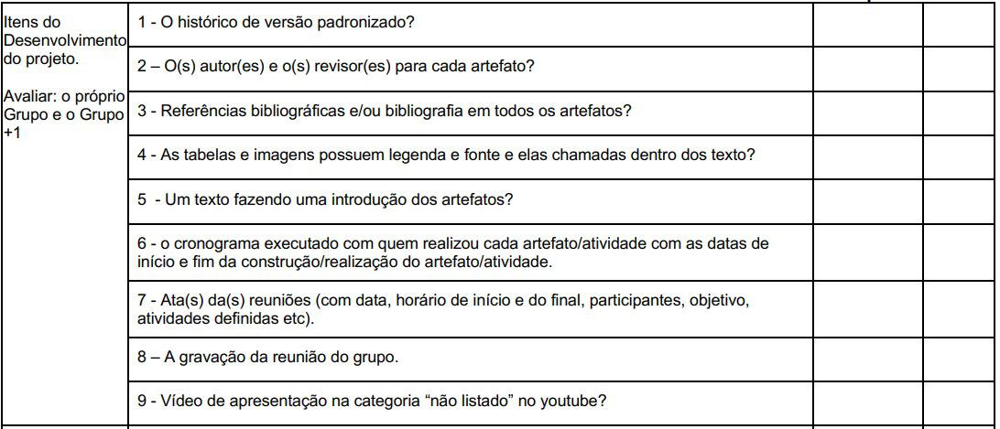

#  Verificação dos Itens de Desenvolvimento do Projeto

## Introdução

&emsp;&emsp;Este documento inclui as verificações utilizada para inspecionar os itens de desenvolvimento do projeto do <a href="https://requisitos-de-software.github.io/2024.2-MeuSUSDigital/">Grupo 4 (Meu SUS Digital)</a>. Ao final, são apresentados em detalhes os resultados alcançados por meio dessa inspeção.

## Objetivo

&emsp;&emsp; O objetivo da verificação é garantir que todos os critérios de avaliação foram plenamente atendidos. Para isso, é feita uma análise do conteúdo e da estrutura do artefato, com o intuito de melhorar sua qualidade.

## Metodologia

&emsp;&emsp; A verificação foi realizada utilizando uma lista de critérios de avaliação, elaborada com base no plano de ensino da disciplina. Com essa lista, foi feito uma verificação para confirmar se cada critério de avaliação havia sido atendido ou não, contando ainda com uma coluna para observações, permitindo o registro de detalhes adicionais ou outras considerações.

Neste documento, realizou-se a avaliação do projeto <a href="https://requisitos-de-software.github.io/2024.2-MeuSUSDigital/">Meu SUS Digital</a>, que trata das atividades realizadas no desenvolvimento do aplicativo <a href="https://play.google.com/store/apps/details?id=br.gov.datasus.cnsdigital&hl=pt_BR&pli=1">Meu SUS Digital</a>.

## Verificação dos Itens de Desenvolvimento do Projeto

&emsp;&emsp;A tabela 01 apresenta a lista de  Verificação do Desenvolvimento do projeto que foi elaborada com base no plano de ensino da disciplina e 02 apresenta a verificação.

Tabela 01: Lista Verificação dos Itens de Desenvolvimento do Projeto

| **ID** | **Descrição**                                                                                       | **Avaliação** | **Autor**      | **Observações**                                |
|--------|-----------------------------------------------------------------------------------------------------|---------------|----------------|-----------------------------------------------|
| 01     | O histórico de versão padronizado? |  | André Barros |  |
| 02     | O(s) autores e o(s) revisores para cada artefato? |  | André Barros |   |
| 03     | Referências bibliograficas e/ou bibliografia em todos os artefatos? |  | André Barros   |  |
| 04     | As tabelas e imagens possuem legenda e fonte e elas chamadas dentro dos textos? |  | André Barros |  |
| 05     | Um texto fazendo uma introdução dos artefatos?|  | André Barros | |
| 06     | O cronograma executado com quem realizou cada artefato/atividade com as datas de íncio e fim da construção e realização do artefato/atividade  |  | André Barros |  |
| 07     | Ata(s) das reuniões (com data, horário de início e do final, participantes, objetivo, atividades definidas, etc).|  | André Barros |  |
| 08     | A gravação da reunião do grupo. |  | André Barros |  |
| 09     | Vídeo de apresentação na categoria "não listado" no youtube? |  | André Barros | 

Autor(a): <a href="https://github.com/LeticiaResende23" target = "_blank">Letícia Resende</a> e <a href="https://github.com/leomitx10" target = "_blank">Leandro de Almeida</a>

 

Tabela 02: Verificação dos Itens de Desenvolvimento do Projeto

| **ID** | **Descrição** | **Avaliação** | **Autor** | **Observações**|
|--------|---------------|---------------|-----------|----------------|
| 01     | O histórico de versão padronizado? |      Sim      | André Barros   |     versão 1.5 18/01                        |
| 02     | O(s) autores e o(s) revisores para cada artefato?                                        |    Sim        | André Barros   | versão 1.5 18/01                                |
| 03     | Referências bibliograficas e/ou bibliografia em todos os artefatos?                                  |     Sim       | André Barros   |  versão 1.5 18/01                              |
| 04     | As tabelas e imagens possuem legenda e fonte e elas chamadas dentro dos textos?                           |    Sim        | André Barros   | versão 1.5 18/01                               |
| 05     | Um texto fazendo uma introdução dos artefatos?                           |  Sim          | André Barros   |  versão 1.5 18/01    
| 06     | O cronograma executado com quem realizou cada artefato/atividade com as datas de íncio e fim da construção e realização do artefato/atividade  |     Sim       | André Barros   |         versão 1.5 18/01                       |
| 07     | Ata(s) das reuniões (com data, horário de início e do final, participantes, objetivo, atividades definidas, etc).                                        |    Sim        | André Barros   |        versão 1.5 18/01                        |
| 08     | A gravação da reunião do grupo.                                 |      Sim      | André Barros   |      versão 1.5 18/01                          |
| 09     | Vídeo de apresentação na categoria "não listado" no youtube?                           |      Sim      | André Barros   |   versão 1.5 18/01    

Autor(a): <a href="https://github.com/LeticiaResende23" target = "_blank">Letícia Resende</a> e <a href="https://github.com/leomitx10" target = "_blank">Leandro de Almeida</a>

## Problemas encontrados

&emsp;&emsp;Para este artefato não foram encontrados problemas.

## Sugestões

&emsp;&emsp;Como o artefato está de acordo com o esperado não há sugestões.

 

## Referências

> 
1. SALES, André Barros de. Plano de Ensino - Requisitos de Software. Disponível em: https://aprender3.unb.br/mod/resource/view.php?id=1305187. Acesso em: 24 de Nov. de 2024.

 <figcaption>Imagem 1: Foto da Referência 1</figcaption>

 

Autor(a): <a href="https://github.com/LeticiaResende23" target = "_blank">Letícia Resende</a> e <a href="https://github.com/leomitx10" target = "_blank">Leandro de Almeida</a>

 

## Histórico de Versão

| Versão |    Data    |      Descrição       |  Autor  | Revisor |
| :----: | :--------: | :------------------: | :-----: | :-----: |
|  1.0   | 20/01/2025 | Criação do Documento  | [Joao Victor Marques](https://github.com/jmarquees)| [Matheus Barros](https://github.com/Ninja-Haiyai)|

