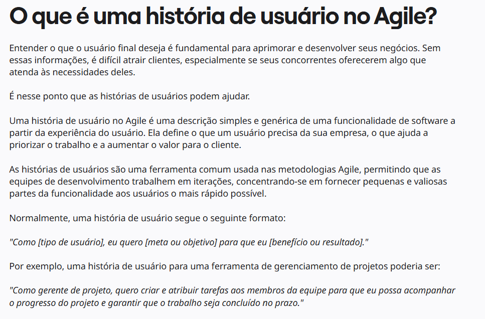

#  Verificação das Histórias de Usuário

## Introdução

&emsp;&emsp;Este documento inclui as verificações utilizada para inspecionar o artefato das Histórias de Usuários. Ao final, são apresentados em detalhes os resultados alcançados por meio dessa inspeção.

## Objetivo

&emsp;&emsp; O objetivo da verificação é garantir que todos os critérios de avaliação foram plenamente atendidos. Para isso, é feita uma análise do conteúdo e da estrutura do artefato, com o intuito de melhorar sua qualidade.

## Metodologia

&emsp;&emsp; A verificação foi realizada utilizando uma lista de critérios de avaliação, elaborada com base no plano de ensino da disciplina. Com essa lista, foi feito uma verificação para confirmar se cada critério de avaliação havia sido atendido ou não, contando ainda com uma coluna para observações, permitindo o registro de detalhes adicionais ou outras considerações.

Neste documento, realizou-se a avaliação do artefato de <a href="https://requisitos-de-software.github.io/2024.2-CAESB-Autoatendimento/modelagem_agil/historia_usuario/">Histórias de Usuário</a>, que trata das atividades realizadas no desenvolvimento do aplicativo <a href="https://play.google.com/store/apps/details?id=br.gov.df.caesb.mobile&hl=pt_BR">Caesb Autoatendimento</a>.

## Verificação das Histórias de Usuário

&emsp;&emsp;A tabela 01 apresenta a lista de  Verificação das Histórias de Usuário  que foram elaboradas com base no plano de ensino da disciplina e 02 apresenta a verificação.

Tabela 01: Lista de Verificação das Histórias de Usuário

| **ID** | **Descrição**  | **Avaliação** | **Autor**                     | **Observações**    |
|--------|----------------|---------------|-------------------------------|--------------------|
| 01     | 
Os títulos das histórias de usuário são auto-explicativos?
  |               | André Barros                |                    |
| 02     | 
O “quem”, “o que” e o “por que” estão definidos na história de usuário?
    |               | André Barros                |                    |
| 03     | 
A participação do cliente e/ou persona na validação das histórias de usuário?
 |               | André Barros                |                    |
| 04     | 
A participação do cliente e/ou persona na elicitação de requisitos?
 |               | André Barros                |                    |
| 05     | 
Todas as histórias de usuários podem ser testadas?
 |               | André Barros                |                    |
| 06     | 
A história possui critérios de aceitação?
 |               | André Barros                |                    |
| 07     | 
As histórias de usuário são concisas, evitando jargões técnicos e mantendo a linguagem acessível para todos os stakeholders?
 |               | Matheus Barros |                    |
| 08     | 
Os critérios de aceitação são específicos e mensuráveis, permitindo uma avaliação clara de quando a história está concluída?
 |               | Matheus Barros|                    |
| 09     | 
A equipe de desenvolvimento consegue entender claramente o que é necessário para implementar a história?
 |               | Joao Victor Marques             |     |
| 10     | 
A história de usuário agrega valor direto ao produto ou serviço?
 |               | Joao Victor Marques             |     |

Autor(a): <a href="https://github.com/Ninja-Haiyai" target="_blank">Matheus Barros</a>, <a href="https://github.com/jmarquees" target="_blank">Joao Victor Marques</a>

 

Tabela 02: Verificação das Histórias de Usuário

| **ID** | **Descrição**  | **Avaliação** | **Autor**                     | **Observações**    |
|--------|----------------|---------------|-------------------------------|--------------------|
| 01     | 
Os títulos das histórias de usuário são auto-explicativos?
  | Sim           | André Barros                | Versão 1.0 18/12    |
| 02     | 
O “quem”, “o que” e o “por que” estão definidos na história de usuário?
    | Sim           | André Barros                | Versão 1.0 18/12    |
| 03     | 
A participação do cliente e/ou persona na validação das histórias de usuário?
 | Sim           | André Barros                | Versão 1.0 18/12    |
| 04     | 
A participação do cliente e/ou persona na elicitação de requisitos?
 | Sim           | André Barros                | Versão 1.0 18/12    |
| 05     | 
Todas as histórias de usuários podem ser testadas?
 | Sim           | André Barros                | Versão 1.0 18/12    |
| 06     | 
A história possui critérios de aceitação?
 | Sim           | André Barros                | Versão 1.0 18/12    |
| 07     | 
As histórias de usuário são concisas, evitando jargões técnicos e mantendo a linguagem acessível para todos os stakeholders?
 | Sim           | Matheus Barros             | Versão 1.0 18/12    |
| 08     | 
Os critérios de aceitação são específicos e mensuráveis, permitindo uma avaliação clara de quando a história está concluída?
 | Sim           | Matheus Barros             | Versão 1.0 18/12    |
| 09     | 
A equipe de desenvolvimento consegue entender claramente o que é necessário para implementar a história?
 | Sim           | Joao Victor Marques             | Versão 1.0 18/12    |
| 10     | 
A história de usuário agrega valor direto ao produto ou serviço?
 | Sim           | Joao Victor Marques             | Versão 1.0 18/12    |

Autor(a): <a href="https://github.com/Ninja-Haiyai" target="_blank">Matheus Barros</a>, <a href="https://github.com/jmarquees" target="_blank">Joao Victor Marques</a>

## Link da gravação
Pode ser vista no [YouTube](https://youtu.be/5GoCtVwS9-U).

    
Vídeo 01: Verificação das Histórias de Usuário

    <iframe width="760" height="515" src="https://www.youtube.com/embed/5GoCtVwS9-U?si=bF34wvnwywt0MOuI" title="YouTube video player" frameborder="0" allow="accelerometer; autoplay; clipboard-write; encrypted-media; gyroscope; picture-in-picture; web-share" referrerpolicy="strict-origin-when-cross-origin" allowfullscreen></iframe>
 
Autor(a): <a href="https://github.com/Ninja-Haiyai" target="_blank">Matheus Barros</a>, <a href="https://github.com/jmarquees" target="_blank">Joao Victor Marques</a>

## Problemas encontrados

1. Alguns títulos não são claros o suficientes chegando a ter somente o nume da funcionalidade.

## Sugestões

1. Mudar alguns títulos para tornar eles mais explicativos sobre o do que se trata a história de usuário.

 

## Referências

> 
1. UNIVERSIDADE FEDERAL DE SANTA CATARINA. Apresentação sobre história de usuários. Disponível em: https://legado.moodle.ufsc.br/pluginfile.php/4330173/mod_resource/content/1/APRES%20HISTORIA%20DE%20USUARIOS%20PDF.pdf. Acesso em: 17 dez. 2024.

 

<figcaption>Imagem 1: Foto da Referência 1</figcaption> 

Autor(a): <a href="https://github.com/LeticiaResende23" target = "_blank">Letícia Resende</a>, <a href="https://github.com/natanalmeida03" target = "_blank">Natan Almeida</a> e <a href="https://github.com/leomitx10" target = "_blank">Leandro de Almeida</a>
 

 

> 
2. UNIVERSIDADE FEDERAL DE SANTA CATARINA. Apresentação sobre história de usuários. Disponível em: https://legado.moodle.ufsc.br/pluginfile.php/4330173/mod_resource/content/1/APRES%20HISTORIA%20DE%20USUARIOS%20PDF.pdf. Acesso em: 17 dez. 2024.

 

<figcaption>Imagem 2: Foto da Referência 2</figcaption> 

Autor(a): <a href="https://github.com/LeticiaResende23" target = "_blank">Letícia Resende</a>, <a href="https://github.com/natanalmeida03" target = "_blank">Natan Almeida</a> e <a href="https://github.com/leomitx10" target = "_blank">Leandro de Almeida</a>
 

 

> 
3. UNIVERSIDADE DE BRASÍLIA. Engenharia de Software: Uma Abordagem Profissional. Disponível em: https://aprender3.unb.br/pluginfile.php/2972503/mod_resource/content/3/Engenharia_de_Software_Uma_Abordagem_Pro.pdf. Acesso em: 17 dez. 2024.

 

<figcaption>Imagem 3: Foto da Referência 3</figcaption> 

Autor(a): <a href="https://github.com/LeticiaResende23" target = "_blank">Letícia Resende</a>, <a href="https://github.com/natanalmeida03" target = "_blank">Natan Almeida</a> e <a href="https://github.com/leomitx10" target = "_blank">Leandro de Almeida</a>
 

 

> 
2. SALES, André Barros de. Plano de Ensino - Requisitos de Software. Disponível em: https://aprender3.unb.br/mod/resource/view.php?id=1305187. Acesso em: 24 de Nov. de 2024.

 <figcaption>Imagem 4: Foto da Referência 4</figcaption>

Autor(a): <a href="https://github.com/LeticiaResende23" target = "_blank">Letícia Resende</a>, <a href="https://github.com/natanalmeida03" target = "_blank">Natan Almeida</a> e <a href="https://github.com/leomitx10" target = "_blank">Leandro de Almeida</a>
 

 

> 
3. Miro. O que é história do usuário. Disponível em: https://miro.com/pt/agile/o-que-e-historia-do-usuario/. Acesso em: 18 de dez. de 2024.

 

<figcaption>Imagem 5: Foto da Referência 5</figcaption> 

Autor(a): 
Autor(a): <a href="https://github.com/Ninja-Haiyai" target="_blank">Matheus Barros</a>, <a href="https://github.com/jmarquees" target="_blank">João Marques</a>
 

## Histórico de Versão

| Versão |    Data    |      Descrição       |  Autor  | Revisor |
| :----: | :--------: | :------------------: | :-----: | :-----: |
|  1.0   | 18/12/2024 | Criação do Documento e Lista de Verificação do Grupo + 1 | [Matheus Barros](https://github.com/Ninja-Haiyai)  [Joao Victor Marques](https://github.com/jmarquees) | [Letícia Resende](https://github.com/LeticiaResende23)  [Leandro de Almeida](https://github.com/leomitx10)  [Natan Almeida](https://github.com/natanalmeida03) |

