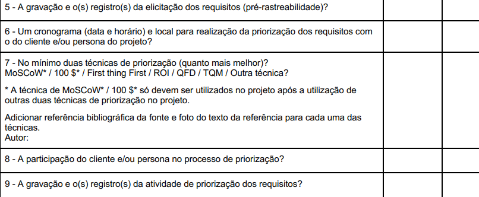

# Verificação das Técnicas de Priorização

## Introdução

&emsp;&emsp;Este documento inclui as verificações utilizada para inspecionar o artefato das Técnicas de Priorização do <a href="https://requisitos-de-software.github.io/2024.2-MeuSUSDigital/">Grupo 4(Meu SUS Digital)</a>. Ao final, são apresentados em detalhes os resultados alcançados por meio dessa inspeção.

## Objetivo

&emsp;&emsp; O objetivo da verificação é garantir que todos os critérios de avaliação foram plenamente atendidos. Para isso, é feita uma análise do conteúdo e da estrutura do artefato.

## Metodologia

&emsp;&emsp; A verificação foi realizada utilizando uma lista de critérios de avaliação, elaborada com base no plano de ensino da disciplina. Com essa lista, foi feito uma verificação para confirmar se cada critério de avaliação havia sido atendido ou não, contando ainda com uma coluna para observações, permitindo o registro de detalhes adicionais ou outras considerações.

Neste documento, realizou-se a avaliação dos artefatos das Técnicas de Priorização do grupo 4, Meu SUS Digital</a>.

## Verificação da Priorização

&emsp;&emsp;A tabela 01 apresenta a Lista de Verificação das Técnicas de Priorização que foi elaborada com base no plano de ensino da disciplina

Tabela 01: Verificação das Técnicas de Priorização

| **ID** | **Descrição**                                                                                                               | **Avaliação** | **Autor**     | **Observações**     |
| ------ | --------------------------------------------------------------------------------------------------------------------------- | ------------- | ------------- | ------------------- |
| 01     | Um cronograma (data e horário) e local para realização da priorização dos requisitos com o cliente e/ou persona do projeto. | Sim           | André Barros  | Versão 1.0 - 24/11. |
| 02     | No mínimo duas técnicas de priorização (quanto mais melhor).                                                                | Sim           | André Barros  | Versão 1.0 - 24/11. |
| 03     | A participação do cliente e/ou persona no processo de priorização.                                                          | Sim           | André Barros  | Versão 1.0 - 24/11. |
| 04     | A gravação e o(s) registro(s) da atividade de priorização dos requisitos.                                                   | Sim           | André Barros  | Versão 1.0 - 24/11. |
| 05     | Os valores atribuídos para os requisitos totalizam exatamente $100?                                                         | Não           | Natan Almeida | Versão 1.0 - 24/11. |

 Autor(a): <a href="https://github.com/natanalmeida03" target = "_blank">Natan Almeida</a>

## Link da gravação
Pode ser vista no [YouTube](https://youtu.be/l9ZI1PRKmHk).

    
Vídeo 01: Verificação das Técnicas de Priorização

    <iframe width="760" height="515" src="https://www.youtube.com/embed/l9ZI1PRKmHk?si=ks6Cnkvj3fusk_0Y" title="YouTube video player" frameborder="0" allow="accelerometer; autoplay; clipboard-write; encrypted-media; gyroscope; picture-in-picture; web-share" referrerpolicy="strict-origin-when-cross-origin" allowfullscreen></iframe>
    Autor(a): <a href="https://github.com/natanalmeida03" target = "_blank">Natan Almeida</a></h6>

## Problemas encontrados

&emsp;&emsp; com base na <a href="https://docs.google.com/spreadsheets/d/1OzpDdd8JBB9U6MkqIrp2Gd6FQbVLPAVr9WXbYPL7Pvo/edit?gid=1384717108#gid=1384717108">planilha</a> onde os valores da priorização foram dispostos, a soma dos valores totalizou $101.

## Sugestões

&emsp;&emsp;Como o artefato está de acordo com o esperado não há sugestões.

 

## Referências

> 
1. WIEGERS, Karl; Software Requirements, Third Edtion. Disponível em: https://aprender3.unb.br/pluginfile.php/2972454/mod_resource/content/3/PriorizaA%CC%83%C2%A7A%CC%83%C2%A3o%20de%20Req.pdf. Acesso em: 25 de Nov. 2024

<figcaption>Imagem 1: Foto da Referência 1</figcaption>

 </img>
 

 Autor(a): <a href="https://github.com/natanalmeida03" target = "_blank">Natan Almeida</a>
 

> 
2. SALES, André Barros de. Plano de Ensino - Requisitos de Software. Disponível em: https://aprender3.unb.br/mod/resource/view.php?id=1305187. Acesso em: 24 de Nov. de 2024.

 <figcaption>Imagem 2: Foto da Referência 2</figcaption>

 

 
Autor(a): <a href="https://github.com/natanalmeida03" target = "_blank">Natan Almeida</a>
 

> 
3. Priorização de Requisitos - Meu SUS Digital. Disponível em: https://docs.google.com/spreadsheets/d/1OzpDdd8JBB9U6MkqIrp2Gd6FQbVLPAVr9WXbYPL7Pvo/edit?gid=1384717108#gid=1384717108. Acesso em: 25 de Nov. de 2024. 

  
 <figcaption>Imagem 3: Soma na Técnica do $100</figcaption>

  

  </img>
  

 

## Histórico de Versão

| Versão |    Data    |                  Descrição                  |                       Autor                        |                      Revisor                       |
| :----: | :--------: | :-----------------------------------------: | :------------------------------------------------: | :------------------------------------------------: |
|  1.0   | 25/11/2024 | Criação do Documento e Lista de Verificação | [Natan Almeida](https://github.com/natanalmeida03) | [Leandro de Almeida](https://github.com/leomitx10) |
