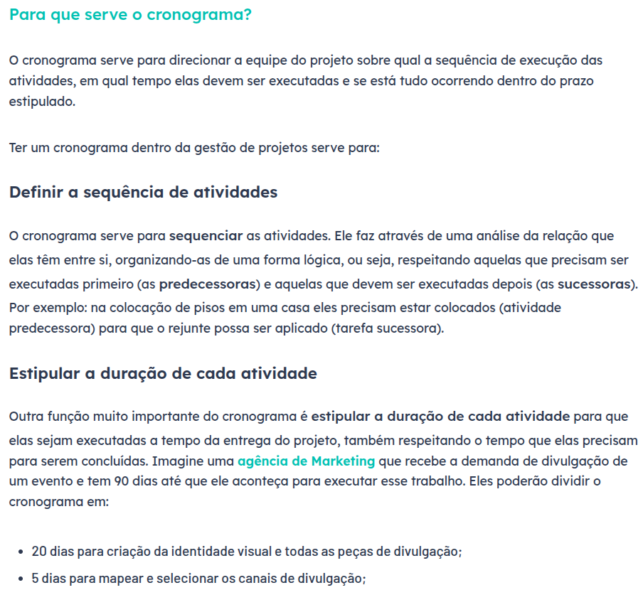
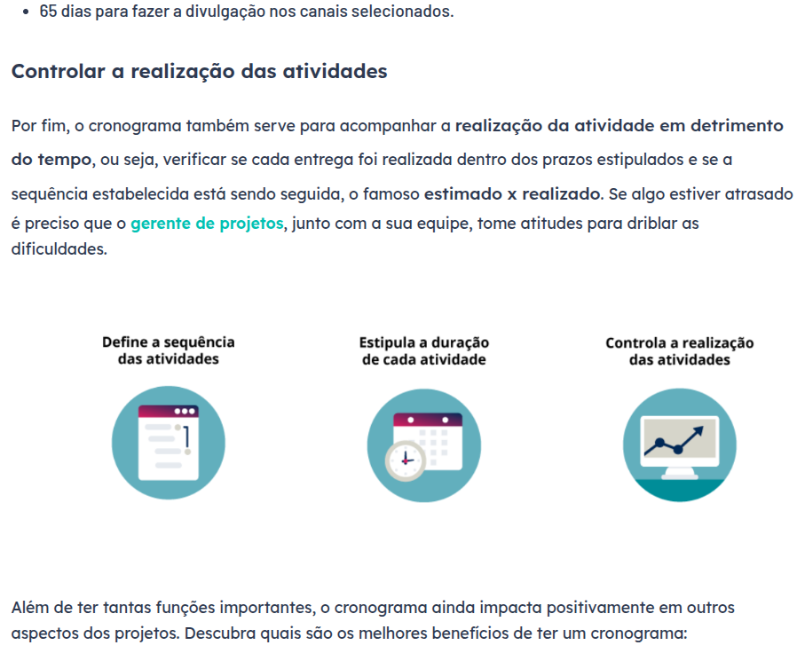
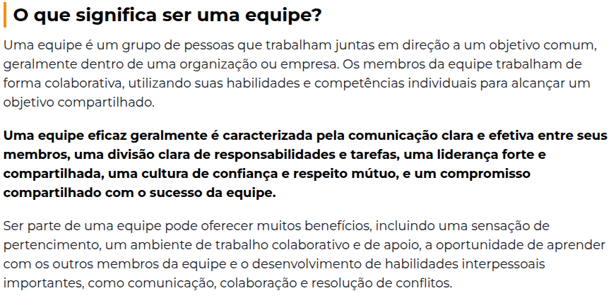
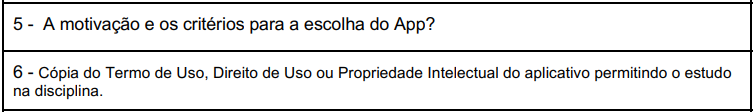
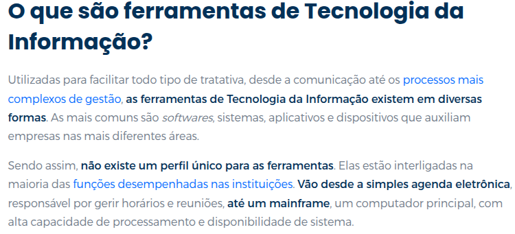

# Verificação da Entrega 1

## Introdução

&emsp;&emsp;  Este documento inclui as verificações utilizadas para inspecionar a entrega 1 do projeto <a href = "https://requisitos-de-software.github.io/2024.2-CAESB-Autoatendimento/" target = "_blank">Caesb Autoatendimento</a>. Ao final, são apresentados em detalhes os resultados alcançados por meio dessa inspeção.

## Objetivo

&emsp;&emsp; O objetivo da verificação é garantir que todos os critérios de avaliação foram plenamente atendidos. Para isso, é feita uma análise do conteúdo e da estrutura do artefato, com o intuito de melhorar sua qualidade.

## Metodologia

&emsp;&emsp;A verificação foi realizada utilizando uma lista de critérios de avaliação, elaborada com base em uma lista com o conteúdo desenvolvido em sala de aula. Com essa lista, foi feito uma verificação para confirmar se cada critério de avaliação havia sido atendido ou não, contando ainda com uma coluna para observações, permitindo o registro de detalhes adicionais ou outras considerações. Neste documento, realizou-se a avaliação dos artefatos <a href = "https://requisitos-de-software.github.io/2024.2-CAESB-Autoatendimento/planejamento/richpicture/" target = "_blank">Rich Picture</a>, <a href = "https://requisitos-de-software.github.io/2024.2-CAESB-Autoatendimento/planejamento/cronograma/" target = "_blank">Cronograma</a>, <a href = "https://requisitos-de-software.github.io/2024.2-CAESB-Autoatendimento/" target = "_blank">Equipe</a>, <a href = "https://requisitos-de-software.github.io/2024.2-CAESB-Autoatendimento/planejamento/aplicativo_escolhido/" target = "_blank">Aplicativo Selecionado</a> e <a href = "https://requisitos-de-software.github.io/2024.2-CAESB-Autoatendimento/planejamento/ferramentas/" target = "_blank">Ferramentas</a>, que trata das atividades realizadas no desenvolvimento do aplicativo Caesb Autoatendimento.

## Verificação do Rich Picture

&emsp;&emsp;A tabela 01 apresenta a lista de verificação do Rich Picture que foi elaborada com base no plano de ensino da disciplina e a tabela 02 apresenta a verificação.

Tabela 01: Lista de verificação do Rich Picture 

| **ID** | **Descrição** | **Avaliação** | **Autor** | **Observações** | **Referências** |
|--------|-------------|--------------|-----------|----------------|----------------|
| 01     | O(s) ator(es) do Rich Picture estão do lado de fora da fronteira do sistema? | | Leandro de Almeida | | 

 |   
| 02     | O Rich Picture conta uma história?  | | Letícia Resende | | 

 |   
| 03     | O Rich Picture contém atores? | | Matheus Barros | | 

 |              
| 04     | O Rich Picture representa interações relevantes entre os atores e o sistema? | | Natan Almeida | | 

 |    
| 05     | O Rich Picture possui legenda? | | Joao Victor | | 

 |              
| 06     | O artefato possui os 5 componentes essenciais de um "Rich Picture"? | | Leandro de Almeida | | 

 |    

Autor(a): <a href="https://github.com/leomitx10" target = "_blank">Leandro de Almeida</a>

 

Tabela 02: Verificação do Rich Picture 

| **ID** | **Descrição** | **Avaliação** | **Autor** | **Observações** | **Referências** |
|--------|-------------|--------------|-----------|----------------|----------------|
| 01     | O(s) ator(es) do Rich Picture estão do lado de fora da fronteira do sistema? | Sim | Leandro de Almeida  | Versão 1.7 22/11 | 

 |
| 02     | O Rich Picture conta uma história? | Sim | Letícia Resende | Versão 1.7 22/11 | 

 |
| 03     | O Rich Picture contém atores? | Sim | Matheus Barros | Versão 1.7 22/11 | 

 |
| 04     | O Rich Picture representa interações relevantes entre os atores e o sistema? | Sim | Natan Almeida | Versão 1.7 22/11 | 

 |
| 05     | O Rich Picture possui legenda? | Sim | Joao Victor | Versão 1.7 22/11 | 

 |
| 06     | O artefato possui os 5 componentes essenciais de um "Rich Picture"? | Sim | Leandro de Almeida | Versão 1.7 22/11 | 

 |

Autor(a): <a href="https://github.com/leomitx10" target = "_blank">Leandro de Almeida</a>

 

## Verificação do Cronograma

&emsp;&emsp;A tabela 03 apresenta a lista de verificação do Cronograma que foi elaborada com base no plano de ensino da disciplina e a tabela 04 apresenta a verificação.

Tabela 03: Lista de verificação do Cronograma 

| **ID** | **Descrição** | **Avaliação** | **Autor** | **Observações** | **Referências** |
|--------|-------------|--------------|-----------|----------------|----------------|
| 01     | O cronograma possui todas as atividades de todas as etapas para cada integrante? |  | Letícia Resende | |   |
| 02     | O cronograma possui datas de início e fim das entregas dos artefatos e com o período da revisão deles? |  |Leandro de Almeida | |   |
| 03     | Possui o cronograma executado? |  | Matheus Barros | |   |
| 04     | O cronograma apresenta um período de gravação da apresentação de cada etapa? |  | Joao Victor | |   |

Autor(a): <a href="https://github.com/leomitx10" target = "_blank">Leandro de Almeida</a>

 

Tabela 04: Verificação do Cronograma 

| **ID** | **Descrição** | **Avaliação** | **Autor** | **Observações** | **Referências** |
|--------|-------------|--------------|-----------|----------------|----------------|
| 01     | O cronograma possui todas as atividades de todas as etapas para cada integrante? |  Sim  | Letícia Resende | Versão 1.3	01/02 |   |
| 02     | O cronograma possui datas de início e fim das entrega dos artefatos e com o período da revisão deles? | Sim | Leandro de Almeida | Versão 1.3	01/02 |   |
| 03     | Possui o cronograma executado? | Sim | Matheus Barros | Versão 1.3	01/02 |   |
| 04     | O cronograma apresenta um período de gravação da apresentação de cada etapa?  | Sim | Joao Victor | Versão 1.3 01/02 |   |

Autor(a): <a href="https://github.com/leomitx10" target = "_blank">Leandro de Almeida</a>

 

## Verificação da Equipe

&emsp;&emsp;A tabela 05 apresenta a lista de verificação de Equipe que foi elaborada com base no plano de ensino da disciplina e a tabela 06 apresenta a verificação.

Tabela 05: Lista de verificação de Equipe 

| **ID** | **Descrição** | **Avaliação** | **Autor** | **Observações** | **Referências** |
|--------|-------------|--------------|-----------|----------------|----------------|
| 01     | O artefato apresenta todos os integrantes da equipe com base na planilha disponibilizada no aprender? | | Leandro de Almeida |  |    
| 02     | Todos os integrantes possuem foto e nome? | | Matheus Barros |  |                 
| 03     | O artefato possui o nome e o github dos integrantes? | | Letícia Resende |  |      

          

Autor(a): <a href="https://github.com/leomitx10" target = "_blank">Leandro de Almeida</a>

 

Tabela 06: Verificação de Equipe 

| **ID** | **Descrição** | **Avaliação** | **Autor** | **Observações** | **Referências** |
|--------|-------------|--------------|-----------|----------------|----------------|
| 01     | O artefato apresenta todos os integrantes da equipe com base na planilha disponibilizada no aprender? | Sim | Leandro de Almeida | Versão 1.3 16/11 |     |   
| 02     | Todos os integrantes possuem foto e nome?  | Sim | Matheus Barros | Versão 1.3 16/11 |     |  
| 03     | O artefato possui o nome e o github dos integrantes? | Sim | Letícia Resende | Versão 1.3 16/11 |  |   

Autor(a): <a href="https://github.com/leomitx10" target = "_blank">Leandro de Almeida</a>

 

## Verificação de Aplicativo Selecionado

&emsp;&emsp;A tabela 07 apresenta a lista de verificação do Aplicativo Selecionado que foi elaborada com base no plano de ensino da disciplina e a tabela 08 apresenta a verificação.

Tabela 07: Lista de verificação do Aplicativo Selecionado 

| **ID** | **Descrição** | **Avaliação** | **Autor** | **Observações** | **Referências** |
|--------|-------------|--------------|-----------|----------------|----------------|
| 01     | O artefato possui os critérios utilizados para escolher o aplicativo?  | | Matheus Barros | |  |            
| 02     | O artefato possui uma Cópia do Termo de Uso, Direito de Uso ou Propriedade Intelectual do aplicativo permitindo o estudo na disciplina? | | Letícia Resende | |  |     
| 03     | O aplicativo selecionado é gratuito? | | Leandro de Almeida | |  |
| 04     | O aplicativo selecionado pertence a uma instituição governamental pública ou é assegurado por uma licença de software livre? | | Natan Almeida | |  |  

Autor(a): <a href="https://github.com/leomitx10" target = "_blank">Leandro de Almeida</a>

 

Tabela 08: Verificação do Aplicativo Selecionado

| **ID** | **Descrição** | **Avaliação** | **Autor** | **Observações** | **Referências** |
|--------|-------------|--------------|-----------|----------------|----------------|
| 01     | O artefato possui os critérios utilizados para escolher o aplicativo? | Sim | Matheus Barros | Versão 1.3 13/11 | |
| 02     | O artefato possui uma cópia do Termo de Uso, Direito de Uso ou Propriedade Intelectual do aplicativo permitindo o estudo na disciplina? | Sim | Letícia Resende | Versão 1.3 13/11 |  |
| 03     | O aplicativo selecionado é gratuito? | Sim | Leandro de Almeida | Versão 1.3 13/11 | |
| 04     | O aplicativo selecionado pertence a uma instituição governamental pública ou é assegurado por uma licença de software livre? | Sim | Natan Almeida | Versão 1.3 13/11 | |

Autor(a): <a href="https://github.com/leomitx10" target = "_blank">Leandro de Almeida</a>

 

## Verificação de Ferramentas

&emsp;&emsp;A tabela 09 apresenta a lista de verificação de Ferramentas que foi elaborada com base no plano de ensino da disciplina e a tabela 10 apresenta a verificação.

Tabela 09: Lista de verificação de Ferramentas 

| **ID** | **Descrição** | **Avaliação** | **Autor** | **Observações** | **Referências** |
|--------|-------------|--------------|-----------|----------------|----------------|
| 01     | O artefato possui todas as ferramentas utilizadas durante o desenvolviemnto do projeto? |  | Leandro de Almeida|  ||
| 02     | O artefato possui o nome e a logo de todas as ferramentas? |  | Matheus Barros| ||
| 03     | O artefato possui a finalidade de todas as ferramentas? |  | Natan Almeida| ||

Autor(a): <a href="https://github.com/leomitx10" target = "_blank">Leandro de Almeida</a>

 

Tabela 10: Verificação de Ferramentas

| **ID** | **Descrição** | **Avaliação** | **Autor** | **Observações** | **Referências** |
|--------|-------------|--------------|-----------|----------------|----------------|
| 01     | O artefato possui todas as ferramentas utilizadas durante o desenvolviemnto do projeto? | Sim | Leandro de Almeida | Versão 1.5 01/02 ||
| 02     | O artefato possui o nome e a logo de todas as ferramentas? | Sim  | Matheus Barros | Versão 1.5 01/02 ||
| 03     | O artefato possui a finalidade de todas as ferramentas? | Sim | Natan Almeida | Versão 1.5 01/02 ||

Autor(a): <a href="https://github.com/leomitx10" target = "_blank">Leandro de Almeida</a>

 

## Link da gravação

Pode ser vista no [YouTube](https://www.youtube.com/embed/msW6G8Pm0LI?si=ngGGG5BWOsVThOyS).

    
Vídeo 01: Verificação dos artefatos

    <iframe width="760" height="515" src="https://www.youtube.com/embed/msW6G8Pm0LI?si=ngGGG5BWOsVThOyS" title="YouTube video player" frameborder="0" allow="accelerometer; autoplay; clipboard-write; encrypted-media; gyroscope; picture-in-picture; web-share" referrerpolicy="strict-origin-when-cross-origin" allowfullscreen></iframe>

Autor(a): <a href="https://github.com/leomitx10" target = "_blank">Leandro de Almeida</a>

 

Tabela 11: Tempo de início da verificação dos artefatos no vídeo

| **Artefato** | **Inicio**   | 
|:----------:|:----------:|
| Rich Picture | <a href="https://youtu.be/msW6G8Pm0LI?t=1" target="_blank">00:00</a>  | 
| Cronograma | <a href="https://youtu.be/msW6G8Pm0LI?t=93" target="_blank">01:33</a> |
| Equipe | <a href="https://youtu.be/msW6G8Pm0LI?t=172" target="_blank">02:52</a> |
| Aplicativo Selecionado | <a href="https://youtu.be/msW6G8Pm0LI?t=210" target="_blank">03:30</a> | 
| Ferramentas | <a href="https://youtu.be/msW6G8Pm0LI?t=260" target="_blank">04:28</a> | 

Autor(a): <a href="https://github.com/leomitx10" target = "_blank">Leandro de Almeida</a>

 

## Problemas encontrados

&emsp;&emsp;Para este artefato não foram encontrados problemas.

## Sugestões

&emsp;&emsp;Como o artefato está de acordo com o esperado não há sugestões.

 

## Referências Bibliográficas

> 
1. BENYON, D. Interação humano-computador. 2. ed. São Paulo: Pearson Universidades, 2011. ISBN 978-85-7936-109-8. 
> 
2. APRENDER 3. Introducing Rich Pictures – Rich Picture Drawing Guidelines. Disponível em: https://aprender3.unb.br/mod/resource/view.php?id=1305239. Acesso em: 3 fev. 2025.

> 
3. ESPINHA, Roberto Gil. Cronograma: O que é e tudo sobre como gerenciar tarefas e projetos. Artia, 20 dez. 2023. Disponível em: https://artia.com/blog/cronograma/#o-que-e-um-cronograma. Acesso em: 9 fev. 2025.

> 
4. FM2S. Entendendo sobre equipes: o que é uma equipe? FM2S, 10 maio 2018. Disponível em: https://www.fm2s.com.br/blog/entendendo-sobre-equipes-o-que-uma-equipe. Acesso em: 9 fev. 2025.

> 
5. DATASAFER. 7 ferramentas de Tecnologia da Informação indispensáveis! Blog Datasafer, 29 dez. 2023. Disponível em: https://blog.datasafer.com.br/7-ferramentas-de-tecnologia-da-informacao-indispensaveis/. Acesso em: 9 fev. 2025.

> 
6. UNIVERSIDADE DE BRASÍLIA. Plano de Ensino. Aprender3, 2025. Disponível em: https://aprender3.unb.br/mod/resource/view.php?id=1305187. Acesso em: 9 fev. 2025.

 

## Histórico de Versão

| Versão |    Data    |           Descrição            |                     Autor(es)                      |                      Revisor(es)                       |
|:----------:|:----------:|:------------------------------------------------:|:-----------------------------------------------------:|:----------------------------------------------------:|
| 1.0        | 31/01/2025 | Criação do Documento e Lista de Verificação      | [Leandro de Almeida](https://github.com/leomitx10)    | [Letícia Resende](https://github.com/LeticiaResende23)      |
| 1.1        | 01/02/2025 | Adicionando a verificação | [Leandro de Almeida](https://github.com/leomitx10)    | [Letícia Resende](https://github.com/LeticiaResende23)      |
| 1.2        | 08/02/2025 | Correção pós apresentação | [Leandro de Almeida](https://github.com/leomitx10)    | [Letícia Resende](https://github.com/LeticiaResende23)      |

