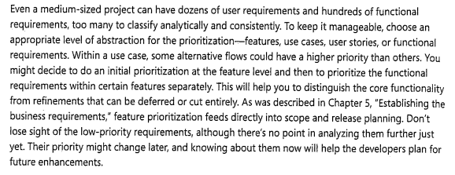

# Verificação da Entrega 2

## Introdução

&emsp;&emsp;  Este documento inclui as verificações utilizadas para inspecionar a entrega 2 do projeto <a href = "https://requisitos-de-software.github.io/2024.2-CAESB-Autoatendimento/" target = "_blank">Caesb Autoatendimento</a>. Ao final, são apresentados em detalhes os resultados alcançados por meio dessa inspeção.

## Objetivo

&emsp;&emsp; O objetivo da verificação é garantir que todos os critérios de avaliação foram plenamente atendidos. Para isso, é feita uma análise do conteúdo e da estrutura do artefato, com o intuito de melhorar sua qualidade.

## Metodologia

&emsp;&emsp;A verificação foi realizada utilizando uma lista de critérios de avaliação, elaborada com base em uma lista com o conteúdo desenvolvido em sala de aula. Com essa lista, foi feito uma verificação para confirmar se cada critério de avaliação havia sido atendido ou não, contando ainda com uma coluna para observações, permitindo o registro de detalhes adicionais ou outras considerações. Neste documento, realizou-se a avaliação dos artefatos feitos com base nas <a href= "https://requisitos-de-software.github.io/2024.2-CAESB-Autoatendimento/elicitacao/tecnicas/analise_documento/" target = "_blank">Técnicas de Elicitação</a> e <a href = "https://requisitos-de-software.github.io/2024.2-CAESB-Autoatendimento/priorizacao/introducao/" target = "_blank">Técnicas de Priorização</a>, bem como do artefato <a href="https://requisitos-de-software.github.io/2024.2-CAESB-Autoatendimento/elicitacao/personas/" target = "_blank">Personas</a>, <a href="https://requisitos-de-software.github.io/2024.2-CAESB-Autoatendimento/elicitacao/perfil_de_usuario/" target="_blank">Perfil de Usuário</a> e <a href="https://requisitos-de-software.github.io/2024.2-CAESB-Autoatendimento/elicitacao/termo/" target="_blank">Termo de Consentimento</a>, todos relacionados às atividades realizadas no desenvolvimento do aplicativo Caesb Autoatendimento.

## Verificação das Técnicas de Elicitação

&emsp;&emsp;A tabela 01 apresenta a lista de verificação das Técnicas de Elicitação que foi elaborada com base no plano de ensino da disciplina e a tabela 02 apresenta a verificação.

Tabela 01: Lista de verificação das Técnicas de Elicitação

| **ID** | **Descrição**                       | **Avaliação** | **Autor**       | **Observações** |
|--------|-------------------------------------|--------------|----------------|-----------------|
| 01     | 	A análise de documentos foi realizada de forma detalhada para identificar requisitos implícitos e complementá-los com outras técnicas de elicitação?                                                            |              | Leandro de Almeida   |                 |
| 02     | Na técnica de Observação, os desenvolvedores observam diretamente os usuários para identificar de maneira eficiente os requisitos funcionais e não funcionais do sistema?                                             |              | Leandro de Almeida   |              |
| 03     | O roteiro da entrevista incluiu perguntas abertas e fechadas para obter informações detalhadas e relevantes sobre a experiência do usuário? |              | Leandro de Almeida   |            |
| 04     | Todos os requisitos levantados foram devidamente documentados, categorizados (RF/RNF) e implementados conforme necessário? |              | Leandro de Almeida |         |

Autor(a): <a href="https://github.com/leomitx10" target = "_blank">Leandro de Almeida</a>

 

Tabela 02: Verificação das Técnicas de Elicitação

| **ID** | **Descrição**                       | **Avaliação** | **Autor**       | **Observações** |
|--------|-------------------------------------|--------------|----------------|-----------------|
| 01     | 	A análise de documentos foi realizada de forma detalhada para identificar requisitos implícitos e complementá-los com outras técnicas de elicitação?                                                            |      Sim        | Leandro de Almeida   |   Versão 1.1 16/11              |
| 02     | Na técnica de Observação, os desenvolvedores observam diretamente os usuários para identificar de maneira eficiente os requisitos funcionais e não funcionais do sistema?                                             |   Sim           | Leandro de Almeida   |     Versão 1.1 22/11            |
| 03     | O roteiro da entrevista incluiu perguntas abertas e fechadas para obter informações detalhadas e relevantes sobre a experiência do usuário? |     Sim         | Leandro de Almeida   |      Versão 1.0 22/11            |
| 04     | Todos os requisitos levantados foram devidamente documentados, categorizados (RF/RNF) e implementados conforme necessário? |      Sim        | Leandro de Almeida |       Versão 1.1 14/12           |

Autor(a): <a href="https://github.com/leomitx10" target = "_blank">Leandro de Almeida</a>

 

## Verificação das Técnicas de Priorização

&emsp;&emsp;A tabela 03 apresenta a lista de verificação das Técnicas de Priorização que foi elaborada com base no plano de ensino da disciplina e a tabela 04 apresenta a verificação.

Tabela 03: Lista de verificação das Técnicas de Priorização

| **ID** | **Descrição**                                                                                  | **Avaliação** | **Autor**       | **Observações** |
|--------|------------------------------------------------------------------------------------------------|--------------|----------------|-----------------|
| 01     | Os requisitos foram corretamente classificados nas categorias "In" e "Out" da técnica "In or Out"? |  | Leandro de Almeida |  |
| 02     | Os requisitos foram corretamente classificados nas categorias "Must-Have", "Should-Have", "Could-Have" e "Won't Have" utilizando o método MoSCoW? |  | Leandro de Almeida | |
| 03     | A técnica First Things First considera corretamente os benefícios, prejuízos, custos e riscos para determinar a prioridade dos requisitos? |  | Leandro de Almeida |  |
| 04    | A técnica "First Things First" foi corretamente aplicada para priorização dos requisitos, considerando os critérios de benefício, penalidade, custo e risco, e as pontuações atribuídas a cada requisito? |  | Leandro de Almeida |  |

Autor(a): <a href="https://github.com/leomitx10" target = "_blank">Leandro de Almeida</a>

 

Tabela 04: Verificação das Técnicas de Priorização

| **ID** | **Descrição**                                                                                  | **Avaliação** | **Autor**       | **Observações** |
|--------|------------------------------------------------------------------------------------------------|--------------|----------------|-----------------|
| 01     | Os requisitos foram corretamente classificados nas categorias "In" e "Out" da técnica "In or Out"? | Sim | Leandro de Almeida | Versão 1.3 26/11 |
| 02     | Os requisitos foram corretamente classificados nas categorias "Must-Have", "Should-Have", "Could-Have" e "Won't Have" utilizando o método MoSCoW? | Sim | Leandro de Almeida | Versão 1.1 24/11 |
| 03     | A técnica First Things First considera corretamente os benefícios, prejuízos, custos e riscos para determinar a prioridade dos requisitos? | Sim | Leandro de Almeida | Versão 1.3 26/11 |
| 04    | A técnica "First Things First" foi corretamente aplicada para priorização dos requisitos, considerando os critérios de benefício, penalidade, custo e risco, e as pontuações atribuídas a cada requisito? | Sim | Leandro de Almeida | Versão 1.3 26/11 |

Autor(a): <a href="https://github.com/leomitx10" target = "_blank">Leandro de Almeida</a>

 

## Verificação Personas

&emsp;&emsp;A tabela 05 apresenta a lista de verificação das Perfil de Usuário que foi elaborada com base no plano de ensino da disciplina e a tabela 06 apresenta a verificação.

Tabela 05: Lista de verificação de Personas

| **ID** | **Descrição**                                                                                  | **Avaliação** | **Autor**       | **Observações** |
|--------|------------------------------------------------------------------------------------------------|--------------|----------------|-----------------|
| 01     | As personas criadas representam de forma realista os diferentes tipos de usuários do aplicativo CAESB Autoatendimento, incluindo personas primárias, secundárias e antipersonas? |              | Leandro de Almeida   |                 |
| 02     | As personas definidas estão alinhadas com o perfil de usuário identificado, garantindo que refletem as necessidades, atitudes e dificuldades dos usuários reais? |              | Leandro de Almeida   |                 |
| 03     | 	O elenco de personas e a razão da quantidade de personas é justificada?  |              | Leandro de Almeida   |                 |

Autor(a): <a href="https://github.com/leomitx10" target = "_blank">Leandro de Almeida</a>

 

Tabela 06: Verificação de Personas

| **ID** | **Descrição**                                                                                  | **Avaliação** | **Autor**       | **Observações** |
|--------|------------------------------------------------------------------------------------------------|--------------|----------------|-----------------|
| 01     | As personas criadas representam de forma realista os diferentes tipos de usuários do aplicativo CAESB Autoatendimento, incluindo personas primárias, secundárias e antipersonas? |    Sim          | Leandro de Almeida   |      Versão 1.0 20/11           |
| 02     | As personas definidas estão alinhadas com o perfil de usuário identificado, garantindo que refletem as necessidades, atitudes e dificuldades dos usuários reais? |     Sim         | Leandro de Almeida   |   Versão 1.0 20/11              |
| 03     | 	O elenco de personas e a razão da quantidade de personas é justificada?  |       Sim       | Leandro de Almeida   |       Versão 1.0 20/11          |

Autor(a): <a href="https://github.com/leomitx10" target = "_blank">Leandro de Almeida</a>

 

## Verificação do Perfil de Usuário

&emsp;&emsp;A tabela 07 apresenta a lista de verificação das Perfil de Usuário que foi elaborada com base no plano de ensino da disciplina e a tabela 08 apresenta a verificação.

Tabela 07: Lista de verificação de Perfil de Usuário

| **ID** | **Descrição**                                                                                  | **Avaliação** | **Autor**       | **Observações** |
|--------|------------------------------------------------------------------------------------------------|--------------|----------------|-----------------|
| 01     | O perfil de usuário foi elaborado com base em dados coletados por meio de Técnicas de Elicitação, considerando características como idade, experiência, motivações e barreiras? |             | Leandro de Almeida |               |
| 02     | Apresenta Educação? (grau de instrução, área de formação, cursos realizados, alfabetismo) |           | Leandro de Almeida |               |
| 03     | 	Foi agrupado os usuários com características semelhantes, seja elas: faixa etária, experiência, atitude e tarefas primárias no sistema? |             | Leandro de Almeida |               |

Autor(a): <a href="https://github.com/leomitx10" target = "_blank">Leandro de Almeida</a>

 

Tabela 08: Verificação de Perfil de Usuário

| **ID** | **Descrição**                                                                                                                                  | **Avaliação** | **Autor**             | **Observações**         |
|--------|----------------------------------------------------------------------------------------------------------------------------------------------|--------------|----------------------|-------------------------|
| 01     | O perfil de usuário foi elaborado com base em dados coletados por meio de técnicas de elicitação, considerando características como idade, experiência, motivações e barreiras? | Sim          | Leandro de Almeida   | Versão 1.2 - 20/11      |
| 02     | Apresenta educação? (grau de instrução, área de formação, cursos realizados, alfabetismo)                                                     | Não          | Leandro de Almeida   | Versão 1.2 - 20/11      |
| 03     | Os usuários foram agrupados com características semelhantes, sejam elas: faixa etária, experiência, atitude e tarefas primárias no sistema?  | Sim          | Leandro de Almeida   | Versão 1.2 - 20/11      |

Autor(a): <a href="https://github.com/leomitx10" target = "_blank">Leandro de Almeida</a>

 

## Verificação do Termo de Consentimento

&emsp;&emsp;A tabela 09 apresenta a lista de verificação das Perfil de Usuário que foi elaborada com base no plano de ensino da disciplina e a tabela 10 apresenta a verificação.

Tabela 09: Lista de verificação de Termo de Consentimento

| **ID** | **Descrição**                                                                                  | **Avaliação** | **Autor**       | **Observações** |
|--------|------------------------------------------------------------------------------------------------|--------------|----------------|-----------------|
| 01     | O termo de consentimento deixa claro que a participação é voluntária, protege os dados dos participantes e especifica o objetivo da pesquisa de forma transparente? |              | Leandro de Almeida |                 |
| 02     | O termo informa corretamente os participantes sobre como seus dados serão utilizados, garantindo sigilo, anonimato e a possibilidade de desistência a qualquer momento sem penalizações? |              | Leandro de Almeida |                 |

Autor(a): <a href="https://github.com/leomitx10" target = "_blank">Leandro de Almeida</a>

 

Tabela 10: Verificação de Termo de Consentimento

| **ID** | **Descrição**                                                                                  | **Avaliação** | **Autor**       | **Observações** |
|--------|------------------------------------------------------------------------------------------------|--------------|----------------|-----------------|
| 01     | O termo de consentimento deixa claro que a participação é voluntária, protege os dados dos participantes e especifica o objetivo da pesquisa de forma transparente? | Sim | Leandro de Almeida | Versão 1.0 22/11 |
| 02     | O termo informa corretamente os participantes sobre como seus dados serão utilizados, garantindo sigilo, anonimato e a possibilidade de desistência a qualquer momento sem penalizações? | Sim | Leandro de Almeida | Versão 1.0 22/11 |

Autor(a): <a href="https://github.com/leomitx10" target = "_blank">Leandro de Almeida</a>

 

## Link da gravação

Pode ser vista no [YouTube](https://www.youtube.com/embed/I4t4dM06GCY?si=yVzMXvlskikF_K28).

    
Vídeo 01: Verificação dos artefatos

    <iframe width="760" height="515" src="https://www.youtube.com/embed/I4t4dM06GCY?si=yVzMXvlskikF_K28" title="YouTube video player" frameborder="0" allow="accelerometer; autoplay; clipboard-write; encrypted-media; gyroscope; picture-in-picture; web-share" referrerpolicy="strict-origin-when-cross-origin" allowfullscreen></iframe>

Autor(a): <a href="https://github.com/leomitx10" target = "_blank">Leandro de Almeida</a>

 

Tabela 11: Tempo de início da verificação dos artefatos no vídeo

| **Artefato** | **Inicio**   | 
|:----------:|:----------:|
| Técnicas de Elicitação | <a href="https://youtu.be/I4t4dM06GCY" target="_blank">00:00</a> | 
| Técnicas de Priorização | <a href="https://youtu.be/I4t4dM06GCY?t=130" target="_blank">02:10</a> |
| Personas | <a href="https://youtu.be/I4t4dM06GCY?t=207" target="_blank">3:27</a> |
| Perfil de Usuário | <a href="https://youtu.be/I4t4dM06GCY?t=284" target="_blank">4:44</a> | 
| Termo de Consentimento | <a href="https://youtu.be/I4t4dM06GCY?t=347" target="_blank">5:47</a> | 

Autor(a): <a href="https://github.com/leomitx10" target = "_blank">Leandro de Almeida</a>

 

## Problemas encontrados

1. No artefato Perfil de Usuário não tem o atributo educação.

## Sugestões

1. Acresentar atributo educação no artefato Perfil de Usuário.

 

## Referências Bibliográficas

> 
1. SERRANO, Maurício; DO PRADO LEITE, Julio Cesar Sampaio. A rich traceability model for social interactions. In: Proceedings of the 6th International Workshop on Traceability in Emerging Forms of Software Engineering. 2011. p. 63
   Acesso em: 23 nov. 2024.

> 
2. VASQUEZ, Carlos Eduardo; SIMÕES, Guilherme Siqueira. Engenharia de requisitos: software orientado ao negócio. 1. ed. São Paulo: Pearson, 2016. 328 p. ISBN 9788574527901. Disponível em: https://aprender3.unb.br/pluginfile.php/2972448/mod_resource/content/4/Elicitacao%20de%20Req%202.pdf. Acesso em: 24 de Nov. 2024

<figcaption>Imagem 1: Foto da Referência 1</figcaption>

 
</img>
Autor(a): <a href="https://github.com/leomitx10" target = "_blank">Leandro de Almeida</a></h6>

 > 
3. S. D. J.; SILVA, B. S. da; SILVEIRA, M. S.; GASPARINI, I.; DARIN, T.; BARBOSA, G. D. J. Interação Humano-Computador e Experiência do Usuário, p. 166. Autopublicação, 2021. ISBN: 978-65-00-19677-1.
<figcaption>Imagem 2: Foto da Referência 2</figcaption>

</img>

Autor(a): <a href="https://github.com/leomitx10" target = "_blank">Leandro de Almeida</a></h6>

<figcaption>Imagem 3: Foto da Referência 3</figcaption>

</img>

Autor(a): <a href="https://github.com/leomitx10" target = "_blank">Leandro de Almeida</a></h6>

> 
4.WIEGERS, Karl E.; BEATTY, Joy. Software Requirements. 3. ed. Redmond: Microsoft Press, 2013 p.315
   Acesso em: 23 nov. 2024.

<figcaption>Imagem 4: Foto da Referência 4</figcaption> 

## Histórico de Versão

| **Versão** | **Data**   | **Descrição**                                    | **Autor**                                             | **Revisor**                                          |
|:----------:|:----------:|:------------------------------------------------:|:-----------------------------------------------------:|:----------------------------------------------------:|
| 1.0        | 31/01/2025 | Criação do Documento e Lista de Verificação      | [Leandro de Almeida](https://github.com/leomitx10)    | [Letícia Resende](https://github.com/leomitx10)      |
| 1.1        | 31/01/2025 | Verificação | [Leandro de Almeida](https://github.com/leomitx10) | [Letícia Resende](https://github.com/leomitx10) |

