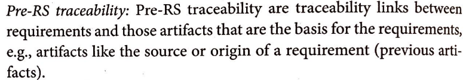
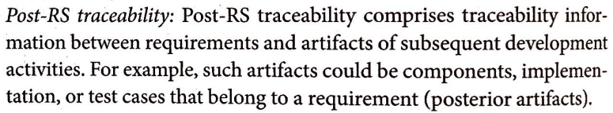

# Verificação da Entrega 4

## Introdução

&emsp;&emsp;  Este documento inclui as verificações utilizadas para inspecionar a entrega 4 do projeto <a href = "https://requisitos-de-software.github.io/2024.2-CAESB-Autoatendimento/" target = "_blank">Caesb Autoatendimento</a>. Ao final, são apresentados em detalhes os resultados alcançados por meio dessa inspeção.

## Objetivo

&emsp;&emsp; O objetivo da verificação é garantir que todos os critérios de avaliação foram plenamente atendidos. Para isso, é feita uma análise do conteúdo e da estrutura do artefato, com o intuito de melhorar sua qualidade.

## Metodologia

&emsp;&emsp;A verificação foi realizada utilizando uma lista de critérios de avaliação, elaborada com base em uma lista com o conteúdo desenvolvido em sala de aula. Com essa lista, foi feito uma verificação para confirmar se cada critério de avaliação havia sido atendido ou não, contando ainda com uma coluna para observações, permitindo o registro de detalhes adicionais ou outras considerações. Neste documento, realizou-se a avaliação dos artefatos feitos com base nas <a href= "https://requisitos-de-software.github.io/2024.2-CAESB-Autoatendimento/modelagem_agil/backlog/" target = "_blank">Backlog</a>, <a href = "https://requisitos-de-software.github.io/2024.2-CAESB-Autoatendimento/modelagem_agil/historia_usuario/" target = "_blank">Histórias de Usuário</a> e <a href ="https://requisitos-de-software.github.io/2024.2-CAESB-Autoatendimento/modelagem_agil/nfr/" target = "_blank"> NFR Framework</a>, todos relacionados às atividades realizadas no desenvolvimento do aplicativo Caesb Autoatendimento.

## Verificação Pós-rastreabilidade

A tabela 01 apresenta a lista de verificação dos artefatos da Pós-rastreabilidade que foi elaborada com base no plano de ensino da disciplina e a tabela 02 apresenta a verificação.

**Tabela 01: Lista de verificação Pós-rastreabilidade**

| **ID** | **Descrição**                                                                                  | **Avaliação** | **Autor**       | **Observações** |
|--------|------------------------------------------------------------------------------------------------|--------------|----------------|-----------------|
| 01     | Todos os requisitos possuem um artefato correspondente na matriz?                               |              | Natan Almeida  |  |
| 02     | Cada artefato do desenvolvimento está devidamente rastreado na matriz?                         |              | Natan Almeida  |  |
| 03     | A tabela informa se o requisito foi ou não implementado?                                        |              | Natan Almeida  |                 |
| 04     | Todos os requisitos possuem rastreamento para os artefatos em que foram utilizados no forward-from? |              | Natan Almeida  |        |
| 05     | As implementações e casos de teste estão vinculados corretamente aos requisitos?               |              | Natan Almeida  |            |
| 06     | Cada requisito está ligado à sua origem?                                                       |              | Natan Almeida  |        |
| 07     | As fontes dos requisitos estão documentadas e rastreáveis?                                     |              | Natan Almeida  |        |

**Autor(a): [Natan Almeida](https://github.com/natanalmeida03)**

**Tabela 02: Verificação do Pós-rastreabilidade**

| **ID** | **Descrição**                                                                                  | **Avaliação** | **Autor**       | **Observações** |
|--------|------------------------------------------------------------------------------------------------|--------------|----------------|-----------------|
| 01     | Todos os requisitos possuem um artefato correspondente na matriz?                               | sim          | Natan Almeida  |  |
| 02     | Cada artefato do desenvolvimento está devidamente rastreado na matriz?                         | sim          | Natan Almeida  |  |
| 03     | A tabela informa se o requisito foi ou não implementado?                                        | sim          | Natan Almeida  |                 |
| 04     | Todos os requisitos possuem rastreamento para os artefatos em que foram utilizados no forward-from? | sim          | Natan Almeida  |        |
| 05     | As implementações e casos de teste estão vinculados corretamente aos requisitos?               | sim          | Natan Almeida  |            |
| 06     | Cada requisito está ligado à sua origem?                                                       | sim          | Natan Almeida  |        |
| 07     | As fontes dos requisitos estão documentadas e rastreáveis?                                     | sim          | Natan Almeida  |        |

**Autor(a): [Natan Almeida](https://github.com/natanalmeida03)**

## Problemas encontrados

Não foram encontrados problemas.

## Sugestões

Como o artefato está de acordo com o esperado não há sugestões.

## Link da gravação

Pode ser vista no [YouTube]().

    
Vídeo 01: Verificação entrega 5 

    <iframe width="760" height="515" src="https://www.youtube.com/embed/QDA4IyA2zbs?si=iEQsqIO76lj5wxX0" title="YouTube video player" frameborder="0" allow="accelerometer; autoplay; clipboard-write; encrypted-media; gyroscope; picture-in-picture; web-share" referrerpolicy="strict-origin-when-cross-origin" allowfullscreen></iframe>

Autor(a): <a href="https://github.com/natanalmeida03" target = "_blank">Natan Almeida</a>

 

## Referências Bibliográficas

> 
SERRANO, Milene. SERRANO, Maurício. Requisitos – Aula 15 . Disponível em: https://aprender3.unb.br/pluginfile.php/2972504/mod_resource/content/1/Requisitos%20-%20Aula%2015a.pdf. Acesso em 02 fev 2025.

> 
SALES, André Barros de. Plano de Ensino - Requisitos de Software. Disponível em: https://aprender3.unb.br/mod/resource/view.php?id=1305187. Acesso em: 02 de Fev. de 2025.

## Histórico de Versão

| **Versão** | **Data**   | **Descrição**                                    | **Autor**                                             | **Revisor**                                          |
|:----------:|:----------:|:------------------------------------------------:|:-----------------------------------------------------:|:----------------------------------------------------:|
| 1.0        | 01/02/2025 | Criação do Documento e Lista de Verificação      | [Natan Almeida](https://github.com/natanalmeida03)    | [Letícia Resende](https://github.com/leomitx10)      |