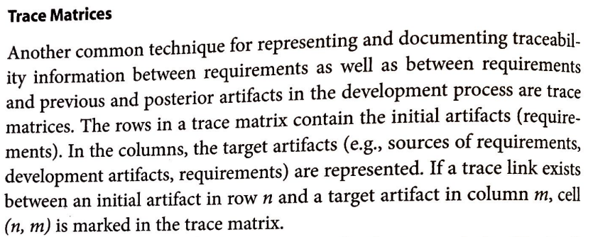
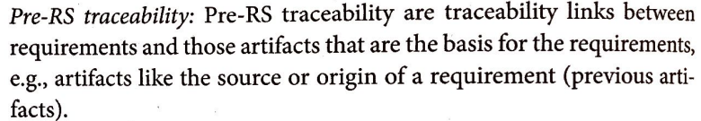
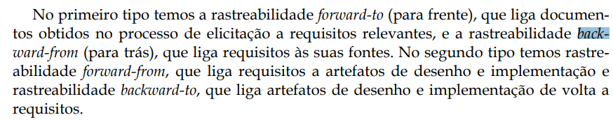
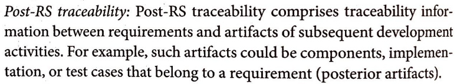

# Verificação da Entrega 5

## Introdução

&emsp;&emsp;Este documento inclui as verificações utilizadas para inspecionar a entrega 5 do projeto <a href="https://requisitos-de-software.github.io/2024.2-CAESB-Autoatendimento/modelagem_agil/nfr/">Caesb Autoatendimento</a>. Ao final, são apresentados em detalhes os resultados alcançados por meio dessa inspeção.

## Objetivo

&emsp;&emsp;O objetivo da verificação é garantir que todos os critérios de avaliação foram plenamente atendidos. Para isso, é feita uma análise do conteúdo e da estrutura do artefato, com o intuito de melhorar sua qualidade.

## Metodologia

&emsp;&emsp;A verificação foi realizada utilizando uma lista de critérios de avaliação, elaborada com base em uma lista com o conteúdo desenvolvido em sala de aula. Com essa lista, foi feita uma verificação para confirmar se cada critério de avaliação havia sido atendido ou não, contando ainda com uma coluna para observações, permitindo o registro de detalhes adicionais ou outras considerações. Neste documento, realizou-se a avaliação da Pós-rastreabilidade, que contempla os artefatos <a href="https://requisitos-de-software.github.io/2024.2-MeuSUSDigital/pos-rastreabilidade/forward-from/">Fordward-From</a>, <a href="https://requisitos-de-software.github.io/2024.2-MeuSUSDigital/pos-rastreabilidade/backward-from/">Backward-From</a>, <a href="https://requisitos-de-software.github.io/2024.2-MeuSUSDigital/pos-rastreabilidade/matriz-de-rastreabilidade/">Matriz de Rastreabilidade</a>.

## Verificação Pós-rastreabilidade

&emsp;&emsp;A tabela 01 apresenta a lista de verificação dos artefatos da Pós-rastreabilidade que foi elaborada com base no plano de ensino da disciplina e a tabela 02 apresenta a verificação.

Tabela 01: Lista de verificação Pós-rastreabilidade

| **ID** | **Descrição**                                                                                  | **Avaliação** | **Autor**       | **Observações** |
|--------|------------------------------------------------------------------------------------------------|--------------|----------------|-----------------|
| 01     | Todos os requisitos possuem um artefato correspondente na matriz?                               |              | Natan Almeida  |  |
| 02     | Cada artefato do desenvolvimento está devidamente rastreado na matriz?                         |              | Natan Almeida  |  |
| 03     | A tabela informa se o requisito foi ou não implementado?                                        |              | Natan Almeida  |                 |
| 04     | Todos os requisitos possuem rastreamento para os artefatos em que foram utilizados no forward-from? |              | Natan Almeida  |        |
| 05     | As implementações e casos de teste estão vinculados corretamente aos requisitos?               |              | Natan Almeida  |            |
| 06     | Cada requisito está ligado à sua origem?                                                       |              | Natan Almeida  |        |
| 07     | As fontes dos requisitos estão documentadas e rastreáveis?                                     |              | Natan Almeida  |        |

Autor(a): <a href="https://github.com/natanalmeida03" target = "_blank">Natan Almeida</a>

 

Tabela 02: Verificação do Pós-rastreabilidade

| **ID** | **Descrição**                                                                                  | **Avaliação** | **Autor**       | **Observações** |
|--------|------------------------------------------------------------------------------------------------|--------------|----------------|-----------------|
| 01     | Todos os requisitos possuem um artefato correspondente na matriz?                               | sim          | Natan Almeida  |  |
| 02     | Cada artefato do desenvolvimento está devidamente rastreado na matriz?                         | sim          | Natan Almeida  |  |
| 03     | A tabela informa se o requisito foi ou não implementado?                                        | sim          | Natan Almeida  |                 |
| 04     | Todos os requisitos possuem rastreamento para os artefatos em que foram utilizados no forward-from? | sim          | Natan Almeida  |        |
| 05     | As implementações e casos de teste estão vinculados corretamente aos requisitos?               | sim          | Natan Almeida  |            |
| 06     | Cada requisito está ligado à sua origem?                                                       | sim          | Natan Almeida  |        |
| 07     | As fontes dos requisitos estão documentadas e rastreáveis?                                     | sim          | Natan Almeida  |        |

Autor(a): <a href="https://github.com/natanalmeida03" target = "_blank">Natan Almeida</a>

 

## Link da gravação

Pode ser vista no [YouTube]().

    
Vídeo 01: Verificação entrega 5 

    <iframe width="760" height="515" src="https://www.youtube.com/embed/QDA4IyA2zbs?si=iEQsqIO76lj5wxX0" title="YouTube video player" frameborder="0" allow="accelerometer; autoplay; clipboard-write; encrypted-media; gyroscope; picture-in-picture; web-share" referrerpolicy="strict-origin-when-cross-origin" allowfullscreen></iframe>

Autor(a): <a href="https://github.com/natanalmeida03" target = "_blank">Natan Almeida</a>

 

Tabela 03: Tempo de início da verificação dos artefatos no vídeo

| **Artefato** | **Inicio**   | 
|:----------:|:----------:|
| Matriz de Ratreabilidade| <a href="https://www.youtube.com/watch?v=QDA4IyA2zbs&t=31s" target="_blank">00:31</a>  | 
| Fordward-from| <a href="https://www.youtube.com/watch?v=QDA4IyA2zbs&t=128s" target="_blank">01:28</a> |
| Backward-from| <a href="https://www.youtube.com/watch?v=QDA4IyA2zbs&t=159s" target="_blank">01:59</a> |

Autor(a): <a href="https://github.com/natanalmeida03" target = "_blank">Natan Almeida</a>

 

## Problemas encontrados

Não foram encontrados problemas.

## Sugestões

Como o artefato está de acordo com o esperado não há sugestões.

 

## Referências Bibliográficas

> 
 1.SAYAO, Miriam. Tastreaabilidade de requisitos. Disponível em: https://aprender3.unb.br/pluginfile.php/2972563/mod_resource/content/3/05_20_sayao.pdf. Acesso em: 02 de Fev. de 2025.

> 
2. SALES, André Barros de. Plano de Ensino - Requisitos de Software. Disponível em: https://aprender3.unb.br/mod/resource/view.php?id=1305187. Acesso em: 02 de Fev. de 2025.

> 
3. POHL, Klaus. Requirements Engineering Fundamentals. Disponível em: https://aprender3.unb.br/pluginfile.php/2972562/mod_resource/content/2/Rastreabilidade.pdf. Acesso em: 02 de Fev. de 2025.

 

## Histórico de Versão

| **Versão** | **Data**   | **Descrição**                                    | **Autor**                                             | **Revisor**                                          |
|:----------:|:----------:|:------------------------------------------------:|:-----------------------------------------------------:|:----------------------------------------------------:|
| 1.0        | 01/02/2025 | Criação do Documento e Lista de Verificação      | [Natan Almeida](https://github.com/natanalmeida03)    | [Letícia Resende](https://github.com/leomitx10)      |