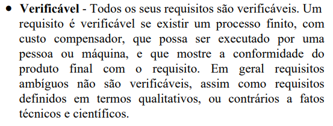

# Verificação da Entrega 1

## Introdução

&emsp;&emsp;  Este documento inclui as verificações utilizadas para inspecionar a entrega 1 do projeto <a href = "https://requisitos-de-software.github.io/2024.2-CAESB-Autoatendimento/" target = "_blank">Caesb Autoatendimento</a>. Ao final, são apresentados em detalhes os resultados alcançados por meio dessa inspeção.

## Objetivo

&emsp;&emsp; O objetivo da verificação é garantir que todos os critérios de avaliação foram plenamente atendidos. Para isso, é feita uma análise do conteúdo e da estrutura do artefato, com o intuito de melhorar sua qualidade.

## Metodologia

&emsp;&emsp;A verificação foi realizada utilizando uma lista de critérios de avaliação, elaborada com base em uma lista com o conteúdo desenvolvido em sala de aula. Com essa lista, foi feito uma verificação para confirmar se cada critério de avaliação havia sido atendido ou não, contando ainda com uma coluna para observações, permitindo o registro de detalhes adicionais ou outras considerações. Neste documento, realizou-se a avaliação dos artefatos <a href = "https://requisitos-de-software.github.io/2024.2-CAESB-Autoatendimento/" target = "_blank">Itens de Desenvovimento do Projeto</a>, <a href = "https://requisitos-de-software.github.io/2024.2-CAESB-Autoatendimento/planejamento/richpicture/" target = "_blank">Rich Picture</a>, <a href = "https://requisitos-de-software.github.io/2024.2-CAESB-Autoatendimento/planejamento/cronograma/" target = "_blank">Cronograma</a>, <a href = "https://requisitos-de-software.github.io/2024.2-CAESB-Autoatendimento/" target = "_blank">Equipe</a>, <a href = "https://requisitos-de-software.github.io/2024.2-CAESB-Autoatendimento/planejamento/aplicativo_escolhido/" target = "_blank">Aplicativo Selecionado</a> e <a href = "https://requisitos-de-software.github.io/2024.2-CAESB-Autoatendimento/planejamento/ferramentas/" target = "_blank">Ferramentas</a>, que trata das atividades realizadas no desenvolvimento do aplicativo Caesb Autoatendimento.

## Verificação dos Itens do Desenvolvimento do Projeto

&emsp;&emsp;A tabela 01 apresenta a lista de verificação de Itens de Planejamento Geral do Projeto que foi elaborada com base no plano de ensino da disciplina e a tabela 02 apresenta a verificação.

Tabela 01: Lista de verificação de Itens do Desenvolvimento do Projeto

| **ID** | **Descrição**                                                                                  | **Avaliação** | **Autor**       | **Observações** |
|--------|------------------------------------------------------------------------------------------------|--------------|----------------|-----------------|
| 01     | O histórico de versão padronizado?                                                             |              | André Barros   |                 |
| 02     | O(s) autores e o(s) revisores para cada artefato?                                             |              | André Barros   |                 |
| 03     | Referências bibliográficas e/ou bibliografia em todos os artefatos?                           |              | André Barros   |                 |
| 04     | As tabelas e imagens possuem legenda e fonte e são chamadas dentro dos textos?                |              | André Barros   |                 |
| 05     | Um texto fazendo uma introdução dos artefatos?                                                |              | André Barros   |                 |
| 06     | O cronograma executado com quem realizou cada artefato/atividade, com datas de início e fim?  |              | André Barros   |                 |
| 07     | Ata(s) das reuniões (com data, horário de início e fim, participantes, objetivo, atividades)? |              | André Barros   |                 |
| 08     | A gravação da reunião do grupo?                                                               |              | André Barros   |                 |
| 09     | Vídeo de apresentação na categoria "não listado" no YouTube?                                  |              | André Barros   |                 |

Autor(a): <a href="https://github.com/leomitx10" target = "_blank">Leandro de Almeida</a>

 

Tabela 02: Verificação dos Itens do Desenvolvimento do Projeto

| **ID** | **Descrição**     | **Avaliação** | **Autor**      | **Observações** |
|--------|-------------------|---------------|----------------|-----------------|
| 01     | O histórico de versão padronizado? |  | André Barros |  |
| 02     | O(s) autores e o(s) revisores para cada artefato? |  | André Barros |   |
| 03     | Referências bibliograficas e/ou bibliografia em todos os artefatos? |  | André Barros   |  |
| 04     | As tabelas e imagens possuem legenda e fonte e elas chamadas dentro dos textos? |  | André Barros |  |
| 05     | Um texto fazendo uma introdução dos artefatos?|  | André Barros | |
| 06     | O cronograma executado com quem realizou cada artefato/atividade com as datas de íncio e fim da construção e realização do artefato/atividade  |  | André Barros |  |
| 07     | Ata(s) das reuniões (com data, horário de início e do final, participantes, objetivo, atividades definidas, etc).|  | André Barros |  |
| 08     | A gravação da reunião do grupo. |  | André Barros |  |
| 09     | Vídeo de apresentação na categoria "não listado" no youtube? |  | André Barros | 

Autor(a): <a href="https://github.com/leomitx10" target = "_blank">Leandro de Almeida</a>

 

## Link da gravação

Pode ser vista no [YouTube]().

    
Vídeo 01: Verificação dos Itens do Planejamento Geral do Projeto

    <iframe width="760" height="515" src="https://www.youtube.com/embed/y2-191PM_ys?si=QWTKBqPnyYzXqOIN" title="YouTube video player" frameborder="0" allow="accelerometer; autoplay; clipboard-write; encrypted-media; gyroscope; picture-in-picture; web-share" referrerpolicy="strict-origin-when-cross-origin" allowfullscreen></iframe>

Autor(a): <a href="https://github.com/leomitx10" target = "_blank">Leandro de Almeida</a>

 

## Verificação do Rich Picture

&emsp;&emsp;A tabela 03 apresenta a lista de verificação do Rich Picture que foi elaborada com base no plano de ensino da disciplina e a tabela 04 apresenta a verificação.

Tabela 03: Lista de verificação do Rich Picture 

| **ID** | **Descrição**                                                                                     | **Avaliação** | **Autor**            | **Observações** |
|--------|-------------------------------------------------------------------------------------------------|--------------|---------------------|-----------------|
| 01     | No artefato “Rich Picture”, há uma legenda explicando os símbolos utilizados no diagrama?       |              | André Barros       |                 |
| 02     | Todos os 5 componentes de um “Rich Picture” estão presentes no artefato apresentado pelo grupo? |              | André Barros       |                 |
| 03     | O(s) ator(es) do Rich Picture estão do lado de fora da fronteira do sistema?                    |              | Leandro de Almeida |                 |
| 04     | O Rich Picture conta uma história?                                                              |              | Letícia Resende     |                 |
| 05     | O Rich Picture contém atores?                                                                   |              | Matheus Barros      |                 |
| 06     | O Rich Picture simula uma ação real do usuário?                                                 |              | Nathan Almeida      |                 |
| 07     | O Rich Picture possui legenda?                                                                  |              | João Victor         |                 |

Autor(a): <a href="https://github.com/leomitx10" target = "_blank">Leandro de Almeida</a>

 

Tabela 04: Verificação do Rich Picture 

| **ID** | **Descrição**                                                                                     | **Avaliação** | **Autor**            | **Observações** |
|--------|-------------------------------------------------------------------------------------------------|--------------|---------------------|-----------------|
| 01     | No artefato “Rich Picture”, há uma legenda explicando os símbolos utilizados no diagrama?       |              | André Barros       |                 |
| 02     | Todos os 5 componentes de um “Rich Picture” estão presentes no artefato apresentado pelo grupo? |              | André Barros       |                 |
| 03     | O(s) ator(es) do Rich Picture estão do lado de fora da fronteira do sistema?                    |              | Leandro de Almeida |                 |
| 04     | O Rich Picture conta uma história?                                                              |              | Letícia Resende     |                 |
| 05     | O Rich Picture contém atores?                                                                   |              | Matheus Barros      |                 |
| 06     | O Rich Picture simula uma ação real do usuário?                                                 |              | Nathan Almeida      |                 |
| 07     | O Rich Picture possui legenda?                                                                  |              | João Victor         |                 |

Autor(a): <a href="https://github.com/leomitx10" target = "_blank">Leandro de Almeida</a>

 

## Link da gravação

Pode ser vista no [YouTube]().

    
Vídeo 02: Verificação do Rich Picture

    <iframe width="760" height="515" src="https://www.youtube.com/embed/Iicg9ibqTYY?si=gvMcs1v1z0U6HQ83" title="YouTube video player" frameborder="0" allow="accelerometer; autoplay; clipboard-write; encrypted-media; gyroscope; picture-in-picture; web-share" referrerpolicy="strict-origin-when-cross-origin" allowfullscreen></iframe>

Autor(a): <a href="https://github.com/leomitx10" target = "_blank">Leandro de Almeida</a>

 

## Verificação do Cronograma

&emsp;&emsp;A tabela 05 apresenta a lista de verificação do Cronograma que foi elaborada com base no plano de ensino da disciplina e a tabela 06 apresenta a verificação.

Tabela 05: Lista de verificação do Cronograma 

| **ID** | **Descrição**                                                                                                     | **Avaliação** | **Autor**       | **Observações** |
|--------|-----------------------------------------------------------------------------------------------------------------|--------------|---------------|-----------------|
| 01     | O cronograma do planejamento apresenta todas as atividades de todas as etapas para cada integrante, com as datas de início e fim da entrega dos artefatos e o período de revisão deles? |              | André Barros   |                 |
| 02     | O cronograma do planejamento apresenta um período de gravação da apresentação de cada etapa?                     |              | André Barros   |                 |
| 03     | O cronograma prevê um período de revisão/ajustes nos artefatos devido às considerações dos monitores/professor?  |              | André Barros   |                 |

Autor(a): <a href="https://github.com/leomitx10" target = "_blank">Leandro de Almeida</a>

 

Tabela 06: Verificação do Cronograma 

| **ID** | **Descrição**                                                                                                     | **Avaliação** | **Autor**       | **Observações** |
|--------|-----------------------------------------------------------------------------------------------------------------|--------------|---------------|-----------------|
| 01     | O cronograma do planejamento apresenta todas as atividades de todas as etapas para cada integrante, com as datas de início e fim da entrega dos artefatos e o período de revisão deles? |              | André Barros   |                 |
| 02     | O cronograma do planejamento apresenta um período de gravação da apresentação de cada etapa?                     |              | André Barros   |                 |
| 03     | O cronograma prevê um período de revisão/ajustes nos artefatos devido às considerações dos monitores/professor?  |              | André Barros   |                 |

Autor(a): <a href="https://github.com/leomitx10" target = "_blank">Leandro de Almeida</a>

 

## Link da gravação

Pode ser vista no [YouTube]().

    
Vídeo 03: Verificação do Cronograma 

    <iframe width="760" height="515" src="https://www.youtube.com/embed/Iicg9ibqTYY?si=gvMcs1v1z0U6HQ83" title="YouTube video player" frameborder="0" allow="accelerometer; autoplay; clipboard-write; encrypted-media; gyroscope; picture-in-picture; web-share" referrerpolicy="strict-origin-when-cross-origin" allowfullscreen></iframe>

Autor(a): <a href="https://github.com/leomitx10" target = "_blank">Leandro de Almeida</a>

 

## Verificação da Equipe

&emsp;&emsp;A tabela 07 apresenta a lista de verificação de Equipe que foi elaborada com base no plano de ensino da disciplina e a tabela 08 apresenta a verificação.

Tabela 07: Lista de verificação de Equipe 

| **ID** | **Descrição**                                                                                   | **Avaliação** | **Autor**       | **Observações** |
|--------|-------------------------------------------------------------------------------------------------|--------------|-----------------|-----------------|
| 01     | Uma página apresentando os integrantes da equipe (com foto), com nome e sem matrícula?         |              | André Barros    |                 |

Autor(a): <a href="https://github.com/leomitx10" target = "_blank">Leandro de Almeida</a>

 

Tabela 08: Verificação de Equipe 

| **ID** | **Descrição**                                                                                   | **Avaliação** | **Autor**       | **Observações** |
|--------|-------------------------------------------------------------------------------------------------|--------------|-----------------|-----------------|
| 01     | Uma página apresentando os integrantes da equipe (com foto), com nome e sem matrícula?         |              | André Barros    |                 |

Autor(a): <a href="https://github.com/leomitx10" target = "_blank">Leandro de Almeida</a>

 

## Link da gravação

Pode ser vista no [YouTube]().

    
Vídeo 04: Verificação de Equipe

    <iframe width="760" height="515" src="https://www.youtube.com/embed/Iicg9ibqTYY?si=gvMcs1v1z0U6HQ83" title="YouTube video player" frameborder="0" allow="accelerometer; autoplay; clipboard-write; encrypted-media; gyroscope; picture-in-picture; web-share" referrerpolicy="strict-origin-when-cross-origin" allowfullscreen></iframe>

Autor(a): <a href="https://github.com/leomitx10" target = "_blank">Leandro de Almeida</a>

 

## Verificação de Aplicativo Selecionado

&emsp;&emsp;A tabela 09 apresenta a lista de verificação do Aplicativo Selecionado que foi elaborada com base no plano de ensino da disciplina e a tabela 10 apresenta a verificação.

Tabela 09: Lista de verificação do Aplicativo Selecionado 

| **ID** | **Descrição**                                                                                  | **Avaliação** | **Autor**       | **Observações** |
|--------|----------------------------------------------------------------------------------------------|--------------|---------------|-----------------|
| 01     | A motivação e os critérios para a escolha do App foram definidos?                            |              | André Barros   |                 |
| 02     | Cópia do Termo de Uso, Direito de Uso ou Propriedade Intelectual do aplicativo permitindo o estudo na disciplina? |              | André Barros   |                 |

Autor(a): <a href="https://github.com/leomitx10" target = "_blank">Leandro de Almeida</a>

 

Tabela 10: Verificação do Aplicativo Selecionado

| **ID** | **Descrição**                                                                                  | **Avaliação** | **Autor**       | **Observações** |
|--------|----------------------------------------------------------------------------------------------|--------------|---------------|-----------------|
| 01     | A motivação e os critérios para a escolha do App foram definidos?                            |              | André Barros   |                 |
| 02     | Cópia do Termo de Uso, Direito de Uso ou Propriedade Intelectual do aplicativo permitindo o estudo na disciplina? |              | André Barros   |                 |

Autor(a): <a href="https://github.com/leomitx10" target = "_blank">Leandro de Almeida</a>

 

## Link da gravação

Pode ser vista no [YouTube]().

    
Vídeo 05: Verificação do Aplicativo Selecionado

    <iframe width="760" height="515" src="https://www.youtube.com/embed/Iicg9ibqTYY?si=gvMcs1v1z0U6HQ83" title="YouTube video player" frameborder="0" allow="accelerometer; autoplay; clipboard-write; encrypted-media; gyroscope; picture-in-picture; web-share" referrerpolicy="strict-origin-when-cross-origin" allowfullscreen></iframe>

Autor(a): <a href="https://github.com/leomitx10" target = "_blank">Leandro de Almeida</a>

 

## Verificação de Ferramentas

&emsp;&emsp;A tabela 11 apresenta a lista de verificação de Ferramentas que foi elaborada com base no plano de ensino da disciplina e a tabela 12 apresenta a verificação.

Tabela 11: Lista de verificação de Ferramentas 

| **ID** | **Descrição**     | **Avaliação** | **Autor**      | **Observações** |
|--------|-------------------|---------------|----------------|-----------------|
| 01     | Possui opção de contraste de cores? |  | André Barros |  |

Autor(a): <a href="https://github.com/leomitx10" target = "_blank">Leandro de Almeida</a>

 

Tabela 12: Verificação de Ferramentas

| **ID** | **Descrição**     | **Avaliação** | **Autor**      | **Observações** |
|--------|-------------------|---------------|----------------|-----------------|
| 01     | Possui opção de contraste de cores? |  | André Barros |  |

Autor(a): <a href="https://github.com/leomitx10" target = "_blank">Leandro de Almeida</a>

 

## Link da gravação

Pode ser vista no [YouTube]().

    
Vídeo 06: Verificação de Ferramentas

    <iframe width="760" height="515" src="https://www.youtube.com/embed/Iicg9ibqTYY?si=gvMcs1v1z0U6HQ83" title="YouTube video player" frameborder="0" allow="accelerometer; autoplay; clipboard-write; encrypted-media; gyroscope; picture-in-picture; web-share" referrerpolicy="strict-origin-when-cross-origin" allowfullscreen></iframe>

Autor(a): <a href="https://github.com/leomitx10" target = "_blank">Leandro de Almeida</a>

## Problemas encontrados

&emsp;&emsp;Embora os requisitos não funcionais tenham sido detalhados na história de usuário, o artefato não possui o cartão de especificação.

## Sugestões

&emsp;&emsp;Como o artefato está de acordo com o esperado não há sugestões.

 

## Referências Bibliográficas

> 
1. CARDOSO, Renato. Engenharia dos requisitos de software. Disponível em: https://www.cin.ufpe.br/~joa/menu_options/school/cursos/engsoft/aulas/requisitos-conceitos.pdf .Acesso em: 17 de Dez. de 2024.

<figcaption>Imagem 1: Foto da Referência 1</figcaption>

 

 

Autor(a): <a href="https://github.com/leomitx10" target = "_blank">Leandro de Almeida</a>

 

> 
1. SALES, André Barros de. Plano de Ensino - Requisitos de Software. Disponível em: https://aprender3.unb.br/mod/resource/view.php?id=1305187. Acesso em: 17 de Dez. de 2024.

 

 

> 
2. SERRANO, Milene. Requisitos – Aula 17. Disponível em: https://aprender3.unb.br/pluginfile.php/2972516/mod_resource/content/1/Requisitos%20-%20Aula%20019a.pdf. Acesso em: 17 de Dez. 2024

## Histórico de Versão

| **Versão** | **Data**   | **Descrição**                                    | **Autor**                                             | **Revisor**                                          |
|:----------:|:----------:|:------------------------------------------------:|:-----------------------------------------------------:|:----------------------------------------------------:|
| 1.0        | 31/01/2025 | Criação do Documento e Lista de Verificação      | [Leandro de Almeida](https://github.com/leomitx10)    | [Letícia Resende](https://github.com/leomitx10)      |

